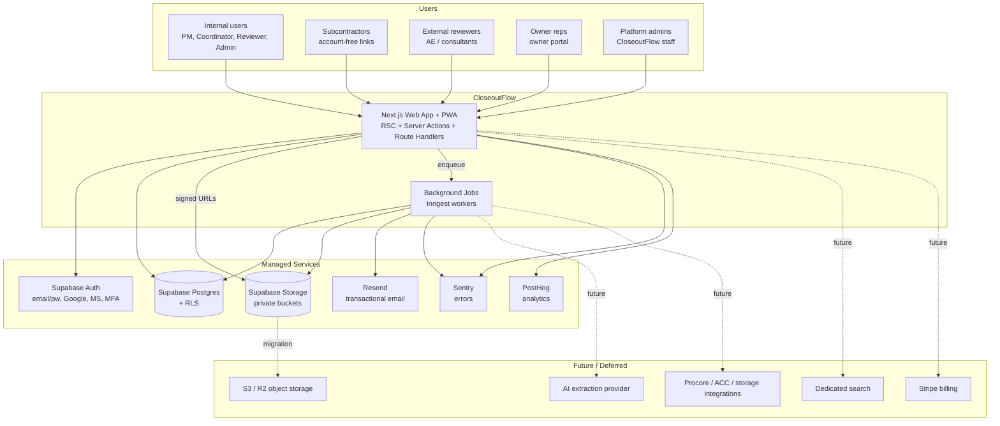
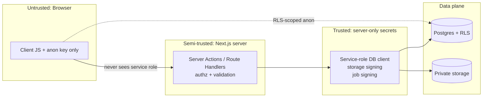

# FILE: /docs/architecture/architecture-overview.md

> **Document status:** Phase 2 architecture — implementation-ready.
> **Depends on Phase 1:** [product-requirements.md](../product/product-requirements.md), [user-roles.md](../product/user-roles.md), [workflows.md](../product/workflows.md), [statuses.md](../product/statuses.md), [feature-roadmap.md](../product/feature-roadmap.md), [glossary.md](../product/glossary.md).
> **Sibling architecture docs:** [technology-stack.md](./technology-stack.md), [repository-structure.md](./repository-structure.md), [data-architecture.md](./data-architecture.md), [auth-and-permissions.md](./auth-and-permissions.md), [file-and-document-processing.md](./file-and-document-processing.md), [background-jobs-and-notifications.md](./background-jobs-and-notifications.md), [testing-and-quality.md](./testing-and-quality.md), [security-and-operations.md](./security-and-operations.md), [environments-and-delivery.md](./environments-and-delivery.md), [architecture-decisions.md](./architecture-decisions.md), [phase-2-implementation-plan.md](./phase-2-implementation-plan.md), [open-decisions.md](./open-decisions.md).

---

## 1. Architectural goals

CloseoutFlow's architecture optimizes, in priority order, for:

1. **Tenant isolation and document security** — sensitive commercial construction records must never leak across organizations. Isolation is enforced in the database (RLS), not only in application code.
2. **Correctness of the closeout domain** — the Phase 1 separation of *Requirement / Submission / Document / Document Version / Review / Approval* is preserved everywhere; no shortcut collapses them.
3. **Two-founder maintainability** — one deployable web app, one clear monorepo, boring well-supported technologies, no premature microservices.
4. **Startup-realistic cost** — managed services with generous free/low tiers; heavy work (files, OCR, AI) is deferred and cost-metered.
5. **Growth without rewrite** — clear seams for background processing, AI extraction, integrations, dedicated search, and object-storage migration, all *designed now, implemented later*.
6. **Excellent mobile-browser and account-free external workflows** — the subcontractor upload path and owner portal are first-class.
7. **Observability, testability, auditability** — every important action is audited (distinct from logs/analytics); the permission model is testable at the database and application layers.

**Explicit non-goals of the architecture:** no microservices at launch, no Kubernetes, no self-hosted infrastructure, no bespoke abstraction over stable internal code, no dependency on any integration (Procore/ACC) to function.

---

## 2. System context

---

## 3. Major components

| Component | Responsibility | Runtime |
|-----------|----------------|---------|
| **Web app (`apps/web`)** | All UI (internal, subcontractor portal, external review, owner portal), Server Actions for mutations, Route Handlers for webhooks/file-signing/health/future API. | Vercel (Node serverless + edge where safe) |
| **Background worker (`apps/worker` — added later)** | Async document processing, reminders, package generation, integration sync, cleanup. Registered as Inngest functions. | Vercel functions invoked by Inngest (or dedicated runtime later) |
| **Postgres (Supabase)** | System of record; enforces tenant isolation via RLS, referential integrity, audit append-only store, Postgres FTS. | Supabase managed |
| **Object storage (Supabase Storage)** | Private document/version blobs; direct resumable uploads; signed access. S3-compatible for future migration. | Supabase managed |
| **Auth (Supabase Auth)** | Internal-user identity, MFA, OAuth (Google/Microsoft). Secure account-free links are a **separate first-party mechanism**, not Supabase sessions. | Supabase managed |
| **Shared packages (`packages/*`)** | Cross-cutting logic: authorization policy, domain types, validation schemas, config/env, database client, provider adapters. | Imported by app + worker |
| **Provider adapters** | Thin interfaces around replaceable vendors (email, storage, jobs, AI, search) to reduce lock-in. | In `packages/*` |

---

## 4. Component boundaries

- **The web app owns presentation and request handling only.** All authorization decisions call the shared `authz` policy; all validation calls shared Zod schemas; all DB access goes through the shared typed client. No ad-hoc SQL or permission logic in feature code.
- **Domain logic lives in feature modules** inside `apps/web` (colocated), with truly shared, stable primitives promoted to `packages/*`. We do **not** pre-extract a "domain package" before code is stable (avoid premature abstraction).
- **The worker never trusts the web and vice versa** beyond signed job payloads; both re-authorize against the database and both are subject to RLS via scoped clients (see [auth-and-permissions.md](./auth-and-permissions.md)).
- **Provider adapters are the only place vendor SDKs are imported.** Feature code depends on the adapter interface, never the vendor SDK directly (except stable, unlikely-to-change ones).

---

## 5. Data flow (representative)

**A. Subcontractor account-free upload (large file):**
1. Coordinator assigns a requirement and issues a secure link (hashed token stored in DB).
2. Sub opens the link → server validates the token, resolves a *scoped* grant, renders only their checklist.
3. Sub requests an upload → Route Handler authorizes via the grant, creates a `document`/`version` intent row, and returns a **signed, resumable upload URL** to storage.
4. Browser uploads **directly to storage** (resumable/TUS) — bytes never pass through a serverless request body.
5. On upload-complete, an event enqueues a background job (scan → checksum → thumbnail → later OCR/AI-classify).
6. Job updates document/version status; requirement moves to `Submitted → Processing → Under review`. Audit events written at each transition.

**B. Internal review/approval:**
1. Reviewer opens the review queue (RSC, RLS-scoped).
2. Approves via a Server Action → `authz` check → transaction updates review + requirement status → writes audit events. **AI can never perform this transition.**

See sequence diagrams in [file-and-document-processing.md](./file-and-document-processing.md).

---

## 6. Trust boundaries

**Boundary rules (non-negotiable):**
- The **service-role key and all vendor secrets exist only server-side.** No privileged credential is ever shipped to the browser (validation item #4).
- The browser may talk to Postgres **only** through the anon key under RLS, or (preferred) through Server Actions/Route Handlers.
- Every external actor (sub, reviewer, owner) is outside the tenant boundary and is admitted only through a **scoped grant** (secure link or account membership) — never a broad session.
- IDOR is prevented structurally: every resource fetch is filtered by `organization_id` + scope in RLS **and** re-checked in `authz`.

---

## 7. Synchronous vs. asynchronous work

| Must be synchronous (in-request) | Must be asynchronous (jobs) |
|----------------------------------|-----------------------------|
| Authentication/authorization checks | Malware scanning |
| Validation | Checksum computation on large files |
| Creating intent rows (document/version/submission) | Thumbnail/preview generation |
| Issuing signed upload/download URLs | OCR / text extraction |
| Status transitions on explicit user action (approve/reject) | AI classification & metadata extraction (suggestion-only) |
| Reading RSC data for pages | Package generation |
| Writing audit events for the action just taken | Reminder & escalation delivery |
| | Integration synchronization |
| | Cleanup / retention tasks |

**Rule:** the web request does the smallest safe unit of trusted work and hands everything heavy, slow, or retry-prone to idempotent background jobs (validation item #7).

---

## 8. Major architectural principles

1. **Database-enforced isolation.** RLS is the backstop; application `authz` is the primary UX gate. Both must agree.
2. **One authorization source of truth** (`packages/authz`) mirrored by RLS policies; never duplicated inconsistently across features.
3. **Deny by default** at every layer.
4. **Suggest, human confirms.** AI writes only to `*_suggestion` fields; no AI actor can reach an approved terminal status (validation item #9).
5. **Append-only truths.** Migrations are append-only after use; audit events are immutable; approved document versions are never overwritten (new version instead).
6. **Adapters at the edges, not the core.** Replaceable vendors sit behind thin interfaces; stable internal code stays concrete.
7. **Server-authoritative.** Clients render; the server decides. No trust in client-supplied scope, role, or ownership.
8. **Boring, managed, portable.** Prefer widely-supported managed services with a documented exit path.

---

## 9. Scaling path

| Stage | Web | DB | Storage | Jobs | Search |
|-------|-----|----|---------|------|--------|
| Pilot / first 10 | Vercel Hobby→Pro; single Supabase project | Supabase small | Supabase Storage | Inngest free/low | Postgres FTS |
| First 100 | Vercel Pro; read-heavy pages cached | Supabase scaled tier; add indexes/read patterns | Supabase Storage; monitor egress | Inngest paid; concurrency limits | Postgres FTS + tuned indexes |
| Large / big files | Same app; move heavy processing to dedicated worker runtime if needed | Consider connection pooling (Supavisor), partition `audit_events` | **Migrate blobs to S3/R2** behind the storage adapter (egress/cost trigger) | Dedicated queue concurrency; possibly self-hosted workers | **Dedicated search** (Typesense/OpenSearch) behind the search adapter |

The application code path does not change when storage or search is swapped — only the adapter implementation and a data-migration job (validation items about Supabase→object-storage and search migration).

---

## 10. Major risks

| Risk | Architectural mitigation |
|------|--------------------------|
| Cross-tenant data leak | RLS on every tenant table + `authz` + automated isolation/IDOR tests + service-role confined to server. |
| Secure-link leakage/abuse | Hashed tokens, short expiry, revocation (fail-closed), scope-limited grants, rate limiting, identity confirmation, audit. |
| Malicious file uploads | Private buckets, signed URLs, MIME/extension/size validation, async malware scan → quarantine (never served), checksums. |
| Service-role exposure | Secret only in server env; lint/secret-scan guards; adapter boundary; never imported in client bundles. |
| Large-file failures / serverless limits | Direct-to-storage resumable uploads bypass serverless bodies; jobs retry idempotently. |
| Runaway processing/AI cost | Async, metered, rate-limited, provider-abstracted; cost controls and dead-letter handling. |
| Vendor lock-in (Supabase/Auth) | Portable Postgres + S3-compatible storage + identity abstraction; documented replacement triggers ([architecture-decisions.md](./architecture-decisions.md)). |
| Two-founder bandwidth | Managed services, one app, strong CI gates, AI-agent guardrails ([AGENTS.md](../../AGENTS.md), [CLAUDE.md](../../CLAUDE.md)). |

---

*Continue to [technology-stack.md](./technology-stack.md).*
