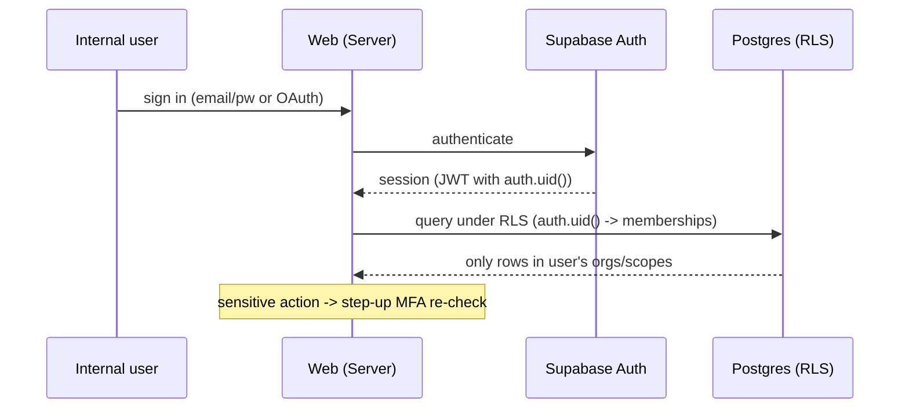
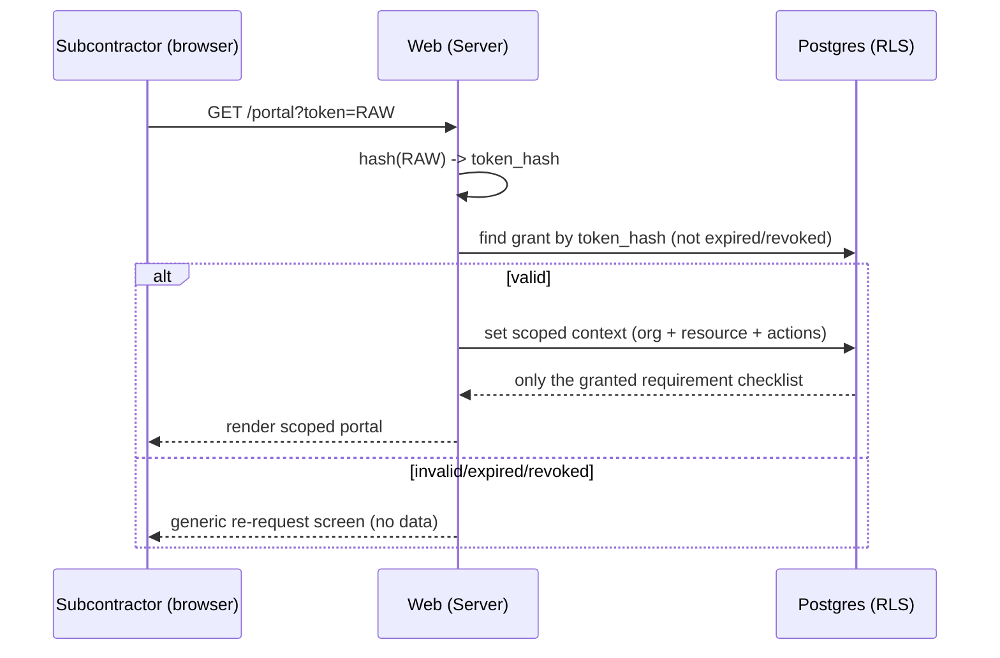

# FILE: /docs/architecture/auth-and-permissions.md

> **Document status:** Phase 2 architecture — authentication & authorization design. **No implementation in Phase 2.**
> **Depends on Phase 1:** [user-roles.md](../product/user-roles.md) (authoritative role/permission model), [workflows.md](../product/workflows.md), [statuses.md](../product/statuses.md).
> **Related:** [data-architecture.md](./data-architecture.md) (RLS), [security-and-operations.md](./security-and-operations.md).

---

## 1. Authentication providers & flows

| Actor | Mechanism |
|-------|-----------|
| Internal users | **Supabase Auth**: email/password (verified), Google OAuth, Microsoft/Azure OAuth, TOTP MFA. |
| Subcontractor contributors | **Secure account-free link** (primary) or optional Supabase-Auth account. |
| External AE/consultant reviewers | **Secure account-free link** (primary) or optional account. |
| Owner representatives | **Secure account-free link** (primary) or optional account, scoped to owner-portal. |
| Platform admins (CloseoutFlow staff) | Separate, MFA-required admin identity; **not** an org membership; access is audited/impersonation-gated. |

**Supported now:** email/password, email verification, password reset, Google, Microsoft, TOTP MFA, session handling — all via Supabase Auth.
**Deferred (additive):** SAML/OIDC SSO + SCIM via **WorkOS** for enterprise; the identity/session module is designed so this slots in without rewiring authorization.



---

## 2. Authorization flow (single source of truth)

**`packages/authz` is the one place authorization decisions are made.** Every Server Action, Route Handler, and job calls it; RLS mirrors it in the database.

```
can(actor, action, resource, context) -> Allow | Deny(reason)
```

- **actor:** `{ type: internal_user | external_grant | platform_admin | system, id, memberships/grants, mfaAge, sessionAge }`.
- **action:** dotted verb from the role matrix (e.g., `requirement.assign`, `document.approve`, `package.publish`).
- **resource:** the target with its `organization_id` + scope chain (project/requirement/document/owner-portal).
- **decision:** deny by default; explicit allow required; explicit deny wins; most-specific scope wins (mirrors [user-roles.md §A](../product/user-roles.md)).

```mermaid
flowchart TD
  REQ[Server Action / Route Handler / Job] --> AZ[authz.can(actor, action, resource)]
  AZ -->|Deny| ERR[403 + audit deny + safe error]
  AZ -->|Allow| DBQ[DB operation under RLS]
  DBQ --> AUD[write audit event]
  DBQ -. RLS also enforces .-> ISO[org/scope isolation]
```

**Why this avoids inconsistent duplication:** feature code never writes its own permission checks. It imports `can(...)` and the shared action constants. Adding a feature means adding actions/policies in `authz` (with tests), not scattering `if role === ...` across the app. RLS provides the independent database guarantee, and a test suite asserts `authz` and RLS agree.

---

## 3. Permission evaluation & scope inheritance

Scopes (nested, from [user-roles.md](../product/user-roles.md)): **platform → organization → office/division → project → requirement → document → owner-portal.**

- **Downward inheritance:** an org-scope grant inherits to projects/requirements/documents unless **narrowed** (e.g., PM limited to assigned projects, admin limited to a division).
- **Narrowing wins** over inherited breadth; **explicit deny** wins over any allow; **most-specific** scope wins on conflict.
- **External grants never inherit upward or sideways** — a requirement grant sees only that requirement.
- **Owner-portal scope** conveys read/download on *published* records only; it cannot reach in-progress internal data.

Evaluation resolves in the order defined in [user-roles.md §A-3]: start deny → platform status (suspended → deny) → highest applicable allow → narrowing → explicit deny → sensitive-action gates.

---

## 4. Role templates & custom permissions

- **Role templates** (Owner, Org Admin, PM, Coordinator, Internal Reviewer, external roles, Owner Rep, Read-only) are predefined bundles of allowed actions per scope, encoded in `packages/authz` and reflected in a `roles`/`grants` data model.
- **Custom permissions** (Enterprise, later): a grant may carry action-level overrides on top of a template; the evaluation engine already supports allow/deny at any scope, so custom grants are additive data, not new code paths.
- Role assignment is per scope (a user is PM on project A, read-only on B) — never a global user attribute.

---

## 5. Secure-link (account-free) architecture

The core of external participation. Designed for security and revocability.

- **Token:** high-entropy (≥128-bit) random value generated server-side. The **raw token appears only in the URL sent to the recipient**; the database stores **only a hash** (e.g., SHA-256) — a DB leak never yields usable links.
- **Record:** `access_grants` / `secure_links` row with `organization_id`, scope (project/requirement/owner-portal + allowed actions), `token_hash`, `expires_at`, `revoked_at`, `created_by`, rotation metadata, and lifecycle status ([statuses.md §F](../product/statuses.md)).
- **No PII in the URL** (validation of NFR-PRIV-002); the token is opaque.
- **Expiration:** every link has `expires_at`; expired links present a re-request flow, never data.
- **Revocation:** setting `revoked_at` fails the link closed **immediately** (checked on every request; also enforceable in RLS).
- **Rotation:** re-issuing creates a new grant (new hash) and can invalidate the old; raw tokens are never reusable after rotation.
- **Identity confirmation (step-up for external):** before a state-changing action (upload, external approval), the actor confirms identity (name/email; optional one-time email code) — recorded on the audit event (AUTH-008).
- **Rate limiting & abuse protection:** link resolution is rate-limited per token/IP (Upstash) to blunt guessing/enumeration; failed resolutions are generic (no info leak).
- **RLS binding:** when a link is resolved server-side, the request runs with a **scoped context** so the database only exposes the grant's rows — a forwarded link cannot widen scope.



---

## 6. Token storage & hashing (summary)

- Store **hashes only** for secure links and any long-lived tokens (API keys later).
- Supabase Auth manages its own session tokens/refresh securely; we do not store user passwords (Supabase does, hashed).
- Webhook signing secrets, service-role key, and provider keys live in server env only (see [security-and-operations.md](./security-and-operations.md)).

---

## 7. Reauthentication & MFA

- **MFA:** TOTP via Supabase Auth; org admins may **require** MFA for all internal members (AUTH-002).
- **Step-up:** sensitive actions ([user-roles.md §D](../product/user-roles.md) — billing, org deletion, role changes, publishing, approvals of legal/compliance docs, exports, integrations) require a **fresh MFA challenge** regardless of session age (AUTH-007). `authz` receives `mfaAge`/`sessionAge` and denies until re-verified.
- **External reauthentication:** high-assurance external actions can require a one-time email code regardless of link age.
- **Session handling:** idle timeout (org-configurable within platform bounds), revocable sessions, forced logout on password change; concurrent sessions allowed but revocable.

---

## 8. External users & owner-portal users (authorization specifics)

- External actors are **never** org members and never get broad JWTs; they act through a scoped grant only.
- **Subcontractor:** `document.upload` on assigned requirements; read status of own items; nothing else.
- **External reviewer:** `document.review` / `approve` / `reject` / `annotate` on assigned stages only; approvals are gated (identity confirmation/step-up).
- **Owner rep:** `owner_portal.read` / `download` (policy-gated) on published records of their building only.
- All external actions are audited under the grant identity plus confirmed actor identity.

---

## 9. Support access & platform administrators

- **Platform admins** have a separate identity, **MFA required**, and **no routine access to tenant document contents**.
- **Support impersonation** (ADMIN-002) is **consented, time-boxed, and fully audited**; every impersonated action is attributed as support in the org's own audit log. Implemented via `authz` actor type `platform_admin` + explicit impersonation context, never by handing staff a service-role console.
- **Break-glass** emergency access is documented, MFA-gated, alerting, and audited.
- Service-role DB access is confined to trusted server code performing already-authorized operations; it is not a human login.

---

## 10. RLS interaction (recap)

- `authz` is the **primary** gate (rich errors, UX, action granularity).
- **RLS is the guarantee** (isolation cannot be bypassed by an app bug).
- Both derive from the same role/scope model; a test suite asserts they never diverge.
- Service-role bypasses RLS **only** in code paths that call `authz` first and write audit events.

---

## 11. SSO / enterprise readiness

- Identity is accessed through a small **session/identity module** (not scattered Supabase calls), so adding **WorkOS SSO/SCIM** later is additive: SSO becomes another way to establish the internal-user identity; `memberships`, `authz`, and RLS are unchanged.
- SCIM provisioning maps to membership create/suspend/remove — the same operations admins already perform.

---

## 12. Permission-test requirements

Mandatory before any feature ships (details in [testing-and-quality.md](./testing-and-quality.md)):

1. **RLS isolation tests (pgTAP):** no cross-org read/write/delete; external grants scoped; service-role confined.
2. **`authz` unit tests:** the full role×action matrix from [user-roles.md §B](../product/user-roles.md), including deny-by-default, narrowing, explicit deny, most-specific-wins.
3. **Parity tests:** `authz` allow ⇔ RLS allow for representative actions; divergence fails CI.
4. **Sensitive-action gate tests:** step-up MFA/reauth/two-person required where specified.
5. **Secure-link tests:** expiry, revocation (fail-closed), rotation, scope limitation, no-PII-in-URL, rate limiting.
6. **AI-approval impossibility test:** no path lets an AI actor reach an approved terminal (cross-checked in review-workflow tests).

---

## 13. Threat scenarios (auth/z-specific)

| Scenario | Defense |
|----------|---------|
| Forwarded/leaked secure link | Short expiry, revocation, scope limitation, identity confirmation, rate limiting, hash-at-rest. |
| IDOR (guessing another org's resource id) | UUIDs + RLS org scoping + `authz` re-check; no sequential ids. |
| Privilege escalation via self-role-edit | `authz` forbids elevating own privileges; role changes gated + audited. |
| Stolen session | Idle timeout, step-up MFA on sensitive actions, revocable sessions, logout-on-password-change. |
| Cross-org access by multi-org user | Explicit active-org context; RLS keyed to context; audit records active org. |
| Service-role leakage to client | Secret server-only; `server-only` imports; secret scanning; adapter boundary. |
| Platform-admin over-reach | Separate identity, consented+audited impersonation, no routine content access, break-glass alerting. |
| Brute-force login/token | Rate limiting + lockout (Upstash), generic errors, MFA. |

---

*Continue to [file-and-document-processing.md](./file-and-document-processing.md).*
