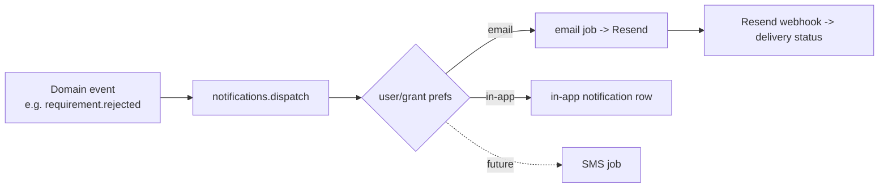

# FILE: /docs/architecture/background-jobs-and-notifications.md

> **Document status:** Phase 2 architecture — jobs, email, notifications. Foundation defines conventions; jobs implemented per phase (processing Phase 8, reminders Phase 10, packages Phase 13).
> **Depends on Phase 1:** [workflows.md](../product/workflows.md) (§22 reminders, §23 escalation, §32–37 packages), [statuses.md](../product/statuses.md) (§G notifications), [product-requirements.md](../product/product-requirements.md) (NOTIF-*).
> **Related:** [file-and-document-processing.md](./file-and-document-processing.md), [security-and-operations.md](./security-and-operations.md).

---

## 1. Selected job platform: Inngest

- **Why:** serverless-native (fits Vercel), first-class **retries, step functions, idempotency keys, cron scheduling, concurrency & rate limits, dead-letter visibility**, and strong **local dev** (Inngest Dev Server). It gives durable, observable workflows without running our own queue infrastructure — the right fit for two founders.
- **Alternatives considered:** **Trigger.dev** (very close; documented switch target), **QStash** (simpler, fewer workflow primitives), **BullMQ/Redis** (self-managed infra), **Vercel Cron only** (scheduling without queue semantics), **Supabase pg_cron/pgmq** (used only for light DB-local scheduling).
- **Replacement trigger:** high-volume cost or a need to self-host → move handlers (kept pure/provider-agnostic) to Trigger.dev or a self-hosted queue. See ADR in [architecture-decisions.md](./architecture-decisions.md).

---

## 2. Job conventions

- **Handlers are pure and provider-agnostic:** business logic in a function that takes typed input and does not depend on Inngest specifics beyond the thin wrapper in `packages/jobs`. This keeps the provider replaceable.
- **Location:** handlers in `apps/worker/src/functions/`; enqueue via `packages/jobs` (`enqueue(event, payload)`); shared job event names/types in `packages/jobs`.
- **Every job:**
  - Has a **stable event name** (`document.uploaded`, `reminder.due`, `package.generate`, `integration.sync`, `cleanup.expired_links`).
  - Declares **idempotency key**, **retry policy**, **concurrency/rate limits**, and **timeout**.
  - **Re-authorizes** against the DB (RLS-scoped or authz-checked) — a job does not blindly trust its payload's scope.
  - Writes **audit events** for meaningful state changes (source = `worker`).
  - Emits **structured logs** (pino) with `request_id`/correlation id and Sentry on failure.

---

## 3. Idempotency

- **Mandatory** (validation item #7). Each job step is keyed (e.g., `version_id + step`) so re-delivery or retry does not double-process (no duplicate thumbnails, no double emails, no double status transitions).
- Idempotency keys also protect against duplicate enqueue (e.g., storage event + client notify both firing).
- Where a job produces an external side effect (email send), an **idempotency token** is passed to the provider (Resend) to dedupe delivery.

---

## 4. Retry policy & dead-letter

- **Retries** with exponential backoff and jitter; max attempts per job class.
- **Transient vs. permanent errors** distinguished: permanent (e.g., invalid payload, infected file) do not retry endlessly.
- **Dead-letter:** exhausted jobs move to a dead-letter state visible in Inngest + alert to founders (Sentry/notification). The affected record shows a `Failed processing`/failed status (never a silent stall). A runbook covers replay after fix.

---

## 5. Scheduling (cron & delayed)

- **Scheduled jobs** (reminders sweep, escalation checks, cleanup, metering aggregation) via Inngest cron.
- **Delayed jobs** (send reminder at T+N, expire link) via Inngest scheduling.
- **Light DB-local schedules** (e.g., periodic maintenance) may use Supabase `pg_cron`, kept minimal.
- All scheduled jobs are **timezone-aware** where user-facing (reminders respect recipient locale, NOTIF-002).

---

## 6. Concurrency, rate limits, versioning

- **Concurrency limits** per job class protect the DB and external providers (e.g., cap parallel OCR/AI to control cost).
- **Rate limits** on outbound email and AI calls.
- **Job versioning:** event schemas are versioned; handlers tolerate old in-flight payloads during deploys (add fields backward-compatibly; never repurpose a field).

---

## 7. Job observability

- Inngest dashboard for run history, retries, dead-letters.
- pino structured logs + Sentry errors, correlated by `request_id`.
- Key metrics: queue depth, failure rate, processing latency, dead-letter count → alerts (see [security-and-operations.md](./security-and-operations.md)). File-processing failure rate is a Phase-1 success metric (§J).

---

## 8. Foundational job seams (implemented in their phases)

| Job | Phase | Purpose |
|-----|-------|---------|
| `process-document` | 8 | scan/checksum/thumbnail/OCR/AI pipeline (file doc). |
| `reminder.sweep` / `reminder.send` | 10 | automated reminders (NOTIF-002). |
| `escalation.check` | 10 | escalate overdue items (NOTIF-003). |
| `package.generate` | 13 | assemble closeout package artifacts (PKG-003). |
| `integration.sync` | 15 | pull/push external systems (additive). |
| `cleanup.expired_links` / retention | ongoing | expire secure links, apply retention. |
| `metering.aggregate` | billing | per-org storage/usage accounting. |

At **Phase 2** only the `packages/jobs` seam + Inngest client + a trivial health/no-op function are created (to prove local dev + CI). No business jobs yet.

---

## 9. Email architecture

- **Provider:** **Resend** with **React Email** templates (typed, componentized). Adapter in `packages/email` (interface + Resend impl) so **Postmark** is a drop-in switch if deliverability demands.
- **Local/dev:** **Mailpit** — no real sends in local/preview; env-driven provider selection.
- **Custom sending domain** with **SPF/DKIM/DMARC** configured (NFR-EMAIL-001) for deliverability; separate subdomains per environment (see [environments-and-delivery.md](./environments-and-delivery.md)).
- **Sending is a job**, not an inline request side effect (retriable, idempotent, rate-limited).
- **Email idempotency:** dedupe token per logical message prevents duplicate sends on retry.

---

## 10. Delivery events, bounces, complaints, suppression

- **Resend webhooks** → `/api/webhooks/resend` (signature-verified) update the notification lifecycle ([statuses.md §G](../product/statuses.md)): `delivered`, `deferred`, `bounced`, `complained`, `opened` (best-effort).
- **Bounces/complaints** update recipient deliverability state; hard bounces and complaints add to a **suppression list**.
- **Suppression** respected for non-transactional messages; **transactional messages** (invites, rejections, escalations) are not suppressed by marketing opt-out but do honor hard-bounce/complaint suppression.
- Webhook handling is **idempotent** (event id dedupe).

---

## 11. Notification architecture (multi-channel)

- **Channels at foundation:** **email + in-app**. Interface in `packages/notifications` is **multi-channel from day one** so **SMS is additive later** (Expansion) — no SMS in the foundation (per instruction and Phase 1).
- **In-app notifications:** stored per user/grant, unread counts, marked read; delivered via the app (polled/streamed).
- **Notification preferences:** per-user channel/category preferences; unsubscribe respected for non-transactional categories.
- **A single notification event may fan out** to multiple channels per preference; each channel send is its own idempotent job with its own lifecycle.

---

## 12. Inbound & future SMS readiness

- **Inbound email** (reply handling, e.g., replying to a notification): designed-for via a dedicated inbound address/route and a parser job; **not implemented** in the foundation. The reply-to domain and webhook seam are reserved.
- **SMS:** the notification channel interface reserves an SMS channel; a provider (e.g., Twilio) plugs into `packages/notifications` when Expansion warrants. No SMS dependency now.

---

## 13. Reminder & escalation delivery (design)

- **Reminders (workflows §22):** a scheduled sweep finds outstanding requirements (`Requested`/`Missing`) whose cadence has elapsed, enqueues per-recipient reminder sends (timezone-aware, throttled), stops on submission, and **audits each delivery** (`reminder.sent`).
- **Escalation (workflows §23):** overdue-beyond-threshold items enqueue escalation notifications up the internal ladder; suppressed if waived/N/A; audited (`escalation.triggered`).
- Both are idempotent (a requirement is not double-reminded for the same cadence tick).

---

## 14. Monitoring (jobs + email)

- Job health, retries, dead-letters → Inngest + Sentry + founder alerts.
- Email delivery/bounce/complaint rates → Resend dashboard + our delivery-event store; alert on bounce/complaint spikes (deliverability is existential for the chase workflow).
- Reminder response rate and file-processing failure rate are tracked as Phase-1 success metrics.

---

*Continue to [testing-and-quality.md](./testing-and-quality.md).*
