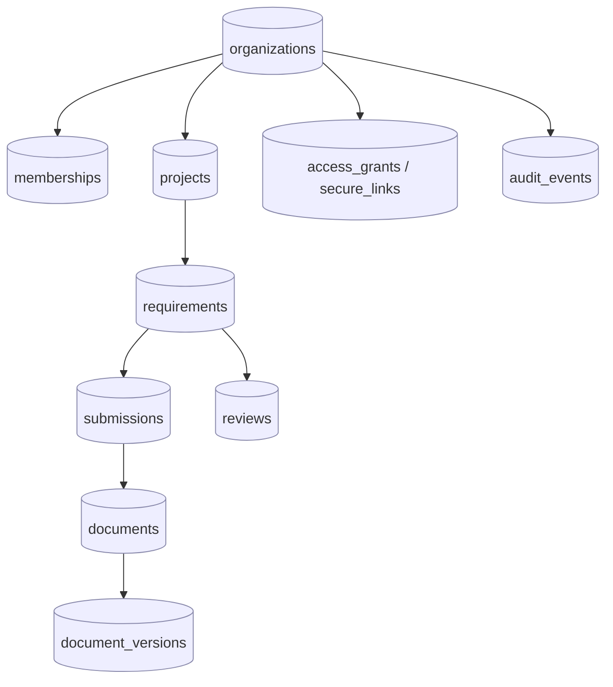
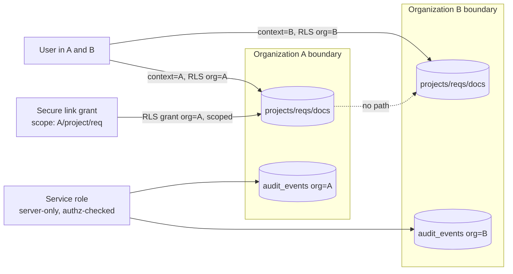

# FILE: /docs/architecture/data-architecture.md

> **Document status:** Phase 2 architecture — database principles & tenancy. **No full Phase 4–15 schema here** — only foundations, conventions, and the tenant-isolation design.
> **Related:** [auth-and-permissions.md](./auth-and-permissions.md), [architecture-overview.md](./architecture-overview.md), [statuses.md](../product/statuses.md), [user-roles.md](../product/user-roles.md).

---

## 1. Database principles

1. **Postgres is the system of record.** Referential integrity, constraints, RLS, and FTS live in the database, not only in the app.
2. **Tenant isolation is a database property.** Every tenant-owned row carries `organization_id`; RLS enforces isolation regardless of application bugs.
3. **The database is server-only.** The service-role key never reaches a client; clients use the anon key under RLS or go through Server Actions/Route Handlers.
4. **Append-only truths.** Migrations are append-only after they run anywhere shared; audit events are immutable; approved document versions are never overwritten.
5. **Explicit over implicit.** Constraints, foreign keys, check constraints, and unique indexes encode the domain rules from [statuses.md](../product/statuses.md) (e.g., legal status transitions guarded where practical).
6. **Portable Postgres.** Avoid Supabase-only SQL where a standard equivalent exists, so the database can move to Neon/RDS if needed. Supabase-specific pieces (auth schema references, storage) are isolated.

---

## 2. Tenant ownership strategy

- **Every tenant-owned table has a non-null `organization_id uuid` FK to `organizations(id)`.** This is the isolation key.
- **Child rows also carry `organization_id` (denormalized) even when reachable via a parent**, so RLS policies are simple, index-friendly, and IDOR-proof without multi-join lookups. A trigger/constraint keeps the denormalized `organization_id` consistent with the parent.
- **Cross-organization users** (a person in multiple orgs) are modeled by `memberships(user_id, organization_id, ...)`; a user row is global, but all access is mediated per-organization.
- **External participants** are not org members. Their access is a **grant** (secure link or invited external account) scoped to a project/requirement/owner-portal, carrying its own `organization_id` for RLS.
- **Platform (CloseoutFlow staff)** are not org members either; platform access is a separate, audited path (see [auth-and-permissions.md](./auth-and-permissions.md)), never a broad DB superuser used for routine reads.



Every box above carries `organization_id`. RLS on each keys off `organization_id` + the caller's membership/grant.

---

## 3. Primary-key strategy

- **UUID primary keys** on all tables, column name `id`.
- **Default `gen_random_uuid()`** at Phase 2 for simplicity and portability. **Preferred target: application-generated UUIDv7** (time-ordered) for index locality on large, insert-heavy tables (documents, audit_events). The DB accepts either; when UUIDv7 generation is added in `packages/db`, no schema change is required.
- **No sequential integer IDs exposed externally** (avoids enumeration/IDOR signal).
- **Natural keys** used only for lookup/reference tables (e.g., trade codes) via unique constraints, not as PKs where they might change.

---

## 4. Timestamp strategy

- Every table has `created_at timestamptz not null default now()` and `updated_at timestamptz not null default now()`.
- `updated_at` maintained by a shared `set_updated_at()` trigger.
- **All timestamps are UTC (`timestamptz`).** The application layer formats to the user's timezone; the database never stores local time.
- Domain event times (e.g., warranty start, CO issued) are their own explicit columns, distinct from row `created_at`.

---

## 5. Soft-delete vs. archive strategy

Per Phase 1 ([statuses.md](../product/statuses.md)), deletion and archival are different concepts:

| Mechanism | Column/Model | Meaning | Reversible |
|-----------|--------------|---------|------------|
| **Archive** | status field (e.g., project `Archived`, document `Archived`) | Read-only, retained, still visible to authorized users; owner portals stay live. | Yes (unarchive) |
| **Soft delete** | `deleted_at timestamptz null` | Removed from active views; retained within retention window; recoverable. | Within retention |
| **Hard delete** | actual row removal | Gated, rare (org deletion after grace period); **never removes audit records of the action**. | No |

- RLS/queries exclude `deleted_at IS NOT NULL` by default via views or standard predicates.
- **Approved document versions are never deleted or overwritten** — replacement creates a new version and marks the old `Superseded`.
- Audit rows are **never** soft- or hard-deleted by application paths.

---

## 6. Schema naming & organization

- **snake_case**, plural table names, singular column names; FK columns `<referenced_table_singular>_id`.
- **Schemas:**
  - `public` — application tables (default).
  - `audit` — append-only audit tables (separate schema; write-only grants).
  - Supabase-managed `auth` / `storage` schemas are referenced, not modified.
  - Optional `internal` schema for platform-admin/operational tables not owned by any tenant.
- Enum-like columns use Postgres `enum` types **or** `text` + check constraints matching the TS union; the choice is documented per table (enums for stable status sets, text+check where values evolve).

---

## 7. Migration policy

- **Tool:** Supabase CLI SQL migrations in `supabase/migrations/`, timestamp-prefixed, forward-only.
- **Append-only after shared use:** once a migration has run in CI/staging/production, it is never edited; corrections are new migrations.
- **Every migration is reviewed and tested** (pgTAP where it changes RLS/constraints); migrations run in CI against an ephemeral DB before merge.
- **Reversibility:** destructive migrations require an explicit, reviewed down-path or a documented data-safety plan; prefer additive changes (add column/table, backfill, switch, later drop).
- **Generated types** are regenerated (`supabase gen types typescript`) and committed in the same PR as the migration.
- **Migration ordering vs. deploy:** schema migrations run **before** the app version that needs them (expand/contract pattern). See [environments-and-delivery.md](./environments-and-delivery.md).

---

## 8. Constraint policy

- **Foreign keys** on every relationship, with explicit `on delete` behavior chosen per relationship (mostly `restrict`; `cascade` only where a child is meaningless without its parent and not audit-relevant).
- **NOT NULL** by default; nullability is a deliberate decision.
- **Check constraints** encode invariants (e.g., a document version's `organization_id` must equal its document's; status values constrained; `deleted_at` rules).
- **Unique constraints** prevent duplicates (e.g., one active secure-link token hash; dedupe keys on requirements per template item).
- **Status transition safety:** where practical, guard illegal transitions with triggers/functions referencing [statuses.md](../product/statuses.md); otherwise enforce in `packages/authz` + tests. The allowed-transition matrix is the contract.

---

## 9. Index policy

- Index every FK used in queries (esp. `organization_id`, `project_id`, `requirement_id`).
- **Composite indexes** leading with `organization_id` for tenant-scoped queries (`(organization_id, status)`, `(organization_id, created_at)`).
- **Partial indexes** for hot filtered sets (e.g., `where deleted_at is null`, `where status = 'requested'`).
- **GIN indexes** for FTS `tsvector` columns and JSONB metadata.
- Indexes are added in the migration that introduces the query pattern; unused indexes are pruned. No premature indexing beyond `organization_id`/FKs at foundation.

---

## 10. Row Level Security (RLS) design

**RLS is ON for every table in `public` and `audit`. Default deny.** Policies are the database-level backstop for tenant isolation and IDOR prevention.

**Caller identity sources:**
- **Internal users:** Supabase Auth JWT → `auth.uid()`; membership resolved via `memberships`.
- **External participants:** admitted through Server Actions/Route Handlers that resolve a **scoped grant**; the server sets a **request-scoped GUC/claim** (e.g., a signed context) so RLS can constrain to the grant's `organization_id` + resource. External actors never receive a broad JWT.
- **Service-role** bypasses RLS and is used only in trusted server code for operations that are themselves authorized by `packages/authz` first (e.g., writing audit rows, admin/impersonation with logging).

**Policy pattern (illustrative, not final schema):**
```
-- SELECT: a row is visible if the caller is a member of its organization
--         with a role/scope granting read, OR holds a matching external grant.
-- WRITE:  additionally requires the specific action grant (checked by authz too).
```
- Helper SQL functions in a controlled schema (e.g., `auth_org_ids()`, `has_project_scope(project_id, action)`) centralize policy logic so it is not copy-pasted per table.
- **RLS and `packages/authz` must agree.** `authz` is the primary UX gate (fast, rich errors); RLS is the guarantee. Divergence is a bug caught by tests.

**Mandatory RLS test coverage** (pgTAP, [testing-and-quality.md](./testing-and-quality.md)):
- No cross-organization SELECT/UPDATE/DELETE is ever possible.
- External grants see only their scoped rows.
- Service-role usage is confined and audited.

---

## 11. Which security rules MUST be in Postgres (not only app code)

| Rule | Enforced in Postgres because |
|------|------------------------------|
| Tenant isolation (`organization_id` scoping) | The last line of defense against app bugs/IDOR; must hold even if a query forgets a filter. |
| External-grant scoping | Prevents a leaked/forwarded link from ever reading beyond its grant. |
| Referential integrity (FKs) | Prevents orphaned documents/versions/reviews. |
| Cross-entity `organization_id` consistency | Check constraint/trigger stops a child being attached to the wrong org. |
| Append-only audit | Grants/triggers prevent update/delete on `audit.*`. |
| Approved-version immutability | Trigger prevents mutating an approved `document_versions` row (new version required). |
| Unique active secure-link token hash | DB uniqueness prevents duplicate/ambiguous tokens. |

App code additionally enforces richer authorization (`packages/authz`), but the above must be *impossible to bypass* from the application.

---

## 12. Database functions

- Used sparingly and deliberately for: `set_updated_at()`, RLS helper predicates, `organization_id` consistency triggers, approved-version immutability, and audit-append triggers.
- Business logic stays in TypeScript; functions/triggers encode **invariants and isolation**, not workflow.
- All functions are `security definer` only when strictly necessary and are reviewed for privilege-escalation safety.

---

## 13. Audit architecture (data view)

Audit is a **first-class, separate concern** from logs and analytics (full model in [security-and-operations.md](./security-and-operations.md) §Audit).

- `audit.audit_events` (append-only) with, at minimum: `id`, `occurred_at`, `organization_id`, `actor_type` (internal_user | external_grant | platform_admin | system/job | ai), `actor_id`, `project_id?`, `target_type`, `target_id`, `action` (dotted, e.g. `requirement.status_changed`), `before` jsonb?, `after` jsonb?, `request_id`, `session_id?`, `ip?`, `user_agent?`, `source` (web | worker | api), `metadata` jsonb.
- **Immutable:** no UPDATE/DELETE grants; enforced by policy + trigger.
- **Written in the same transaction** as the action it records where possible (consistency); high-volume/non-critical audit may be buffered but never dropped silently.
- **AI actor** is a valid `actor_type` for *suggestions*, but there is **no audit event type that records an AI approval** — because AI cannot approve (validation item #9).
- Retention/partitioning: partition by month once volume warrants; retention per policy, never below legal minimums.

---

## 14. Search readiness

- **Phase-1 through mid-roadmap:** Postgres FTS (`tsvector` columns + GIN indexes), **permission-aware because search runs under RLS** (a user can only match rows they can see) — search results can never cross tenant/scope (validation of permission-aware search).
- **OCR/extracted text** stored in a dedicated column/table (`document_text`) linked to `document_versions`, indexed for FTS.
- **Migration path to dedicated search** (Typesense/OpenSearch) is behind `packages/search`; the same query interface serves FTS now and an external engine later, with an indexer job keeping the engine in sync and **re-checking permissions at query time** (never trusting a stale index for authorization).

---

## 15. Transaction strategy

- **Every state-changing action is atomic.** A requirement transition that updates a review, the requirement, and writes audit events happens in one transaction; partial failure rolls back (NFR-ERR-001).
- Long/async work (file processing, package generation) is **not** held in a single DB transaction; it advances through idempotent job steps, each with its own small transaction and audit event.
- Optimistic concurrency (version/`updated_at` checks) guards races on documents/reviews; concurrent replacement creates a new version rather than clobbering.

---

## 16. Seed & test-data strategy

- `supabase/seed/` holds **deterministic, clearly-fake, non-production** seed data (validation: no production data anywhere but production).
- Seeds create: a couple of sample organizations, memberships across roles, a project skeleton — enough to exercise RLS and permissions in local/dev.
- pgTAP tests build their own fixtures per test for isolation.
- **No secrets, no real customer data, no real emails** in seeds; emails use example domains routed to Mailpit locally.
- A single cross-platform `pnpm db:reset` (Node script) resets local DB + applies migrations + seeds identically on Windows and Linux.

---

## 17. Backup & recovery expectations

- **Backups:** rely on Supabase automated backups (point-in-time recovery on paid tiers); frequency/retention documented in [security-and-operations.md](./security-and-operations.md). Target RPO ≤ 24h at launch, tightening toward ≤ 1h for critical data as we scale.
- **Restoration testing:** periodic restore drills into a scratch project are a required runbook item (backups are not trusted until a restore is proven).
- **Storage:** document blobs are backed by Supabase Storage durability; the migration to S3/R2 (with versioning + lifecycle) is the long-term durability path.
- **Exports:** organization export (Phase 1 EXP-001/ORG-005) produces a portable structured archive independent of the backup system.

---

## 18. Data-boundary diagram (isolation view)



**Guarantee:** there is *no query path* from Organization A's rows to Organization B's rows for any non-service caller; the multi-org user only ever sees the org matching their active context; a secure link only ever sees its granted scope.

---

*Continue to [auth-and-permissions.md](./auth-and-permissions.md).*
