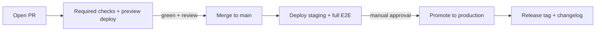

# FILE: /docs/architecture/environments-and-delivery.md

> **Document status:** Phase 2 architecture — environments, CI/CD, delivery.
> **Related:** [testing-and-quality.md](./testing-and-quality.md), [security-and-operations.md](./security-and-operations.md), [architecture-decisions.md](./architecture-decisions.md).
> **Hard rule:** **Preview and staging never use production data or production secrets** (validation requirement). Each environment has its own database, storage, auth config, and keys.

---

## 1. Environments

| Env | Purpose | Web | Database | Storage | Auth | Data |
|-----|---------|-----|----------|---------|------|------|
| **Local** | Developer machine (Win + Linux) | `pnpm dev` | Supabase local (Docker) | Supabase local | Supabase local | Seed only |
| **Preview** | Per-PR ephemeral review | Vercel Preview | Dedicated preview Supabase project (or branch DB) | Preview bucket | Preview auth keys | Seed/synthetic only |
| **Staging** | Pre-prod integration/QA | Vercel (staging) | Staging Supabase project | Staging bucket | Staging auth keys | Synthetic only |
| **Production** | Live customers | Vercel (prod) | Production Supabase project | Prod bucket | Prod auth keys | Real |

- **Separate Supabase projects** per environment (at minimum prod vs. non-prod; preview may use a shared non-prod project with ephemeral schemas/branch DBs if per-PR projects are impractical — never prod).
- **Separate storage buckets and auth configurations** per environment.
- **Email:** local/preview → Mailpit or Resend test mode (no real recipients); staging → Resend with a staging subdomain and restricted/allowlisted recipients; production → Resend prod domain.

---

## 2. Environment variables

- **Single validated schema** in `packages/env` (Zod, server/client split). App fails fast if a required var is missing/malformed.
- **`.env.example`** documents every variable with non-secret placeholders and a comment; it is the onboarding contract.
- **Secrets storage:** Vercel project env (per environment), Supabase project settings, GitHub Actions secrets. **Never in the repo.**
- **Client-exposed vars** are explicitly `NEXT_PUBLIC_*` and contain **no secrets** (anon key only, never service-role).
- Preview/staging/prod each hold their own values; CI injects only the values needed per job.

---

## 3. Deployment provider & model

- **Vercel** hosts the web app; **Git-driven deploys**: every PR → Preview; merge to `main` → Staging; promotion → Production.
- **Background worker (Inngest):** functions deploy with the app (Vercel-hosted endpoints) and are registered with Inngest; a dedicated worker runtime is a later option if long-running jobs demand it.
- **Supabase** is provisioned per environment; migrations applied via CI (see §5).

---

## 4. CI/CD (GitHub Actions)

**Branch strategy:** trunk-based — short-lived feature branches off `main`, small PRs, `main` always deployable. Release tags mark production promotions.

**Pull-request required checks (blocking):**
- Typecheck, lint, format check.
- Unit/component/integration (Vitest).
- **pgTAP RLS/constraint + authz** tests.
- **Migration apply (empty→head) + generated-types diff = 0** + append-only check.
- Build verification.
- **Gitleaks** secret scan + `pnpm audit`/Renovate security.
- Playwright **smoke** + **axe a11y** against the PR preview.

**Merge to `main` → Staging:** full E2E + full a11y + migrations applied to staging.

**Production promotion:** manual approval (founder), post-deploy smoke tests, migration-ordering verification, release tag + changelog entry.

---

## 5. Migration process (expand/contract)

1. Author append-only SQL migration in `supabase/migrations/`; regenerate + commit types.
2. CI applies empty→head on an ephemeral DB and runs pgTAP.
3. **Schema deploys before dependent app code**: migrations run against the target environment **ahead of** the app version that requires them (expand), so old and new app code both work during rollout; destructive drops happen in a later migration after the old code is gone (contract).
4. Never edit an applied migration; corrections are new migrations.

---

## 6. Rollback process

- **App rollback:** Vercel instant rollback to the previous deployment.
- **Schema rollback:** because migrations are expand/contract and forward-only, rollback is normally achieved by **rolling the app back** (old code still works against the expanded schema), then shipping a corrective forward migration if needed — not by destructive down-migrations in production. Destructive changes are gated behind a documented data-safety plan.
- **Data recovery:** PITR/backups for genuine data loss (DR runbook).

---

## 7. Feature flags

- Lightweight flag mechanism (config table or a flag provider such as PostHog feature flags) to gate incomplete/enterprise features and enable **design-early/implement-later** surfaces safely.
- Flags are environment-aware; risky features ship dark and are enabled per-org.
- Flags are for rollout control, not for bypassing authorization or isolation.

---

## 8. Release process

- Small, frequent releases from `main`.
- **Changelog** maintained (Changesets or curated `CHANGELOG.md`); release tags on production promotions.
- Post-release: watch Sentry/uptime; smoke tests; rollback ready.

---

## 9. Maintenance mode

- A maintenance flag/route can present a read-only or paused state during risky migrations; owner portals should remain available where possible (they read published, immutable data).

---

## 10. Domain & email-domain plan

- **App domains:** production `app.closeoutflow.com` (or chosen brand domain); staging `staging.…`; previews on Vercel-generated URLs. Owner portals served under the app domain (path/subdomain per branding decision — see [open-decisions.md](./open-decisions.md)).
- **Email domains:** dedicated sending subdomain (e.g., `mail.closeoutflow.com`) with **SPF/DKIM/DMARC**; separate subdomain for staging; warmed reputation on the production sender. Reply-to/inbound address reserved for future inbound email.

---

## 11. Backup & recovery expectations (env view)

- Production PITR/backups enabled; staging/preview backups minimal (disposable data).
- Restoration drills target a scratch project, never production.
- Storage durability per provider; future S3/R2 versioning for the durable target.

---

## 12. Windows + Linux parity

- All dev/ops commands are **pnpm/Turbo tasks or Node scripts** — no bash-only or PowerShell-only steps required to develop or test.
- Supabase local runs via Docker Desktop on Windows and Docker on Linux/CI.
- CI runs on Linux; the same task names run locally on Windows, guaranteeing "works on my machine" ≡ "works in CI."

---

*Continue to [architecture-decisions.md](./architecture-decisions.md).*
