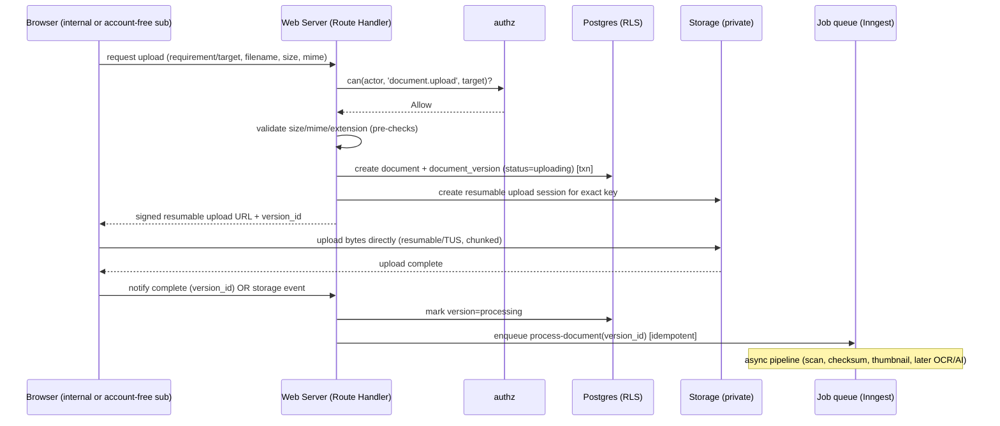

# FILE: /docs/architecture/file-and-document-processing.md

> **Document status:** Phase 2 architecture — file storage & processing design. Upload/signing/validation designed for Phase 8; processing pipeline **designed now, implemented later**.
> **Depends on Phase 1:** [product-requirements.md](../product/product-requirements.md) (DOC-*, PORT-*, NFR-FILE-*), [statuses.md](../product/statuses.md) (document lifecycle), [workflows.md](../product/workflows.md).
> **Related:** [background-jobs-and-notifications.md](./background-jobs-and-notifications.md), [data-architecture.md](./data-architecture.md), [security-and-operations.md](./security-and-operations.md).

**Core rule:** the architecture **must not rely on public file URLs**, and **large uploads must never pass through a normal serverless request body** (validation items #6 and the public-bucket prohibition). Bytes go **browser → storage** directly via signed, resumable uploads.

---

## 1. Storage provider & migration path

- **Initial:** **Supabase Storage**, **private buckets only**. Supports signed URLs, resumable uploads (TUS), and is **S3-compatible**.
- **Migration path:** when storage egress/cost or feature needs demand it, move blobs to **S3 or Cloudflare R2** behind the `packages/storage` adapter. Because keys are already S3-style and access is always via the adapter + signed URLs, migration is a data copy + adapter swap, not an app rewrite.
- **Trigger to migrate:** sustained high egress cost, need for lifecycle tiering/Glacier-style archival, or Supabase storage limits.

---

## 2. Storage key structure (org/project separation)

```
org/{organization_id}/project/{project_id}/document/{document_id}/version/{version_id}/{sanitized_filename}
```

- **Organization and project are encoded in the key path**, reinforcing isolation and enabling per-org/project lifecycle and metering.
- Keys use **UUIDs**, not user-supplied names, to prevent traversal/collision; the original filename is stored as metadata and sanitized in the key.
- Thumbnails/previews live in a parallel derived path: `.../version/{version_id}/derived/{kind}`.
- **No key is ever publicly resolvable**; access is exclusively via short-lived signed URLs.

---

## 3. Private-file access & signed URLs

- **All buckets private.** No public URLs, ever.
- **Download:** the server authorizes via `packages/authz` (and RLS on the owning row), then issues a **short-lived signed download URL** (minutes). The URL is single-purpose and expires quickly.
- **Upload:** the server authorizes, creates intent rows, then issues a **signed resumable upload URL** scoped to the exact target key.
- **Owner-portal downloads** honor per-portal download policy (view-only/watermark/blocked) enforced before a signed URL is issued.
- Every signed-URL issuance for sensitive files is **access-logged/audited** (who, what, when).

---

## 4. Upload flow (large-file safe)



- The **web request never carries the file bytes**; it only authorizes, records intent, and signs. This satisfies the large-file/serverless-body requirement.
- **Resumable/multipart** handles large O&M manuals, as-built packages, and flaky mobile connections; interrupted uploads resume.
- Bulk/folder uploads (PORT-002) issue multiple signed sessions; **partial failures are per-file** and never lose already-succeeded files.

---

## 5. Validation

| Layer | Checks |
|-------|--------|
| Pre-sign (sync, in request) | Declared MIME allowed, extension allowed, size ≤ limit (plan/config), authorization. |
| Post-upload (async job) | **Content-based MIME sniff** (magic bytes, not just declared type), extension/MIME agreement, size confirmation, checksum. |
| Security (async job) | Malware scan → quarantine on hit. |

- File-size limits are configurable per plan (NFR-FILE-001); defaults documented.
- Mismatched declared vs. sniffed type is flagged/quarantined, not silently trusted.

---

## 6. Malware scanning & quarantine

- **Async scan** on every uploaded version before it is `Available`. Provider abstracted (`packages/storage` or a dedicated scan adapter): options include a hosted scanning API or a ClamAV-based scanner in the worker.
- **On hit:** version → `Quarantined` (status per [statuses.md §C](../product/statuses.md)); **never served**, never previewed, excluded from packages; admin-only mediated release after clearance. Audit event written.
- Until a version passes scan + validation, it is not `Available` and cannot enter review.

---

## 7. Checksums & duplicate detection

- **SHA-256 checksum** computed for every stored version (in the async job).
- **Duplicate detection:** identical checksum within an organization can be flagged (dedupe hint / storage-cost control, NFR-FILE-002). Dedup is **safe-only**: we never collapse versions that are legally/version-distinct; we may avoid re-storing identical bytes via reference counting where the storage layer supports it.
- Checksums also support integrity verification and detecting silent corruption.

---

## 8. Document versions (integrity)

- A **document** has one or more **versions**; the version is the immutable stored artifact.
- **Replacing** a document creates a **new version**; the prior becomes `Superseded` (retained) — **approved versions are never overwritten** (version-integrity principle; DB trigger enforces immutability of approved versions, see [data-architecture.md §11](./data-architecture.md)).
- Version metadata: checksum, size, mime, uploader (internal user or external grant identity), timestamps, status, derived-asset refs.
- Review attaches to a specific version; replacing during active review supersedes the in-flight version with notice and restarts review.

---

## 9. Processing pipeline (async, provider-abstracted)

```mermaid
flowchart LR
  E[upload-complete event] --> S1[scan malware]
  S1 -->|clean| S2[checksum + validate mime]
  S1 -->|infected| QUAR[Quarantine + audit]
  S2 --> S3[thumbnail/preview gen]
  S3 --> S4[PDF metadata extract]
  S4 --> S5[OCR / text extract (later)]
  S5 --> S6[AI classify + metadata extract (later, SUGGESTION ONLY)]
  S6 --> DONE[version=Available + suggestions saved]
  QUAR --> DLQ[dead-letter if repeated failure]
  S2 -.retry.-> S2
```

**Which work is sync vs async:**
- **Sync (in request):** authorization, intent rows, signing, cheap pre-validation.
- **Async (jobs):** scanning, checksum, thumbnails/previews, PDF metadata, OCR, AI classification/extraction, package generation. All heavy, slow, or cost-bearing work is async.

**Pipeline properties:**
- **Steps are idempotent** and keyed by `version_id` + step; re-running a step is safe (validation item #7).
- **Retries** with backoff; repeated failures route to a **dead-letter** with alerting; the version shows `Failed processing` (retriable) rather than silently stalling.
- **Processing status** is tracked on the version and surfaced in the UI.

---

## 10. OCR & AI readiness (designed, not built)

- **OCR/text extraction** output is stored in `document_text` (linked to the version) for Postgres FTS now and dedicated search later.
- **AI classification & metadata extraction** are added in Phase 15 behind `packages/ai`. They write **only** to `*_suggestion` fields with confidence + rationale; a human confirms (DOC-003/004/006).
- **AI can never approve.** No pipeline step can move a requirement/document to an approved terminal status (validation item #9). The pipeline produces suggestions; approval is a separate human Server Action through `authz`.
- Provider abstraction lets us swap AI vendors and enforce **cost controls** (batch, rate-limit, size caps, opt-in per plan).

---

## 11. Preview & thumbnail generation

- Thumbnails/previews generated async, stored in the derived path, served via signed URLs.
- Large drawings/PDFs get downscaled previews for fast mobile viewing (NFR-PERF-002); the original is fetched on demand.
- Non-previewable types degrade gracefully to an icon + metadata.

---

## 12. Retention, deletion & backup

- **Retention** configurable per policy (NFR-RET); owner records retained long-term (owner portal longevity).
- **Deletion:** soft-delete (`deleted_at`) hides a version; hard-delete is gated and rare (org deletion after grace), and **never removes audit records** of the file's history.
- **Superseded versions are retained**, not deleted, to preserve history.
- **Backups:** Supabase Storage durability now; S3/R2 with object-versioning + lifecycle as the durable target. Restoration drills are a runbook item.

---

## 13. Access logging & metering

- **Access logs/audit:** signed-URL issuance for downloads and uploads writes audit events (actor, version, action) — supporting the Phase-1 requirement to audit file downloads (SEC-001).
- **Storage-usage metering:** per-organization and per-project byte accounting (derived from the key structure and version sizes) feeds billing/plan limits and cost monitoring. Metering is a background aggregation, not a hot-path computation.

---

## 14. Cost controls (file/processing)

- Direct-to-storage uploads avoid serverless compute for bytes.
- Async processing is rate-limited, size-capped, and provider-abstracted; OCR/AI are opt-in and metered.
- Duplicate detection and lifecycle tiering (later) reduce storage cost.
- Thumbnails reduce bandwidth for previews.
- Cost drivers are tracked in [security-and-operations.md](./security-and-operations.md) and the cost section of the overview.

---

*Continue to [background-jobs-and-notifications.md](./background-jobs-and-notifications.md).*
