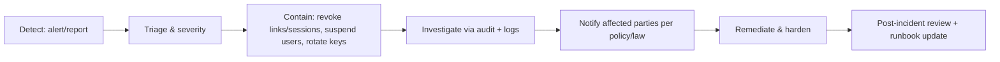

# FILE: /docs/architecture/security-and-operations.md

> **Document status:** Phase 2 architecture — security foundation, audit, observability, operations.
> **Depends on Phase 1:** [product-requirements.md](../product/product-requirements.md) (NFR-SEC-*, SEC-*, K risks), [user-roles.md](../product/user-roles.md), [workflows.md](../product/workflows.md) (§40–42).
> **Related:** [auth-and-permissions.md](./auth-and-permissions.md), [data-architecture.md](./data-architecture.md), [file-and-document-processing.md](./file-and-document-processing.md), [environments-and-delivery.md](./environments-and-delivery.md).

---

## 1. Threat model (STRIDE-lite, product-specific)

| Category | Primary threats for CloseoutFlow |
|----------|----------------------------------|
| **Spoofing** | Forged/forwarded secure links; stolen sessions; impersonating an org member. |
| **Tampering** | Altering an approved document version; forging audit; modifying another org's data. |
| **Repudiation** | "I never approved/waived that" — mitigated by complete audit. |
| **Information disclosure** | Cross-tenant leak; leaked file URLs; PII in logs/URLs; service-role exposure. |
| **Denial of service** | Upload floods; secure-link brute force; expensive OCR/AI abuse. |
| **Elevation of privilege** | IDOR; self-role escalation; RLS bypass; job trusting payload scope. |

### Highest-risk attack paths (this product specifically)
1. **Cross-tenant data access** (RLS gap / IDOR) → catastrophic confidentiality breach. *Top risk.*
2. **Secure account-free link abuse** (leak, forward, guess) → external exposure of a project's documents.
3. **Malicious file upload** (malware, MIME confusion, huge files) → infection/serving harm, cost DoS.
4. **Service-role key exposure to client** → total isolation bypass.
5. **Privilege escalation / approval by non-authorized actor (incl. AI)** → integrity/legal harm.
6. **Audit gap** → undetectable/undeniable-but-unprovable actions on legally significant records.

Every control below maps back to these paths.

---

## 2. Security controls (by risk path)

| Control | Addresses |
|---------|-----------|
| **RLS on every tenant table, default deny** | 1, 5 |
| **`authz` single source of truth + authz↔RLS parity tests** | 1, 5 |
| **UUID ids (no enumeration) + org-scoped fetches** | 1 (IDOR) |
| **Secure links: hashed tokens, short expiry, revocation, scope limit, identity confirm, rate limit** | 2 |
| **Private buckets + signed short-lived URLs only (no public URLs)** | 2, 3 |
| **Upload validation (MIME sniff, extension, size) + async malware scan → quarantine** | 3 |
| **Direct-to-storage resumable uploads (bytes bypass serverless)** | 3 (DoS) |
| **Service-role server-only; `server-only` imports; secret scanning; adapter boundary** | 4 |
| **Deny-by-default authz; no self-escalation; sensitive-action step-up MFA / two-person** | 5 |
| **AI writes only to `*_suggestion`; no AI approval path** | 5 |
| **Append-only immutable audit in separate schema** | 6 |
| **Rate limiting + brute-force lockout (Upstash)** | 2, 3 (DoS) |
| **CSP + security headers; input validation (Zod); parameterized queries; output encoding** | XSS, CSRF, SQLi, SSRF |

---

## 3. Web-attack defenses

- **XSS:** React auto-escaping; no `dangerouslySetInnerHTML` without sanitization; strict **Content-Security-Policy**; user-supplied file previews served from a separate origin/sandboxed context, never inline-executed.
- **CSRF:** Server Actions use framework CSRF protections + same-site cookies; state-changing Route Handlers require same-site/origin checks and (for external APIs later) signed tokens.
- **SQL injection:** all DB access via the typed Supabase client / parameterized queries; **no string-concatenated SQL** in app code; migrations reviewed.
- **SSRF:** integration/webhook fetches (later) use allowlists, no fetching user-supplied internal URLs, and run from the worker with egress controls; storage access is via signed URLs, not arbitrary fetch.
- **Clickjacking:** `frame-ancestors` CSP + `X-Frame-Options`.
- **Open redirect:** validated redirect targets only.

---

## 4. Secrets management

- **All secrets in environment variables**, provided by Vercel/Supabase/GitHub secret stores — **never committed** (validation: no production secrets in repo). `.env.example` documents non-secret placeholders only.
- **`packages/env`** validates presence/shape at boot; missing secrets fail fast.
- **Service-role key, webhook signing secrets, provider keys:** server-only; never `NEXT_PUBLIC_*`.
- **Gitleaks** in CI + pre-commit blocks accidental commits.
- **Rotation runbook** for key compromise; short-lived signed URLs limit blast radius.

---

## 5. Security headers & CSP

- Strict CSP (nonce-based scripts, restricted connect/img/frame-src), `Strict-Transport-Security`, `X-Content-Type-Options: nosniff`, `Referrer-Policy: strict-origin-when-cross-origin`, `X-Frame-Options`/`frame-ancestors`, `Permissions-Policy` minimizing APIs.
- Set centrally (Next.js middleware/headers config) so every route inherits them; verified by a CI header check.

---

## 6. Rate limiting & brute-force protection

- **Upstash Redis** sliding-window limits on: login, password reset, MFA attempts, secure-link resolution, upload signing, and future public API.
- **Lockout/backoff** on repeated auth/token failures; generic error messages (no user/link enumeration).
- Per-org and per-IP limits protect against noisy-neighbor and abuse.

---

## 7. Logging & sensitive-data handling

- **Structured logs (pino)** to stdout → platform log drains + Sentry breadcrumbs.
- **Never log secrets, tokens, full file contents, or unnecessary PII.** A log-scrubbing allowlist and `NFR-PRIV-002` (no PII/tokens in URLs or logs) are enforced; secure-link raw tokens are never logged.
- Logs carry `request_id` for correlation but are **not** the audit trail (see §9).

---

## 8. Encryption

- **In transit:** TLS everywhere (Vercel/Supabase managed).
- **At rest:** Postgres and Storage encrypted at rest (Supabase managed); backups encrypted.
- **Application-level:** hashed secure-link tokens; passwords handled by Supabase Auth (hashed). Field-level encryption for especially sensitive fields is a future option if a data class warrants it.

---

## 9. Audit architecture (authoritative)

**Audit events are a distinct, first-class concern — not logs, not analytics** (validation item #8).

| Concern | Store | Purpose | Mutable? | PII posture |
|---------|-------|---------|----------|-------------|
| **Audit events** | `audit.audit_events` (Postgres, separate schema) | Legal/compliance traceability of important actions | **Immutable, append-only** | Minimal, intentional, retained |
| **Application logs** | pino → log drain/Sentry | Debugging/ops | Ephemeral | Scrubbed |
| **Product analytics** | PostHog | Behavioral/product insight | Aggregable | Privacy-conscious, no sensitive doc content |

**What qualifies as an audit event:** the Phase-1 SEC-001 list — uploads, replacements/versioning, approvals, rejections, comments, requirement changes, reminder delivery, permission changes, publishing, downloads (signed-URL issuance), support access, org lifecycle, secure-link issue/revoke, status transitions on core entities.

**Event fields:** `id`, `occurred_at`, `organization_id`, `actor_type` (internal_user | external_grant | platform_admin | system/job | ai), `actor_id`, `project_id?`, `target_type`, `target_id`, `action` (dotted), `before?`/`after?` (jsonb), `request_id`, `session_id?`, `ip?`, `user_agent?`, `source` (web|worker|api), `metadata`.

**Properties:**
- **Immutable:** no UPDATE/DELETE grants; trigger-enforced; separate schema with write-only app grants.
- **Written in-transaction** with the action where feasible.
- **AI actor** may appear on *suggestion* events; there is **no audit action representing an AI approval** (AI cannot approve).
- **Retention:** long, never below legal minimums; **partition by month** when volume warrants (high-volume handling).
- **Search/export:** authorized admins can query and export their org's audit trail; platform support access is itself audited.
- **Privacy:** `before/after` store what's necessary for traceability, not entire documents; sensitive values minimized.

---

## 10. Observability (operations)

| Concern | Tool | Alerts |
|---------|------|--------|
| Errors | **Sentry** (web + worker), release-tagged | High-severity/regression → founders |
| Structured logs | **pino** → drain | Queried on incident |
| Jobs | **Inngest dashboard** | Dead-letter / failure spike → founders |
| Database | **Supabase dashboard** + slow-query logs | Connection saturation, slow queries |
| Uptime | **Better Stack**/Vercel monitors on `/api/health` | Downtime → founders |
| Performance | Vercel analytics + Sentry performance | p95 regressions |
| Email delivery | Resend dashboard + delivery-event store | Bounce/complaint spikes |
| File processing | Job metrics + failure-rate metric | Failure-rate breach |
| Security | Rate-limit hits, auth failures, secret-scan | Anomaly → founders |
| Product analytics | **PostHog** (privacy-conscious) | — |

- **Environment separation** in all tools (local/preview/staging/prod tagged; never mixed).
- **Alert priorities:** P1 (data/security/outage) → immediate founder notification; P2 (degradation) → daily digest; P3 (informational) → dashboard only.

---

## 11. Incident response (workflows §42)

- Containment primitives already exist: **revoke secure links, revoke sessions, suspend users/orgs, rotate keys, disable a tenant.**
- **Incomplete audit trail is itself a critical finding.**
- Runbook required: severity matrix, contact tree, breach-notification timelines, evidence handling.

---

## 12. Backups & restoration testing

- **Backups:** Supabase automated + PITR (paid tier); storage durability + future S3/R2 versioning. Encrypted.
- **RPO/RTO:** launch aim RPO ≤ 24h (tightening to ≤ 1h for critical data), RTO defined in the DR runbook; both validated by drills.
- **Restoration testing:** periodic restore into a scratch environment; **backups are not trusted until a restore succeeds.**
- **Org export** (ORG-005/EXP-001) provides a tenant-portable archive independent of infra backups.

---

## 13. Data retention & organization deletion

- **Retention** configurable per policy (NFR-RET); owner records retained long-term (portal longevity). Audit never deleted below legal minimums.
- **Org deletion (workflows §40):** two-person + MFA + grace period; **forced export prompt**; **explicit owner-portal continuity decision** (transfer/retain/terminate, OWNER-009) — owner access never silently lost; deletion action itself is audited even after data removal.

---

## 14. Support access & platform administration

- Platform admins: separate MFA-required identity; **no routine tenant document access.**
- **Support impersonation:** consented, time-boxed, fully audited, surfaced in the org's audit log; **break-glass** documented and alerting.
- Service-role is not a human console; it is confined to authorized server code.

---

## 15. Dependency & supply-chain security

- **Renovate** for batched updates; **security patches expedited**; `pnpm audit` + Dependabot alerts in CI.
- **License review** on new dependencies; avoid abandoned/unmaintained libraries (see [architecture-decisions.md](./architecture-decisions.md) dependency ADR).
- **Gitleaks** secret scanning; **branch protection** (required checks, no direct pushes to `main`).
- Lockfile committed; reproducible installs in CI.

---

## 16. SOC 2 readiness (path, not a launch requirement)

Foundations that make future SOC 2 achievable without rework:
- Complete audit trail; RBAC with least privilege; encryption in transit/at rest; change management via PRs + CI + migrations; access reviews via `memberships`; incident-response + backup/restore runbooks; vendor list with data-flow mapping; environment separation; secret management.
- Formal SOC 2 (evidence collection, policies, auditor) is pursued when enterprise demand justifies it; the architecture does not block it.

---

## 17. Operational runbooks required later

- Incident response & breach notification.
- Backup restoration / DR drill.
- Secret rotation (esp. service-role/webhook).
- Dead-letter job replay.
- Deploy/rollback & migration recovery.
- Org export & deletion execution.
- Support-impersonation & break-glass procedure.
- Malware/quarantine handling & release.

Runbooks live in `docs/runbooks/` and are authored as their capabilities ship.

---

*Continue to [environments-and-delivery.md](./environments-and-delivery.md).*
