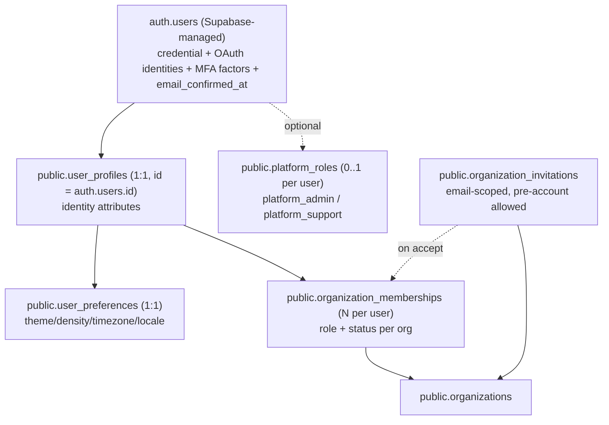

# FILE: /docs/auth/identity-and-authentication.md

> **Document status:** Phase 4A specification — identity & authentication. **Specification only.**
> **Related:** [phase-4-overview.md](./phase-4-overview.md), [permissions-and-rls.md](./permissions-and-rls.md), [phase-4-data-model.md](./phase-4-data-model.md), [account-security-and-lifecycle.md](./account-security-and-lifecycle.md), [routes-and-screens.md](./routes-and-screens.md); Phase 2 [auth-and-permissions.md](../architecture/auth-and-permissions.md).

---

## 1. Identity model

**Relationships & rules:**
- **`auth.users`** is the identity/credential record (email, password hash, OAuth identities, TOTP factors, `email_confirmed_at`, `aal`). Closeout never stores passwords.
- **Every authenticated user has exactly one `user_profiles` row** (`user_profiles.id = auth.users.id`, 1:1). See §Profile creation.
- **`user_preferences`** is 1:1 with the user (identity vs. preferences separated).
- **`organization_memberships`** is the *only* source of a user's org access (role + status per org). A user may have many memberships (multi-org).
- **`organization_invitations`** are **email-scoped** and may exist **before** the invitee has an account; on acceptance they create/reactivate a membership.
- **`platform_roles`** is a small, separate table for CloseoutFlow staff — **never** conferring org data access (see [permissions-and-rls.md §platform](./permissions-and-rls.md)).
- **Future external users** (subcontractors, reviewers, owner reps) and **secure-link grants** are **separate concepts** implemented in later phases; Phase 4 introduces none of them but the `authz` `Actor` union already reserves `external_grant`.

### Profile creation (decision)
- **Primary mechanism: an `AFTER INSERT` trigger on `auth.users`** → SECURITY DEFINER `public.handle_new_user()` inserts a minimal `user_profiles` row (`id`, `created_at`, `account_status='active'`, `onboarding_status='profile_pending'`) and a default `user_preferences` row. Idempotent (`on conflict do nothing`). *Why:* guarantees a profile exists atomically with account creation regardless of entry path (password, OAuth), avoiding “profile missing” races.
- **Defense-in-depth fallback:** a server-side **`ensureProfile()`** on the first authenticated request upserts the profile if the trigger is unavailable (e.g., managed-auth trigger restrictions). *Reconsideration trigger:* if Supabase disallows `auth.users` triggers on the plan, `ensureProfile()` becomes primary.
- Profile creation after registration is part of an **atomic expectation** ([data-model §transactions](./phase-4-data-model.md)): a user without a profile is treated as onboarding-incomplete, never as authorized.

### Attribute placement
| Attribute | Home | Notes |
|-----------|------|-------|
| email, password, OAuth identities, MFA factors, `email_confirmed_at`, `aal`, `last_sign_in_at` | **`auth.users`** (Supabase) | Verified session facts; read via `getUser()`. |
| display/first/last/preferred name, avatar, phone, account_status, onboarding_status | **`user_profiles`** | App identity. |
| theme, density, timezone, locale | **`user_preferences`** | User defaults. |
| **org-specific** job title, role, status | **`organization_memberships`** | **Never global** — job title/role differ per org. |
| platform_admin / platform_support | **`platform_roles`** | Separate from org roles. |

### Auth metadata — **never trusted for authorization**
`raw_user_meta_data` and `app_metadata` may hold non-authoritative UX hints only. **Authorization is derived exclusively from `organization_memberships` + `platform_roles` in Postgres.** The only Supabase session facts trusted are `auth.uid()` (verified user id), `email_confirmed_at` (verified), and `aal` (MFA assurance) — all validated server-side via `getUser()`. A forged/edited metadata claim must grant nothing (tested).

### Deleted/banned auth users
`user_profiles.id → auth.users(id)`. Phase 4 account removal is a **controlled app flow** ([account-security-and-lifecycle.md](./account-security-and-lifecycle.md)): request → grace → **anonymize** profile + revoke sessions + resolve owned orgs, **retaining audit**. A raw Supabase deletion/ban (support/break-glass) triggers a cleanup that anonymizes the profile and marks memberships `removed`; **audit rows are never deleted** and reference the (now anonymized) actor id.

---

## 2. Authentication methods

| Method | Phase 4 | Local-runnable | Founder cloud config |
|--------|---------|:--------------:|----------------------|
| Email + password (verified) | ✅ | ✅ (local Supabase + Mailpit) | prod SMTP/domain |
| Email verification | ✅ | ✅ (Mailpit) | prod email domain |
| Password reset | ✅ | ✅ | prod email domain |
| Google OAuth | **architecture built**, real login staging/prod | build against disabled provider locally | Google credentials |
| Microsoft (Azure) OAuth | **architecture built** | disabled locally | Microsoft credentials |
| TOTP MFA | ✅ | ✅ (authenticator app) | — |
| Sign out (current) | ✅ | ✅ | — |
| Sign out of all devices | ✅ (`signOut({ scope: 'global' })`) | ✅ | — |
| Reauthentication (sensitive) | ✅ (fresh password/MFA) | ✅ | — |
| Account recovery | recovery codes; support break-glass | ✅ (codes) | support process |
| Failed-login handling | ✅ (Upstash rate limit + generic errors + lockout backoff) | ✅ | — |
| Disabled/suspended accounts | ✅ (`account_status` gate) | ✅ | — |
| SAML/SSO | **not built** (compatibility-preserved via WorkOS-later, ADR-004) | — | later |

**OAuth architecture (built locally, real creds later):** an `/auth/callback` Route Handler performs the PKCE code exchange for **all** flows (OAuth, email verification, password recovery, email change). Identity linking: an OAuth sign-in that matches an existing verified email links to the same `auth.users`/profile; a conflict (OAuth email already tied to a password account) is handled per [account-security-and-lifecycle.md §OAuth conflict]. Local dev uses email/password + MFA; the OAuth buttons render but are disabled/hidden when provider env is absent (`OAUTH_GOOGLE_ENABLED`/`OAUTH_MICROSOFT_ENABLED` derived from env presence).

---

## 3. SSR & session architecture (Next.js App Router + `@supabase/ssr`)

**Approved pattern:** cookie-based sessions via `@supabase/ssr`, with three server client factories in a new `@closeoutflow/auth` package (built on `@closeoutflow/db`/`env`):
- `createServerClient()` — for Server Components/Server Actions/Route Handlers; reads/writes auth cookies.
- `createMiddlewareClient()` — used only inside `proxy.ts` to **refresh** the session and set cookies.
- The existing **anon** client (`@closeoutflow/db`) remains for RLS-scoped queries; **service-role** stays server-only for audit RPC + admin functions.

**Golden rule — verify, don't decode:** every authorization/protection decision calls **`supabase.auth.getUser()`** (which validates the token with Supabase), **never `getSession()` alone** (which trusts the cookie). `getSession()` may be used only for non-security UI hints.

**Request lifecycle:**
1. **`proxy.ts` (Next 16 middleware):** refreshes the session (rotates tokens, updates cookies) and applies the existing nonce CSP. It performs **coarse** redirects only (e.g., unauthenticated → `/sign-in` for `(app)` paths) as UX, **not** as the security boundary. Middleware can be bypassed, so it never makes the final call.
2. **Protected layouts (`(app)/layout.tsx`, `/account`, `/settings`):** server-side `getUser()`; if none → redirect `/sign-in?next=…` (allowlisted). Resolve **active org** ([organizations-and-memberships.md §switching](./organizations-and-memberships.md)); enforce membership.
3. **Data access:** all queries run under the **anon client with the user's cookie → RLS**. RLS is the real isolation boundary.
4. **Mutations:** Server Actions call `authz.can(...)` then perform the RLS-scoped write (or a SECURITY DEFINER transactional function), then write audit.

**Auth callback route (`/auth/callback`):** exchanges `code` for a session, then redirects to a **server-validated relative path** (`next` param allowlisted to in-app routes; absolute/external → `/`). Handles OAuth, email confirmation, recovery, and email-change confirmations.

**Cache:** authenticated routes are dynamic (root is already `force-dynamic` for the nonce); **no caching of user/org data**; `getUser()` per request avoids stale identity. Public auth pages may be static.

**Sign-out:** a Server Action calls `signOut()` (clears cookies) + writes `auth.signed_out`; "sign out everywhere" uses `scope: 'global'`.

**Password change:** requires reauth; on success, **revoke other sessions** (`scope: 'others'`/global) and notify the user (email). See [account-security-and-lifecycle.md](./account-security-and-lifecycle.md).

**Where security decisions live:**
| Layer | Responsibility |
|-------|----------------|
| **PostgreSQL (RLS + SECURITY DEFINER functions)** | Tenant isolation; membership/role/permission enforcement; ownerless prevention; suspended-member/org denial; transactional integrity; audit writes. **The authoritative boundary.** |
| **Server (layouts, Server Actions, Route Handlers, `authz`)** | `getUser()` verification; active-org resolution; `authz.can()`; redirects + open-redirect prevention; rate limiting; reauth/MFA gating; audit orchestration. |
| **Browser** | Optimistic UI, form UX, theme — **never trusted for protection**. No org id or role from the client is authoritative. |

---

## 4. Email verification

- New email/password sign-ups are **unverified** until they confirm via the Supabase-sent verification email (link → `/auth/callback` → `/verify-email` success). `email_confirmed_at` gates access: unverified users reach only `/verify-email` (resend, change email) and sign-out.
- Resend is **rate-limited** ([invitations-onboarding-and-email.md §rate limits](./invitations-onboarding-and-email.md)). OAuth sign-ups are pre-verified by the provider.
- Audit: `auth.registered`, `auth.email_verified`.

## 5. Password reset

- `/forgot-password` (email) → Supabase recovery email → link → `/auth/callback` (recovery) → `/reset-password` (set new password, requires the recovery session) → success + **revoke other sessions** + notify.
- Reset links **expire** (Supabase default; documented) and are **single-use**. Generic success messaging (“If an account exists, we sent a link”) to resist enumeration. Rate-limited by email+IP.
- Audit: `auth.password_reset_requested`, `auth.password_changed`.

## 6. OAuth (Google + Microsoft)

- Sign-in/up via provider → `/auth/callback` PKCE exchange → session → onboarding/dashboard. Email from a trusted provider is treated as verified.
- **Account linking:** same verified email → same identity. **Conflict** (provider email already a password account, or two providers same email): present a clear “sign in with your existing method” path; never silently merge credentials. (Full linking UX may be minimal in Phase 4; conflicts fail safe.)
- Local dev: providers **disabled** unless env present; **no production OAuth creds required locally**.
- Audit: `auth.oauth_linked` (first link), `auth.signed_in` with `method='oauth:google|microsoft'`.

## 7. Multi-factor authentication (TOTP)

- **TOTP** via Supabase MFA (AAL1→AAL2). Enroll (`/account/security`): QR + verify code → factor active; issue **one-time recovery codes** (shown once, **hashed at rest** in `user_profiles`/dedicated table). Challenge on sign-in when a verified factor exists.
- **Reauthentication** for sensitive actions requires AAL2 when MFA is enrolled (fresh challenge regardless of session age) — see [permissions-and-rls.md §sensitive actions](./permissions-and-rls.md).
- Factor removal requires reauth + audit. **Lost factor** → recovery codes; if also lost → identity-verified **support/break-glass** (audited) — **no insecure self-service reset**.
- **Mandatory for:** platform admins; **ownership transfer**. **Optional (recommended)** for members; **org-MFA-policy** field reserved on `organizations` (enforced in a later phase; the column exists so policy can be toggled without a migration).
- Audit: `auth.mfa_enrolled`, `auth.mfa_removed`, `auth.mfa_challenge_failed` (throttled).

## 8. Session management & reauthentication

- Sessions are Supabase-managed (access + refresh cookies, HTTP-only, Secure, SameSite=Lax). Refresh in `proxy.ts`. Idle/absolute lifetime per Supabase config (documented).
- **Session listing/revocation:** Supabase does not expose a rich per-device session list via the client; Phase 4 supports **“sign out of all other devices”** (global revoke) and current-session sign-out reliably. An optional `user_session_metadata` table (best-effort, populated on sign-in with coarse device/IP hints for the security screen) is **deferred unless justified** ([data-model](./phase-4-data-model.md) marks it optional). The `/account/sessions` screen shows the current session + a global "sign out everywhere" always, and a best-effort recent-activity list if `user_session_metadata` is adopted.
- **Reauthentication:** sensitive actions (change password/email, remove MFA, transfer ownership, delete org/account, change/remove owner) require a **fresh** credential check (password re-entry and/or AAL2). Implemented via Supabase reauthentication + an `authz` `mfaAge`/`sessionAge`/`aal` input.

## 9. Account recovery

- Password: reset flow (§5). MFA-locked: recovery codes → support break-glass. Email-locked (lost inbox): support-verified process (documented, audited) — never a self-service email swap without verification.

## 10. Platform-administrator authentication

- Same Supabase Auth accounts, **plus** a `platform_roles` record and **mandatory MFA** (enforced server-side: platform actions require AAL2). Platform admins **do not** gain org data access from this role (see [permissions-and-rls.md §platform](./permissions-and-rls.md)). Sign-in is standard; platform capabilities appear only in a separate platform-admin surface (out of the tenant shell) and are all audited. **Break-glass** access is documented, MFA-gated, alerting, and audited.

## 11. Security requirements (auth-specific)

- Verified `getUser()` for all gates; no `getSession()`-only protection; no client-only guards.
- Secure cookies (HTTP-only/Secure/SameSite); token refresh in middleware; global revoke on password change.
- Generic, non-enumerating error messages; rate limiting on all auth endpoints ([account-security §rate limits] / [invitations §rate limits]).
- Open-redirect prevention: `next`/callback targets allowlisted to relative in-app paths.
- Suspended `account_status` and suspended memberships/orgs are denied at the DB layer (RLS) and surfaced with clear UX.
- Secrets/tokens/passwords never logged (pino redaction) or placed in URLs/analytics.

## 12. Threat scenarios

| Scenario | Defense |
|----------|---------|
| Forged JWT/metadata claims org access | Authorization from DB memberships only; metadata non-authoritative; parity + forgery tests. |
| `getSession()`-only gate bypass (edited cookie) | `getUser()` verification everywhere; e2e asserts protected routes reject tampered/absent sessions. |
| Direct navigation to protected route | Server layout `getUser()` + RLS; middleware redirect is secondary. |
| Cross-tenant read via missing filter | Forced RLS keyed on membership; pgTAP isolation matrix. |
| Open redirect via `next`/OAuth callback | Relative-path allowlist; reject external/absolute. |
| Password-reset/invite enumeration | Generic responses, rate limiting, hashed tokens. |
| Stolen session | Idle/absolute expiry, reauth on sensitive actions, global revoke on password change, MFA. |
| MFA bypass on sensitive action | AAL2 required (fresh) when enrolled; platform/ownership always AAL2. |
| Service-role leakage to client | Server-only, `server-only` import guard + build test; confined to audit RPC/admin functions. |
| Suspended user still acting | `account_status`/membership status checked in RLS + server; session revoke on suspension (best-effort) + immediate DB denial. |
| Profile-missing race granting access | No profile / no active membership ⇒ onboarding state, never authorized. |

---

*Continue to [organizations-and-memberships.md](./organizations-and-memberships.md).*
