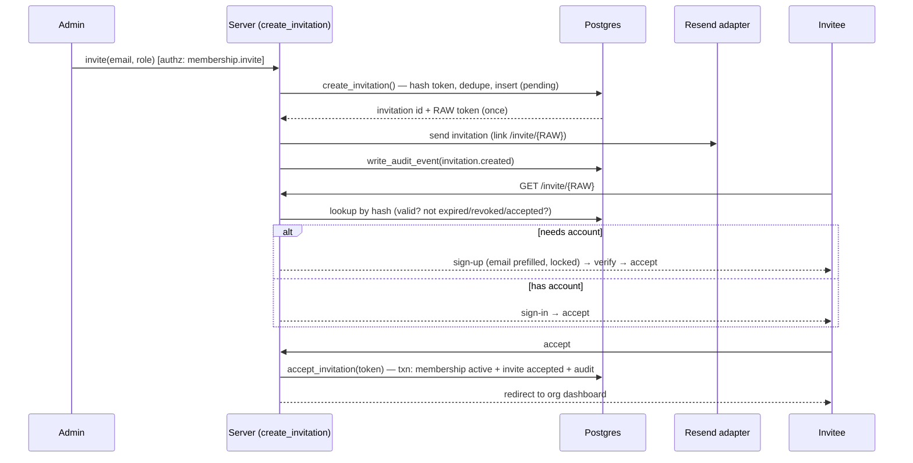
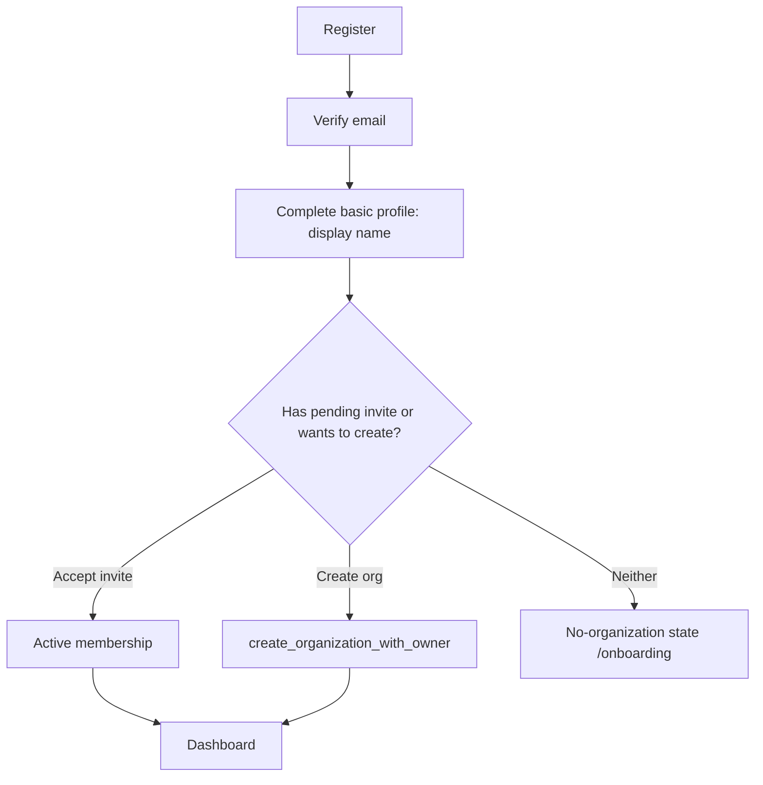

# FILE: /docs/auth/invitations-onboarding-and-email.md

> **Document status:** Phase 4A specification — invitations, onboarding, email. **Specification only.**
> **Related:** [organizations-and-memberships.md](./organizations-and-memberships.md), [permissions-and-rls.md](./permissions-and-rls.md), [phase-4-data-model.md](./phase-4-data-model.md), [routes-and-screens.md](./routes-and-screens.md), [audit-events.md](./audit-events.md); Phase 2 [background-jobs-and-notifications.md](../architecture/background-jobs-and-notifications.md) (Resend + email adapter seam).

---

## 1. Invitation flow

## 2. Token design

- **High entropy:** ≥256-bit random, URL-safe. The **raw token appears only in the emailed link** (`/invite/[token]`); the DB stores **only `token_hash` (sha-256)**. A DB leak yields no usable links.
- **Scoped:** bound to `organization_id` + `email` + `role`.
- **Expiring:** `expires_at` (default **14 days**; configurable).
- **Revocable:** `revoked_at` → immediate fail-closed.
- **Single-use:** `accepted_at` set on first success; re-use is a no-op returning the existing membership (idempotent).
- **Enumeration-resistant:** no client SELECT by email/token; lookup only inside `accept_invitation()` (definer, hash); generic errors (“This invitation is no longer valid”); **rate-limited**; **never logged** (excluded from pino + analytics).
- **Rotation:** resend generates a new token+hash+expiry and invalidates the prior.

## 3. Acceptance — existing user vs new user

- **Existing user:** `/invite/[token]` → if authenticated with the **matching verified email**, show accept CTA → `accept_invitation`. If authenticated as a **different** user/email → clear “This invite is for you@example.com; sign out to accept” (no silent cross-account accept).
- **New user (before sign-up):** `/invite/[token]` → sign-up with **email prefilled and locked to the invite email** → verify email → auto-return to accept → `accept_invitation`. The invitation survives the sign-up round trip (token in the return URL / short-lived server state).
- **Email mismatch:** acceptance requires the authenticated user’s **verified** email == invite email (citext). Mismatch → rejected with guidance; never bind the invite to a non-matching account.
- **Acceptance auto-creates an active membership** (decision): no second approval — the admin already authorized the invite; requiring approval-on-accept adds friction with no security gain. (A future org setting could add approval; not in Phase 4.)

## 4. Resend, revoke, expiration, duplicates

- **Resend:** rotates token+expiry (audit `invitation.resent`); rate-limited.
- **Revoke:** `revoked_at` (audit `invitation.revoked`); link fails closed; optional “invitation revoked” email (off by default).
- **Expiration:** past `expires_at` → treated as expired; acceptance rejected; admin may resend.
- **Duplicates:** partial unique `(organization_id, lower(email)) where status='pending'` prevents multiple live invites to the same email/org; inviting an already-**active member** is rejected with a clear message; inviting a **removed** member creates a pending invite that, on accept, **reactivates** their membership.
- **Multiple pending invitations (different orgs):** allowed — an invitee may hold invites from several orgs; each is independent.
- **Changed role before acceptance:** admin revokes+reissues (or a guarded edit) with the new role (audited).
- **Suspended organization:** invitations cannot be **created or accepted** (org-status guard).
- **Removed inviter:** invitation remains valid (org-scoped); audit records the original `invited_by`.

## 5. Onboarding

- **Complete when:** profile has `display_name` **and** ≥1 **active** membership (`onboarding_status='complete'`). Derived from data → **resumable** (interrupted onboarding continues from the missing step).
- **Skipping optional steps:** avatar/phone/preferences are optional; only display name + one membership are required to finish.
- **Multiple invitations:** `/select-organization` lists pending invites + existing memberships; user accepts one or more.
- **No organization:** `/onboarding` offers **Create organization** or **enter an invite** (paste code / open link).
- **Removed from final org:** returns to no-org state; existing profile retained.
- **Invited user already in another org:** accepting adds a second membership (multi-org); lands in the newly joined org (active-org cookie set).

## 6. Email-template inventory (Phase 4)

Sender identity **Closeout** (`Closeout <no-reply@mail.closeoutflow.com>` in prod; Mailpit locally). All: single clear CTA, expiration note where relevant, **plain-text + HTML** (React Email via the `packages/email` adapter), accessible (semantic, sufficient contrast, meaningful link text), **no secrets** (only the one-time action link; no passwords/codes in body beyond the link), **branded Closeout**, prod links to `closeoutflow.com`.

| Email | Sent by | Subject direction | CTA | Expiry | Sensitive-data rule |
|-------|---------|-------------------|-----|:-----:|---------------------|
| Verify email | **Supabase Auth** (templated) | “Confirm your email for Closeout” | Confirm email | link TTL | link only |
| Reset password | **Supabase Auth** | “Reset your Closeout password” | Reset password | link TTL | link only; generic |
| Email changed | Supabase (to old + new) | “Your Closeout email was changed” | (informational) | — | no new email in body to old addr beyond notice |
| Organization invitation | **App (Resend)** | “You’re invited to {Org} on Closeout” | Accept invitation | 14 days | token only in link |
| Invitation reminder | App (Resend) | “Reminder: your Closeout invitation” | Accept invitation | remaining | link only |
| Invitation revoked (optional) | App | “An invitation was revoked” | — | — | no token |
| Password changed | App/Supabase | “Your Closeout password was changed” | Secure account | — | no credential |
| MFA changed | App | “Two-factor was {enabled/disabled}” | Review security | — | no factor secret |
| New sign-in (optional/config) | App | “New sign-in to your Closeout account” | Review activity | — | coarse device/IP only |
| Ownership transfer (initiated/completed) | App | “Ownership of {Org} …” | Review / Accept | transfer TTL | no token in completed |
| Member removed/suspended | App | “Your access to {Org} changed” | Contact admin | — | no internal notes |
| Security alert | App | “Security alert for your Closeout account” | Secure account | — | minimal detail |

**Which are Supabase-native vs app-sent:** verify/reset/email-change/OAuth confirmations use **Supabase Auth email** (configure Supabase SMTP → Resend + branded templates in the founder step). **Invitations, security notifications, membership/ownership emails** are **app-sent via the Resend adapter** so Closeout controls content/branding.

## 7. Email branding

- Visible product name **Closeout** everywhere; wordmark/logo per Phase 3; footer with Closeout + support link; links to `app.closeoutflow.com`/`closeoutflow.com` in prod. **Never** “CloseoutFlow” in visible copy (internal identifiers unchanged). Plain-text alternative required (deliverability + accessibility). SPF/DKIM/DMARC per [environments-and-delivery.md](../architecture/environments-and-delivery.md) (founder step).

## 8. Rate limits (Upstash adapter seam)

Sliding-window limits; **keys hash the identifier** (email/IP/user id) — never store raw secrets/tokens.

| Action | Suggested limit (tune) | Key |
|--------|------------------------|-----|
| Sign up | 5 / hour / IP; 3 / day / email-hash | ip, email-hash |
| Sign in | 10 / 10 min / IP; lockout backoff / email-hash | ip, email-hash |
| Password reset request | 3 / hour / email-hash + IP | email-hash, ip |
| Verification resend | 3 / hour / user | user id |
| Invitation create | 50 / hour / org; 200 / day / org | org id |
| Invitation resend | 5 / hour / invitation | invitation id |
| Invitation acceptance | 10 / 10 min / IP | ip |
| OAuth callback | 20 / 10 min / IP | ip |
| MFA attempts | 5 / 10 min / user (then lock) | user id |
| Organization creation | 5 / day / user | user id |
| Role change / member admin | 100 / hour / org | org id |
| Ownership transfer | 3 / day / org | org id |
| Account recovery | 3 / day / email-hash | email-hash |

Exceeding a limit → generic “Too many attempts, try again later” (no enumeration), audited where security-relevant (`auth.rate_limited` optional).

## 9. Audit events (invitation/onboarding subset)

`invitation.created`, `invitation.resent`, `invitation.revoked`, `invitation.accepted`, `membership.activated`, `organization.created` — full catalog in [audit-events.md](./audit-events.md).

## 10. Error states (invitation/onboarding)

Invalid/expired/revoked/already-accepted token → clear, generic “This invitation link is no longer valid — ask an admin to resend.” Email mismatch → “This invitation is for another email.” Suspended org → “This organization isn’t accepting invitations right now.” No-org after removal → onboarding. Full matrix in [routes-and-screens.md §error states](./routes-and-screens.md) and [account-security-and-lifecycle.md](./account-security-and-lifecycle.md).

---

*Continue to [routes-and-screens.md](./routes-and-screens.md).*
