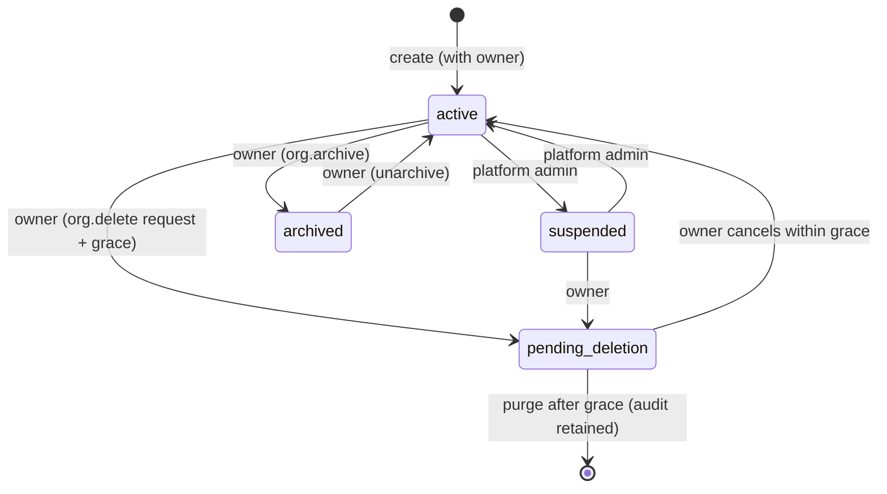
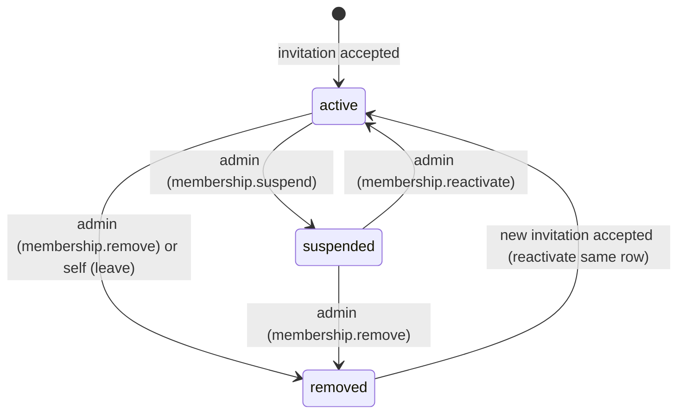
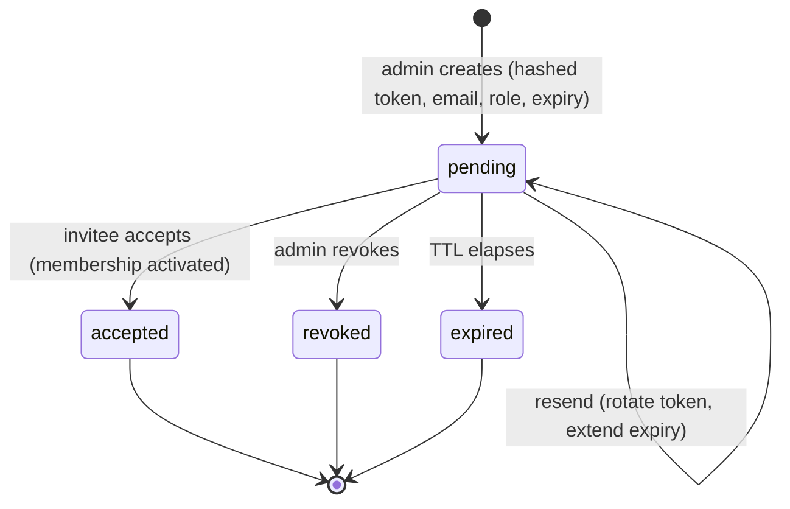

# FILE: /docs/auth/organizations-and-memberships.md

> **Document status:** Phase 4A specification — organizations, memberships, roles, ownership, switching, lifecycle. **Specification only.**
> **Related:** [phase-4-overview.md](./phase-4-overview.md), [permissions-and-rls.md](./permissions-and-rls.md), [phase-4-data-model.md](./phase-4-data-model.md), [invitations-onboarding-and-email.md](./invitations-onboarding-and-email.md); Phase 1 [user-roles.md](../product/user-roles.md), [statuses.md](../product/statuses.md).

---

## 1. Organization model

`organizations` (fields; full schema in [phase-4-data-model.md](./phase-4-data-model.md)):

| Field | Phase 4 | Notes |
|-------|:------:|-------|
| `id` (uuid pk) | required | |
| `display_name` | **required** | visible name (Closeout UI). |
| `legal_name` | optional | for later docs/billing. |
| `slug` | **required, unique** | generated; URL-safe; used for references, **not** for access. |
| `logo_url` | optional (later) | branding (Phase 14 owner portal); reserved. |
| `primary_domain` | optional | future SSO/allowlist hint; **never** auto-joins users in Phase 4. |
| `timezone` | required (default) | org default. |
| `default_locale` | required (default `en-US`) | |
| `status` | required | `active` / `suspended` / `archived` / `pending_deletion`. |
| `requires_mfa` | required (default false) | **reserved** org-MFA policy; enforced later. |
| `onboarding_status` | optional | `active` once first member + settings exist. |
| `created_at` / `updated_at` | required | |
| `archived_at` / `suspended_at` / `deletion_requested_at` | nullable | lifecycle timestamps. |

**Owner is NOT a column** — ownership is the `owner` **membership role** (avoids denormalized/ownerless drift). Enforced by a **partial unique index** ensuring ≤1 active `owner` per org.

**Required now vs later:** required now — `display_name`, `slug`, `timezone`, `default_locale`, `status`. Later — `logo_url`, `primary_domain`, rich branding, address fields, billing identifiers (Phase 16). Address/office/division fields are **deferred** (offices/divisions are Phase 5+); Phase 4 keeps organizations flat.

**Slug:** generated from `display_name` (lowercase, kebab, ASCII-folded) + numeric suffix on collision; globally unique. Slug **changes** allowed by admins (audited); Phase 4 does **not** implement slug-history redirects (not needed while org context is cookie-based, §switching).

**Duplicate organizations:** display names may duplicate (different companies/regions); uniqueness is by `id`/`slug` only. Creating a second org with the same name is allowed (audited).

### Organization lifecycle

- **Creation:** atomic — org row + owner membership (+ audit) in one transaction (SECURITY DEFINER `create_organization_with_owner`). See [data-model §transactions](./phase-4-data-model.md).
- **Suspension:** **platform-admin only** (customer support/abuse). Suspended org → **all members denied data access** by RLS; owner may still see a “suspended” banner + billing/appeal path (later). Audit `organization.suspended`.
- **Archival:** owner action; read-only org (members retain read, no mutations); reversible. Audit `organization.archived`.
- **Deletion:** owner action; **request → grace period (default 30 days) → purge**; requires reauth + MFA + typed confirmation; **export readiness** (a later export job) is reserved. Audit `organization.deletion_requested` (and `…_cancelled` / `…_completed`). Audit rows are **retained** past purge.

---

## 2. Membership model

`organization_memberships` (fields in [data-model](./phase-4-data-model.md)): `id`, `organization_id`, `user_id`, `role`, `status`, `invited_by`, `job_title` (org-specific, optional), `joined_at`, `created_at`, `updated_at`, `suspended_at`, `removed_at`, `removal_reason`.

- **Unique:** one membership per `(user_id, organization_id)` (unique constraint). Rejoining reactivates the same row (history preserved), it does not create a duplicate.
- **Invitation is a SEPARATE entity** ([invitations-onboarding-and-email.md](./invitations-onboarding-and-email.md)) — **not** a membership status — because an invitee may have **no account yet** (no `user_id`), and invitations have their own token/expiry/revocation lifecycle. Acceptance creates/reactivates an `active` membership.

### Membership statuses

`active` · `suspended` · `removed`. **“left”** is modeled as `removed` with `removal_reason='left'` (self-initiated) — a flag, not a separate status — so the state machine stays simple while preserving “who left vs. was removed.” (`invited` is **not** a membership status; it lives on the invitation entity.)

- **Active:** full role-based access.
- **Suspended:** **denied all org data access** by RLS (may see only a “your access is suspended” state); sessions best-effort revoked for that org context; reversible.
- **Removed:** no access; row retained for history/audit; may be reactivated by accepting a fresh invitation.
- **Leaving voluntarily:** `membership.leave` (self) → `removed` (reason=left). **The sole owner cannot leave** — must transfer ownership first (guarded).
- **User deletion:** memberships → `removed`; owned orgs must be transferred or deleted first ([account-security-and-lifecycle.md](./account-security-and-lifecycle.md)).
- **Organization deletion:** memberships purged with the org after grace (audit retained).

### Future project/review impact (conceptual only)
When a member is suspended/removed, their **future project assignments and reviews** (Phase 5+) will be flagged for reassignment; Phase 4 records the membership change + audit, and later phases read that state. **No project tables are created now.**

---

## 3. Organization roles (Phase 4 capabilities)

Six org roles (preserving [user-roles.md](../product/user-roles.md)). Phase 4 capabilities are **org-level only**; PM/Coordinator/Reviewer carry the label now so Phase 5 can attach **project scopes** without re-inviting.

| Role | Phase 4 capabilities | NOT in Phase 4 |
|------|----------------------|----------------|
| **Owner** | Everything org-level: view/update org, manage members + roles, transfer ownership, archive/delete org, view audit, manage security/MFA policy, manage own profile. Exactly one active owner. | billing (Phase 16), projects (Phase 5). |
| **Administrator** | View/update org settings; invite/suspend/reactivate/remove members; change roles (**except** to/from `owner`, and cannot remove/suspend the owner); manage invitations; view audit. | transfer ownership, delete org, change owner. |
| **Project Manager** | Member-level now: view org, view team/members, manage own profile/preferences. **(Gets project-management scopes in Phase 5.)** | manage members/roles/settings. |
| **Closeout Coordinator** | Same as PM at org level now. **(Gets coordination scopes in Phase 5.)** | member/role/settings management. |
| **Internal Reviewer** | Same as PM at org level now. **(Gets review scopes in Phase 9.)** | member/role/settings management. |
| **Viewer** | Read-only: view org, view members; manage own profile. | any mutation of org/members. |

**Role ordering (Phase 4 effective power):** Owner > Administrator > {Project Manager = Closeout Coordinator = Internal Reviewer} ≈ Viewer(read-only). The three “functional” roles differ from Viewer only in **reserved future project capability**, not Phase-4 org powers. This is intentional — we do not fabricate project behavior to differentiate them now.

---

## 4. Ownership (final model)

**Single primary owner per organization.** Rationale: simplest, matches [user-roles.md](../product/user-roles.md) (one Org Owner), and structurally prevents ambiguity; “backup ownership” is served by the **transfer flow** + **platform break-glass**, not by multiple owners.

**Invariants (enforced in DB):**
- Partial unique index: **at most one** `role='owner' AND status='active'` per org.
- **Last-owner guard** in every membership-mutation function: cannot remove, suspend, downgrade, or (self-)leave the sole owner. → **ownerless is impossible.**

**Transfer (two-step, safe):** `organization_ownership_transfers` row (id, org, from_user, to_user, status, initiated_at, responded_at, expires_at).
1. Current owner initiates → target must be an **existing active member** (Owner selects; typically promoted to Admin first or directly). Requires **reauth + MFA**.
2. Target **accepts** (recommended, so ownership isn’t dumped) within an expiry, or declines/expires.
3. On accept: **atomic swap** — target’s membership role → `owner`; former owner’s role → `administrator`; transfer → `completed`; audit `organization.ownership_transfer_completed`. (SECURITY DEFINER `complete_ownership_transfer`.)

**Edge cases:** owner suspension/removal by an admin is **blocked** (owner-protected); owner account deletion **requires transfer or org deletion first**; if an owner is genuinely lost (no transfer possible), **platform break-glass** assigns ownership to a verified admin (audited). Pending transfer + owner leaves → blocked until resolved. MFA + reauth + audit on all ownership changes.

---

## 5. Invitation lifecycle (summary; detail in [invitations doc](./invitations-onboarding-and-email.md))

Statuses align with [statuses.md §F](../product/statuses.md): `pending`(≈Pending/Active link) → `accepted` / `expired` / `revoked`. Acceptance is **transactional + idempotent** and **auto-creates/reactivates** an active membership (no second approval).

---

## 6. Member lifecycle & administration

Actions (permissions in [permissions-and-rls.md](./permissions-and-rls.md)): **invite** (`membership.invite`), **resend/revoke invitation**, **change role** (`membership.change_role`), **suspend** (`membership.suspend`), **reactivate**, **remove** (`membership.remove`), **leave** (self, `membership.leave`), **transfer ownership** (`organization.transfer_ownership`). Bulk actions **deferred**.

**Safeguards:**
- **Last-owner** and **last-admin** guards (an org must retain at least the owner; removing the last admin path is allowed only if the owner remains — the owner is always a super-admin).
- **Self-removal restrictions:** anyone may leave **except** the sole owner (transfer first).
- **Confirmation UX:** role changes and removals require a confirm dialog ([patterns.md §16](../design/patterns.md)); owner/security-affecting changes require **reauth + MFA**.
- **Audit** on every action ([audit-events.md](./audit-events.md)); **notification** to affected user + admins ([invitations doc §emails](./invitations-onboarding-and-email.md)).

---

## 7. Organization switching (final model)

**Active organization = a server-validated cookie preference** (`cof-active-org` holding an org id), **re-checked against `organization_memberships` on every request**. **Not** path- or subdomain-based.

*Why:* simplest scalable model that fits the existing header org switcher and non-org-in-path routes (`/settings/team`), avoids per-org URL rewrites/subdomain infra, and keeps a shareable link stable. **Reconsideration trigger:** if cross-org deep-linking/shared URLs become important, move to `/o/[slug]/…` path scoping (the membership check is unchanged; only URL derivation differs).

**Rules:**
- The cookie is a **preference, never proof of access.** Each request resolves the active org by: cookie org id → confirm the user has an **active** membership → use it; else pick the most-recently-active membership; else route to `/select-organization` (or `/onboarding` if none).
- **One org:** auto-selected (no switcher UI needed, but header still shows it).
- **Multiple orgs:** header switcher (Phase 3 shell) + command palette “Go to organization…”; switching = a Server Action that sets the cookie (+ optional audit) and revalidates.
- **Suspended/removed membership or deleted/suspended org** for the active cookie → drop it, fall back or `/select-organization`.
- **Cross-tab:** cookie shared; new requests in other tabs see the switch (acceptable).
- **Stale context:** server re-validates each request; a stale/invalid cookie can never grant access (RLS + membership check).
- **Safe redirect** after switch: to a known in-app path (allowlisted), default `/dashboard`.

**Org identity belongs in:** **session/cookie preference validated server-side** (final). Not path, not subdomain, not client-trusted.

---

## 8. Onboarding (summary; detail in [invitations doc §onboarding](./invitations-onboarding-and-email.md))

Register → verify email → complete basic profile (display name) → **create org OR accept invitation** → dashboard → optionally invite teammates. **Onboarding complete** when the profile has a display name **and** the user has ≥1 **active** membership. Derived from data (stateless), so it resumes naturally. **No-organization state** routes to `/onboarding` (create/join). A user removed from their final org returns to the no-org state.

---

## 9. Suspension / removal / leaving / deletion — quick reference

| Event | Actor | Effect | Guard | Audit |
|-------|-------|--------|-------|-------|
| Suspend member | Admin/Owner | RLS-denied; sessions best-effort revoked | not the owner | `membership.suspended` |
| Reactivate | Admin/Owner | access restored | — | `membership.reactivated` |
| Remove member | Admin/Owner | `removed`; access gone; history kept | not last owner | `membership.removed` |
| Leave | Self | `removed(reason=left)` | not sole owner | `membership.left` |
| Transfer ownership | Owner→member | role swap | target accepts; reauth+MFA | `ownership_transfer_*` |
| Suspend org | Platform admin | all members denied | — | `organization.suspended` |
| Archive org | Owner | read-only | — | `organization.archived` |
| Delete org | Owner | grace → purge | reauth+MFA+confirm | `organization.deletion_requested` |

---

*Continue to [permissions-and-rls.md](./permissions-and-rls.md).*
