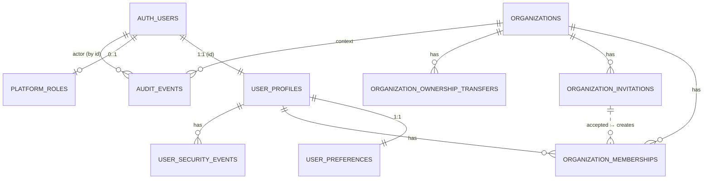

# FILE: /docs/auth/phase-4-data-model.md

> **Document status:** Phase 4A specification — conceptual schema, functions, transactions, migration plan. **No production SQL. No fake project/document tables.**
> **Related:** [permissions-and-rls.md](./permissions-and-rls.md), [organizations-and-memberships.md](./organizations-and-memberships.md), [audit-events.md](./audit-events.md); Phase 2 [data-architecture.md](../architecture/data-architecture.md) (conventions: UUID pk, `timestamptz` UTC, `created_at`/`updated_at` + `set_updated_at()` trigger, snake_case, forced RLS, denormalized `organization_id`, text+check for evolvable enums, append-only migrations).

**Conventions inherited (do not restate per table):** UUID `id` default `gen_random_uuid()`; `created_at`/`updated_at timestamptz not null default now()` with the existing `set_updated_at()` trigger; all times UTC; **status/role columns are `text` + `check`** (consistent with the existing `audit.audit_events`; easier to evolve than PG enums); every tenant-owned table carries `organization_id`; **RLS enabled + forced** on all; no business (project/document/requirement) tables.

---

## 1. Conceptual entity model (ER)

---

## 2. Proposed Phase 4 tables

### 2.1 `public.user_profiles`
- **Purpose:** durable application identity for each auth user.
- **Columns:** `id uuid pk` (= `auth.users.id`, FK), `display_name text`, `first_name text`, `last_name text`, `preferred_name text`, `avatar_url text`, `phone text`, `account_status text not null default 'active' check in ('active','suspended','deleted')`, `onboarding_status text not null default 'profile_pending' check in ('profile_pending','org_pending','complete')`, `recovery_codes_hash text[]` *(or a child table)*, `created_at`, `updated_at`, `deleted_at timestamptz null`.
- **Keys/constraints:** pk `id`; FK `id → auth.users(id) on delete cascade` *(app deletion flow anonymizes first; cascade is the last-resort integrity backstop)*; `check` on statuses.
- **Indexes:** pk; partial `where account_status='active'` (optional).
- **Org ownership:** none (user-scoped). **RLS:** self + shared-active-org read; self update; no direct insert/delete (§permissions 5.1). **Audit:** `profile.updated`, deletion events.

### 2.2 `public.user_preferences`
- **Purpose:** persisted UI/personal preferences (Phase 3 theme/density become durable).
- **Columns:** `user_id uuid pk` (FK `→ auth.users(id) on delete cascade`), `theme text not null default 'system' check in ('light','dark','system')`, `density text not null default 'comfortable' check in ('comfortable','compact')`, `timezone text`, `locale text not null default 'en-US'`, `created_at`, `updated_at`.
- **RLS:** self only. **Audit:** not required (low-sensitivity; optional).

### 2.3 `public.organizations`
- **Purpose:** tenant boundary.
- **Columns:** `id uuid pk`, `display_name text not null`, `legal_name text`, `slug text not null`, `logo_url text`, `primary_domain text`, `timezone text not null default 'America/New_York'`, `default_locale text not null default 'en-US'`, `status text not null default 'active' check in ('active','suspended','archived','pending_deletion')`, `requires_mfa boolean not null default false`, `onboarding_status text not null default 'active'`, `created_at`, `updated_at`, `archived_at`, `suspended_at`, `deletion_requested_at`.
- **Keys/constraints:** pk; **unique `slug`**; `check` status; `check` non-empty display_name.
- **Indexes:** unique(`slug`); `status`.
- **RLS:** member SELECT; Owner/Admin update; inserts/status via functions (§5.3). **Audit:** created/updated/archived/suspended/deletion_requested.

### 2.4 `public.organization_memberships`
- **Purpose:** the sole source of org access (role + status per user per org).
- **Columns:** `id uuid pk`, `organization_id uuid not null` (FK `→ organizations(id) on delete cascade`), `user_id uuid not null` (FK `→ auth.users(id) on delete cascade`), `role text not null check in ('owner','administrator','project_manager','closeout_coordinator','internal_reviewer','viewer')`, `status text not null default 'active' check in ('active','suspended','removed')`, `job_title text`, `invited_by uuid null` (FK `→ auth.users(id)`), `removal_reason text null check in ('left','removed_by_admin','account_deleted','org_deleted')`, `joined_at timestamptz`, `created_at`, `updated_at`, `suspended_at`, `removed_at`.
- **Keys/constraints:** pk; **unique `(organization_id, user_id)`** (one membership per user per org); **partial unique index `(organization_id) where role='owner' and status='active'`** (≤1 active owner → ownerless-prevention backstop).
- **Indexes:** `(user_id, status)` (list a user’s active orgs); `(organization_id, status)`; `(organization_id, role)`.
- **RLS:** self + same-org member list; changes via permission + functions (§5.4). **Audit:** invited/activated/role_changed/suspended/reactivated/removed/left.

### 2.5 `public.organization_invitations`
- **Purpose:** pre-account, email-scoped invitations (separate from memberships).
- **Columns:** `id uuid pk`, `organization_id uuid not null` (FK on delete cascade), `email citext not null` *(case-insensitive; requires `citext` extension)*, `role text not null check in (…roles…)`, `status text not null default 'pending' check in ('pending','accepted','revoked','expired')`, `token_hash text not null` *(sha-256 of a high-entropy token; raw never stored)*, `invited_by uuid not null` (FK `→ auth.users(id)`), `accepted_by uuid null` (FK), `expires_at timestamptz not null`, `accepted_at`, `revoked_at`, `created_at`, `updated_at`.
- **Keys/constraints:** pk; **unique `token_hash`**; **partial unique `(organization_id, email) where status='pending'`** (one live invite per email per org); `check` status; `check` role.
- **Indexes:** unique(`token_hash`); `(organization_id, status)`; `(email, status)`.
- **RLS:** Owner/Admin SELECT (their org); **no client SELECT-by-token/email**; acceptance via `accept_invitation(token)` (definer, hash lookup). **Audit:** created/resent/revoked/accepted/expired.

### 2.6 `public.organization_ownership_transfers`
- **Purpose:** two-step, accepted ownership transfer.
- **Columns:** `id uuid pk`, `organization_id uuid not null` (FK on delete cascade), `from_user uuid not null` (FK), `to_user uuid not null` (FK), `status text not null default 'pending' check in ('pending','accepted','declined','cancelled','expired')`, `initiated_at`, `responded_at`, `expires_at timestamptz not null`, `created_at`, `updated_at`.
- **Keys/constraints:** pk; **partial unique `(organization_id) where status='pending'`** (one pending transfer per org).
- **Indexes:** `(organization_id, status)`; `(to_user, status)`.
- **RLS:** from/to users + admins view; mutations via functions. **Audit:** initiated/completed/declined/cancelled/expired.

### 2.7 `public.platform_roles`
- **Purpose:** CloseoutFlow-staff platform roles, separate from org roles.
- **Columns:** `user_id uuid pk` (FK `→ auth.users(id) on delete cascade`), `role text not null check in ('platform_admin','platform_support')`, `granted_by uuid null`, `created_at`, `updated_at`.
- **RLS:** self SELECT only; **never self-grant**; provisioned by migration/seed or break-glass admin function. **Audit:** grant/revoke (platform-sensitive).

### 2.8 `public.user_security_events` (user-facing security log)
- **Purpose:** user-visible security activity (new sign-in, password/email/MFA change, session revoke) for `/account/security`. **Distinct from the immutable legal `audit.audit_events`.**
- **Columns:** `id uuid pk`, `user_id uuid not null` (FK on delete cascade), `event_type text not null check in ('sign_in','password_changed','email_changed','mfa_enrolled','mfa_removed','session_revoked','recovery_used')`, `ip inet`, `user_agent text`, `occurred_at timestamptz not null default now()`, `metadata jsonb not null default '{}'`.
- **RLS:** self SELECT; server insert only. **Audit:** the *sensitive* subset also writes to `audit.audit_events`.

### 2.9 `public.user_session_metadata` — **OPTIONAL / deferred unless justified**
- **Purpose:** best-effort device/session hints for `/account/sessions`. Supabase does not expose a rich session list; this table would be populated on sign-in. **Recommendation: defer**; ship “sign out everywhere” + current session first. Include only if founder wants a device list ([open-decisions.md](./open-decisions.md)).

---

## 3. Lifecycle & timestamp fields (summary)

Every table: `created_at`/`updated_at`. Lifecycle timestamps where status matters: org (`archived_at`,`suspended_at`,`deletion_requested_at`), membership (`suspended_at`,`removed_at`,`joined_at`), invitation (`accepted_at`,`revoked_at`,`expires_at`), transfer (`responded_at`,`expires_at`), profile (`deleted_at`). Archive/soft states use status + timestamps; **no hard client deletes** (functions/purge only).

---

## 4. Database functions & triggers (justified only)

All SECURITY DEFINER functions: **`set search_path = ''`**, **grants narrowed** (revoke from public/anon; grant to `authenticated` or `service_role` as noted), **fixed argument lists**, **internal caller authorization** (`auth.uid()` + membership/permission), **tested by pgTAP**.

| Function / trigger | Security | Grant | Purpose / transaction | Idempotency |
|--------------------|----------|-------|-----------------------|-------------|
| `handle_new_user()` (trigger AFTER INSERT on `auth.users`) | definer | (trigger) | create `user_profiles` + `user_preferences` | `on conflict do nothing` |
| `set_updated_at()` (existing) | invoker | — | maintain `updated_at` | n/a |
| `current_user_id()`, `is_org_member()`, `has_org_role()`, `has_org_permission()`, `is_platform_admin()`, `is_platform_support()` | definer | authenticated | RLS helpers (no recursion) | pure/stable |
| `create_organization_with_owner(display_name)` | definer | authenticated | **txn:** insert org + owner membership + audit; generate unique slug | one call = one org (returns id) |
| `create_invitation(org, email, role)` | definer | authenticated | authorize inviter; hash token; dedupe; insert; audit; return **raw token** to server for the email | dedupe via partial unique |
| `accept_invitation(token)` | definer | authenticated | **txn:** hash-lookup pending+unexpired invite; verify caller email matches; create/reactivate active membership; mark invite accepted; audit | **idempotent** (re-accept returns existing membership; no dup) |
| `revoke_invitation(id)` / `resend_invitation(id)` | definer | authenticated | authorize; revoke or rotate token+expiry; audit | rotate invalidates old |
| `change_member_role(membership_id, role)` | definer | authenticated | authorize; owner-target + owner-role guards; **txn:** update + audit | last-admin safe |
| `suspend_member` / `reactivate_member` / `remove_member(membership_id)` | definer | authenticated | authorize; owner-target + **last-owner** guards; **txn:** status + audit; (suspend → best-effort session revoke) | safe repeat |
| `leave_organization(org)` | definer | authenticated | self; **sole-owner guard**; txn status=removed(left) + audit | safe |
| `initiate_ownership_transfer(org, to_user)` | definer | authenticated | owner + reauth/AAL2 (server-checked) + target is active member; insert pending transfer; audit | one pending per org |
| `complete_ownership_transfer(id)` | definer | authenticated | target accepts; **txn:** swap roles (new owner / old→admin); mark completed; audit | swap is atomic |
| `archive_organization` / `request_organization_deletion` / `cancel_organization_deletion` | definer | authenticated | owner + gates; status + timestamps + audit | idempotent by status |
| `get_organization_audit(org, limit, before)` | definer | authenticated | `audit.view` gate; returns only that org’s audit rows (audit stays off PostgREST) | read-only |
| `write_audit_event(...)` (existing) | definer | **service_role** | append-only audit insert | append-only |
| `platform_suspend_org` / `platform_suspend_user` / `platform_get_security_events` | definer | (service_role via server) | `is_platform_admin()` + AAL2; status + audit | idempotent |

**Trigger vs. explicit transaction:** only `handle_new_user` and `set_updated_at` are triggers. All **business/identity workflows are explicit SECURITY DEFINER functions** invoked in one statement (safer, testable, auditable) — **no complex workflow logic hidden in row triggers**.

---

## 5. Transaction boundaries (must roll back together)

| Operation | Atomic unit |
|-----------|-------------|
| Organization creation | org row **+** owner membership **+** `organization.created` audit |
| Invitation acceptance | membership create/reactivate **+** invitation→accepted **+** `invitation.accepted`/`membership.activated` audit |
| Role change | membership.role update **+** `membership.role_changed` audit |
| Member suspend/remove/leave | status update **+** audit (**+** best-effort session revoke, outside the DB txn) |
| Ownership transfer completion | new-owner role **+** old-owner→admin **+** transfer→completed **+** audit |
| Organization deletion request | org→pending_deletion **+** timestamps **+** audit |
| Profile creation after registration | profile **+** preferences (trigger; idempotent) |

If the audit write fails for a **sensitive** action, the **whole transaction rolls back** (audit-failure blocks the action). Best-effort side effects (email, session revoke) run **after** commit and never block the primary result.

---

## 6. Ordered migration plan (append-only; SQL written in Phase 4B, not now)

| # | Migration | Contents |
|---|-----------|----------|
| `0003` | extensions & helpers | `citext` (invitation emails); confirm `pgcrypto`; base helper functions (`current_user_id`, `is_platform_admin`). |
| `0004` | profiles & preferences | `user_profiles`, `user_preferences`; `handle_new_user` trigger; RLS enable+**force**+policies; grants. |
| `0005` | organizations | `organizations`; slug uniqueness; RLS+force+policies; `set_updated_at` triggers. |
| `0006` | memberships | `organization_memberships` (unique + partial-owner index); `is_org_member`/`has_org_role`/`has_org_permission`; RLS+force+policies. |
| `0007` | invitations | `organization_invitations` (citext, token_hash unique, pending dedupe); RLS+force; `create_invitation`/`accept_invitation`/`revoke`/`resend`. |
| `0008` | ownership transfers | `organization_ownership_transfers`; `initiate`/`complete`/`cancel`; last-owner guards; `create_organization_with_owner`; membership mutation functions (`change_role`,`suspend`,`reactivate`,`remove`,`leave`). |
| `0009` | platform roles & security events | `platform_roles`, `user_security_events`; `get_organization_audit`; platform admin functions; grants. |
| `0010` | seed & pgTAP | deterministic local test users/orgs (non-prod); pgTAP RLS/isolation/parity tests. |

Each migration: RLS **enable + force**, revoke-then-grant, pgTAP for new policies/functions, and **regenerate + commit `types.generated.ts`** (schemas `public,audit`). Migrations are **append-only** after shared use. **No project/document/requirement tables in any migration.** The `validate-migrations.mjs` guard (which forbids business tables) continues to pass — Phase 4 tables (organizations, memberships, invitations) are **identity/tenancy**, not the forbidden business set; update the guard’s allowlist if needed to permit these named identity tables while still forbidding `projects/requirements/documents/reviews/…`.

> **Note for Codex:** the existing `scripts/validate-migrations.mjs` forbids a fixed list including `organizations`/`memberships`. Phase 4 legitimately introduces those. **Adjust the guard** (a small, reviewed change) to allow the Phase 4 identity/tenancy tables while still blocking `projects, requirements, submissions, documents, reviews, packages` — do not silently defeat the guard.

---

*Continue to [invitations-onboarding-and-email.md](./invitations-onboarding-and-email.md).*
