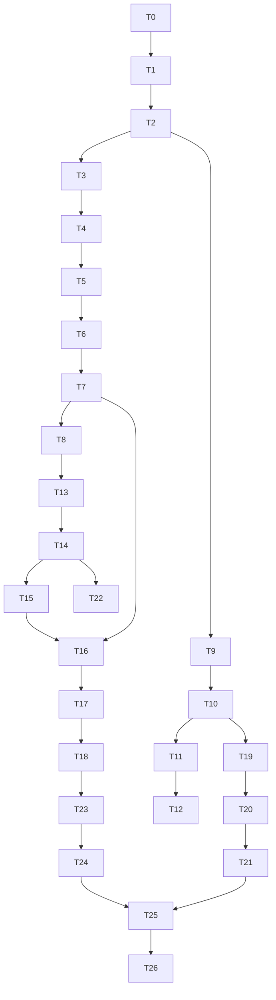

# FILE: /docs/auth/phase-4-implementation-plan.md

> **Document status:** Phase 4A specification — the ordered Phase 4B plan for Codex. **Identity/tenancy only; no Phase 5 projects/companies/documents.**
> **Hard boundary — Codex MUST NOT:** create project/contact/subcontractor/requirement/document/review/package tables or features; build billing/AI/search/integrations/external portals or full SSO/SCIM; weaken the nonce CSP or runtime gates; use service-role for ordinary user reads; trust client `organization_id`/metadata for authz; use `getSession()` as an auth gate; expose dev routes in production; edit applied migrations. Static, labeled behavior only where a provider is deferred.
> **Depends on:** all sibling Phase 4 docs + the existing foundation (`packages/authz|db|env|audit|observability|ui`, `apps/web` shell, `proxy.ts` nonce CSP, migrations `0000–0002`, Supabase local + Mailpit).
> **Legend:** *Founder?* = needs founder cloud config (else runs locally with the noted local alternative).

---

## Task 0 — Phase review & branch prep (gate)
- **Objective:** Read all Phase 1–4 docs; confirm constraints (RLS isolation, deny-by-default, no client-trusted org id, service-role restraint, verified `getUser()`, hashed invitations, ownerless-prevention, no Phase 5 tables, brand=Closeout). Create branch `codex/phase-4b-auth`. Report contradictions; don’t invent.
- **Files:** none. **Migration:** none. **Tests:** none. **DoD:** written confirmation of the boundaries + a note that `validate-migrations.mjs` will need a reviewed allowlist update (Task 3). **Founder?** No.

## Task 1 — `@closeoutflow/auth` package & Supabase SSR
- **Objective:** New `packages/auth` with `@supabase/ssr` server/middleware client factories, `getUser()` helpers, active-org resolver interface, reauth/AAL helpers. Extend `packages/env` with auth/OAuth/rate-limit keys (validated; optional locally, required staging/prod). **No screens yet.**
- **Files:** `packages/auth/src/*`, `packages/env` additions, `.env.example`. **Migration:** none. **RLS:** none. **Server logic:** clients + session verification. **Tests:** unit (client factories server-only; `getUser` vs `getSession` guard; env validation); **extend server-only build test** to the auth server entry. **Security:** service-role stays server-only; secrets server-only. **DoD:** clients typecheck, boundary+server-only tests green. **Founder?** No (local Supabase).

## Task 2 — Session middleware & protected-layout scaffolding
- **Objective:** Extend `proxy.ts` to refresh the session (in addition to nonce CSP) and do **coarse** redirects; add server `(app)`/`/account`/`/platform` layout guards using verified `getUser()` (no data yet). Redirect **allowlist** helper (open-redirect prevention).
- **Files:** `apps/web/proxy.ts` (additive), `apps/web/app/(app)/layout.tsx` (auth check), `app/account/layout.tsx`, `app/platform/layout.tsx`, `lib/safe-redirect.ts`. **Tests:** Playwright (unauth → `/sign-in`; tampered cookie denied), unit (redirect allowlist rejects `//evil`,`https://evil`). **Security:** CSP unchanged (verify nonce still emitted). **DoD:** protected routes redirect server-side; CSP intact. **Founder?** No.

## Task 3 — Phase 4 migration foundations
- **Objective:** Migration `0003` (extensions: `citext`; base helpers) + **reviewed update to `scripts/validate-migrations.mjs`** to allow Phase 4 identity/tenancy tables (`organizations`, `organization_memberships`, `organization_invitations`, `organization_ownership_transfers`, `platform_roles`, `user_profiles`, `user_preferences`, `user_security_events`) while **still forbidding** `projects, requirements, submissions, documents, reviews, packages`.
- **Files:** `supabase/migrations/0003_*.sql`, `scripts/validate-migrations.mjs`, regenerated `types.generated.ts`. **Migration:** yes (append-only). **Tests:** `db:validate` passes with new allowlist; pgTAP baseline. **DoD:** guard updated + reviewed; migration applies clean. **Founder?** No.

## Task 4 — Profiles & preferences
- **Objective:** Migration `0004`: `user_profiles`, `user_preferences`, `handle_new_user` trigger + `ensureProfile` server fallback; RLS enable+**force**+policies; grants. Persist Phase 3 theme/density into `user_preferences` (hydrate on auth; keep localStorage fast-path).
- **RLS:** self + shared-active-org read (profiles); self-only (prefs). **Audit:** `profile.updated`. **Tests:** pgTAP (self-only, shared-org name visibility, no cross-org); Vitest (ensureProfile idempotent; preference hydration). **A11y/Responsive:** preferences screen later (Task 19). **DoD:** every new auth user gets a profile+prefs; cross-org profile leak denied. **Founder?** No.

## Task 5 — Organizations
- **Objective:** Migration `0005`: `organizations` (slug uniqueness, status), RLS+force+policies, `set_updated_at`. `create_organization_with_owner` deferred to Task 8 (needs memberships).
- **Tests:** pgTAP (member SELECT; non-member denied; Owner/Admin update). **DoD:** org table isolated by membership (once memberships exist); typecheck. **Founder?** No.

## Task 6 — Memberships & role→permission engine
- **Objective:** Migration `0006`: `organization_memberships` (unique + partial-owner index), RLS helper functions (`is_org_member`,`has_org_role`,`has_org_permission`,`is_platform_admin`), memberships RLS+force+policies (recursion-safe). Populate `packages/authz`: `permissions`, `roles`, role→permission matrix, real `can()` (deny-by-default) + sensitive-gate inputs.
- **Tests:** **authz matrix** (Vitest); pgTAP (membership isolation, recursion-free, helper grants); **authz⇔RLS parity harness**. **Security:** metadata-forgery grants nothing. **DoD:** parity green; deny-by-default proven. **Founder?** No.

## Task 7 — RLS & authorization parity hardening
- **Objective:** Complete/verify RLS on all tables so far; write the **cross-tenant pgTAP matrix** (Org A vs Org B for every op) and the parity suite; suspended-member/org denial tests.
- **Tests:** the isolation + parity + suspended suites. **DoD:** zero cross-tenant access proven; suspended denial proven. **Founder?** No.

## Task 8 — Organization creation (atomic) + onboarding start
- **Objective:** Migration `0008a` (or fold into `0006`): `create_organization_with_owner` (txn: org + owner membership + audit; slug gen). `/onboarding` + `/select-organization` screens (Phase 3 components); active-org cookie resolver wired.
- **UI routes:** `/onboarding`, `/select-organization`. **Audit:** `organization.created`, `membership.activated`. **Tests:** pgTAP (atomic; ownerless-safe start); Playwright (create org → dashboard); a11y. **DoD:** a user can create an org and land on the dashboard with an active membership. **Founder?** No.

## Task 9 — Sign-up & email verification
- **Objective:** `/sign-up`, `/verify-email`, `/auth/callback` (verification path). Supabase email via **Mailpit** locally. Rate limits (Upstash seam; local no-op safe but production-required).
- **Audit:** `auth.registered`, `auth.email_verified`. **Tests:** Vitest (schema, callback redirect allowlist), Playwright (register→verify via Mailpit), a11y. **Security:** generic errors; no enumeration. **DoD:** register+verify locally. **Founder?** Prod email domain later.

## Task 10 — Sign-in & sign-out
- **Objective:** `/sign-in`, sign-out server action (current + global), reauth helper. Failed-login handling + rate limit + lockout.
- **Audit:** `auth.signed_in`(best-effort), `auth.sign_in_failed`, `auth.signed_out`. **Tests:** Vitest+Playwright (valid/invalid, unverified, rate limit, `next` allowlist). **DoD:** sign-in/out works; protected routes reachable only when authed. **Founder?** No.

## Task 11 — Password reset
- **Objective:** `/forgot-password`, `/reset-password`, callback recovery path; revoke-other-sessions + notify on change.
- **Audit:** `auth.password_reset_requested`, `auth.password_changed`(blocking). **Tests:** Vitest+Playwright (request→reset via Mailpit; expired link; generic responses; other-session revoke). **DoD:** reset works locally. **Founder?** Prod email later.

## Task 12 — OAuth foundations (Google + Microsoft)
- **Objective:** OAuth buttons + callback code-exchange + identity linking + conflict handling. **Providers disabled locally unless env present** (built + unit/integration tested against a stub; E2E OAuth skipped locally, documented).
- **Audit:** `auth.oauth_linked`, `auth.signed_in(method=oauth)`. **Tests:** Vitest (callback, conflict, allowlist); Playwright OAuth **skipped locally** (staging with creds). **DoD:** OAuth code paths built + tested without prod creds. **Founder?** **Yes** (Google/Microsoft creds for staging/prod).

## Task 13 — Organization invitations
- **Objective:** Migration `0007`: `organization_invitations` (citext, token_hash unique, pending dedupe), RLS+force, `create_invitation`/`revoke_invitation`/`resend_invitation` (hash, dedupe, audit). Invite UI in `/settings/team`; invitation email via Resend adapter (Mailpit locally).
- **Audit:** `invitation.created/resent/revoked`. **Tests:** pgTAP (hash-at-rest, dedupe, revoke fail-closed, no client SELECT); Vitest (email render, no token in body/logs); rate limits. **DoD:** admins invite; tokens hashed/scoped/expiring/revocable. **Founder?** Prod email later.

## Task 14 — Invitation acceptance
- **Objective:** `/invite/[token]`, `accept_invitation(token)` (txn, idempotent, email-match, reactivate); new-user (prefilled/locked email) + existing-user flows.
- **Audit:** `invitation.accepted`, `membership.activated`. **Tests:** pgTAP (idempotent double-accept; email mismatch rejected; expired/revoked; suspended org blocks); Playwright (both flows); a11y. **DoD:** acceptance atomic+idempotent; membership active. **Founder?** No.

## Task 15 — Organization switching
- **Objective:** Active-org cookie (`cof-active-org`) set via server action, validated every request; header switcher (Phase 3) wired; `/select-organization`; safe fallback for suspended/removed/deleted.
- **Tests:** Playwright (multi-org switch; tampered cookie denied; stale context → select-org); unit (resolver). **DoD:** secure switching; never client-trusted. **Founder?** No.

## Task 16 — Team management
- **Objective:** `/settings/team` real: member `DataTable`, role change, suspend/reactivate/remove, pending invitations (resend/revoke), confirmations. `change_member_role`/`suspend`/`reactivate`/`remove` functions (guards).
- **Audit:** membership.* events; notifications. **Tests:** authz (permission-gated actions); pgTAP (guards; owner-target protection); Playwright; a11y (dialogs, table). **DoD:** full member admin with safeguards + audit. **Founder?** No.

## Task 17 — Ownership transfer
- **Objective:** Migration `0008b`: `organization_ownership_transfers`; `initiate_/complete_/cancel_ownership_transfer` (reauth+MFA, target accept, atomic swap, last-owner guard). UI in `/settings/team` + accept flow.
- **Audit:** `ownership_transfer.*`. **Tests:** pgTAP (atomic swap; ownerless impossible; MFA gate); Playwright (initiate→accept). **DoD:** safe transfer; ownerless impossible. **Founder?** No.

## Task 18 — Suspension, reactivation, removal, leaving
- **Objective:** Finalize member-lifecycle functions + `leave_organization` (sole-owner guard); suspended-member RLS denial + best-effort session revoke; removed-member reactivation via invite.
- **Audit:** membership.suspended/reactivated/removed/left. **Tests:** pgTAP (suspended denied all data; last-owner leave blocked; reactivation reuses row); Playwright. **DoD:** lifecycle complete + guarded. **Founder?** No.

## Task 19 — Profile settings
- **Objective:** `/account/profile`, `/account/preferences` (persist to DB; keep localStorage fast-path); unsaved-changes guard (SPA-safe).
- **Audit:** `profile.updated`. **Tests:** Vitest (validation, hydration), Playwright, a11y. **DoD:** profile/prefs persist without Phase 3 regression. **Founder?** Avatar upload optional/deferred.

## Task 20 — Security settings, MFA, sessions
- **Objective:** `/account/security` (password change reauth, MFA enroll/remove, recovery codes hashed, security-event list), `/account/sessions` (global sign-out + current). `user_security_events` populated. `user_session_metadata` only if adopted (open decision).
- **Migration:** `0009` (`user_security_events`, `platform_roles`, `get_organization_audit`, platform admin fns). **Audit:** `auth.mfa_*`, `auth.session_revoked`, `auth.password_changed`. **Tests:** Vitest+Playwright (enroll/challenge/remove; AAL2 gate; recovery hashed; global revoke). **DoD:** MFA + sessions functional + audited. **Founder?** MFA/CAPTCHA settings later.

## Task 21 — Protected layouts & route guards (finalize)
- **Objective:** Complete the route-access decision table server-side: no-org, suspended-user/-membership/-org, unverified, MFA-challenge states; `/platform` guard (platform role + AAL2, noindex). Ensure middleware is never the sole gate.
- **Tests:** Playwright (every state routes correctly; direct nav; platform hidden from non-admins); security regression. **DoD:** decision table enforced server-side + RLS. **Founder?** No.

## Task 22 — Authentication & invitation emails
- **Objective:** Finalize Closeout-branded templates (React Email + adapter): verify/reset (Supabase templates configured), invitation/reminder/revoked, password/email/MFA changed, ownership transfer, member removed/suspended, security alert. Plain-text + a11y; no secrets; prod links to closeoutflow.com; Mailpit locally.
- **Tests:** Vitest email render (brand=Closeout, no token/secret, plain-text present). **DoD:** all emails render + branded. **Founder?** **Yes** (Resend/SMTP + prod domain for real sends).

## Task 23 — Audit integration (finalize)
- **Objective:** Wire the full [audit-events.md](./audit-events.md) catalog through `write_audit_event`/definer functions; typed action constants in `packages/audit`; blocking vs best-effort per event; redaction whitelists.
- **Tests:** pgTAP+Vitest (every sensitive action writes its event; audit-failure rolls back a sensitive txn; **no token/secret** in events; immutability). **DoD:** catalog complete + tested. **Founder?** No.

## Task 24 — Rate limits & abuse controls
- **Objective:** Upstash-backed limits on all auth/invite/admin endpoints (hashed keys); generic over-limit UX; lockout backoff; optional CAPTCHA hook for sign-up/sign-in (recommended, prod).
- **Tests:** Vitest (limits enforced; keys hashed; no raw secret). **DoD:** limits in place; local no-op safe, prod-required. **Founder?** CAPTCHA + prod Upstash later.

## Task 25 — Full validation (pgTAP, unit, E2E, a11y, cross-browser)
- **Objective:** Run/complete the entire [phase-4-testing.md](./phase-4-testing.md) suite; fix gaps: isolation matrix, parity, invitation/ownership/session/MFA/rate-limit/email/audit, open-redirect, service-role boundary; a11y (light+dark), mobile, Chromium/Firefox/WebKit. Extend the **brand regression** test to all new pages.
- **Tests:** the whole suite green. **DoD:** all Phase 4 DoD criteria + the 22 validation checks pass. **Founder?** No.

## Task 26 — Documentation, exit review, completion
- **Objective:** `docs/auth/phase-4-implementation-progress.md` + `phase-4-exit-review.md`; update `AGENTS.md`/`CLAUDE.md` pointers to `docs/auth/*` and the current plan; confirm **no Phase 5 tables/features**; record founder-action status. **Do not start Phase 5.**
- **Tests:** doc-link check; full suite green. **DoD:** signed exit review; ready for a Phase 4C audit. **Founder?** Approve to proceed.

---

## Ordering notes
- **Migrations precede the features that use them** (expand/contract): profiles(4) → orgs(5) → memberships+authz(6) → parity(7) → org-create(8) before any UI writes; invitations(13) before acceptance(14); transfers(17) before finalizing lifecycle(18). Auth screens (9–12) can proceed in parallel once Tasks 1–2 land, but **org-required UI waits on Tasks 6–8**.
- **authz + RLS (6–7) are load-bearing** — no membership-gated UI ships before parity is green.
- OAuth (12) and email (22) real behavior are **founder-gated**; their code + tests land locally first.

## Dependency graph

## What this plan must NOT do (recap)
No projects/contacts/subcontractors/requirements/documents/reviews/packages tables or features; no billing/AI/search/integrations/portals/SSO/SCIM; no CSP/gate weakening; no service-role for normal reads; no client-trusted org id/metadata authz; no `getSession()` gate; no dev routes in prod; no edits to applied migrations. **Stops before Phase 5.**

---

*Continue to [open-decisions.md](./open-decisions.md).*
