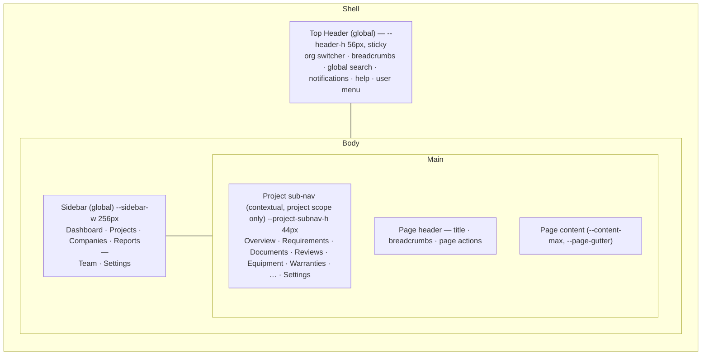
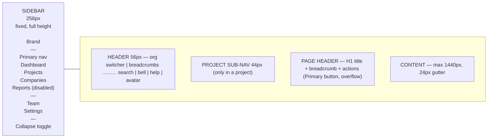
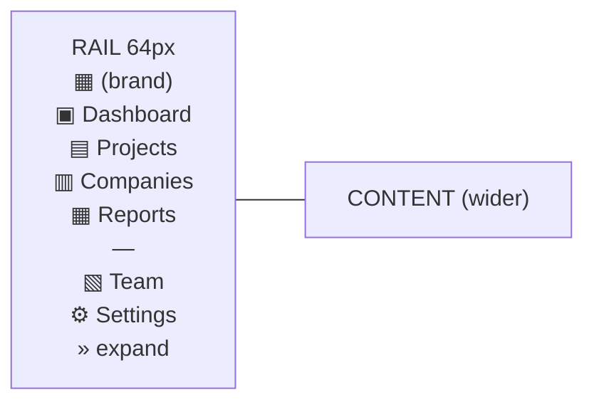
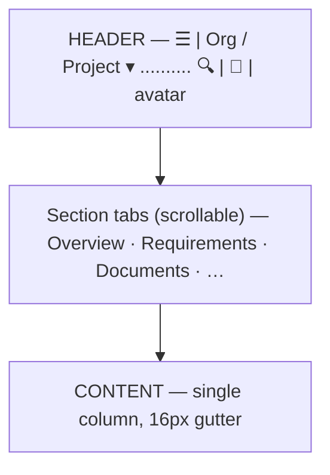

# FILE: /docs/design/application-shell.md

> **Document status:** Phase 3A design — the internal application shell. **Specification only.**
> **Depends on:** [design-tokens.md](./design-tokens.md) (dimensions), [navigation-and-routes.md](./navigation-and-routes.md) (route map), [user-roles.md](../product/user-roles.md) (internal personas).
> **Scope:** the **internal** shell for PMs, coordinators, org admins, and internal reviewers. Subcontractor and owner **external** experiences are **not** part of this shell and are designed in their own phases ([navigation-and-routes.md §external](./navigation-and-routes.md)).

---

## 1. Shell anatomy

Three persistent regions + content. **Global** chrome is org-wide; a **project context** appears only inside a project.

- **Global (always present):** Header, Sidebar.
- **Project-specific (only inside `/projects/[id]/…`):** Project sub-navigation (tabs/rail) + project context in the header breadcrumb.
- **Content region:** page header + body, width-constrained by page type (list/detail/form).

---

## 2. Desktop layout (≥ lg / 1024px)

- Sidebar is **fixed**, full height, own scroll if nav overflows. Header is **sticky** top. Content scrolls independently.
- Grid: `[sidebar] [1fr]`; header spans the right column only (sidebar has its own brand area at top), OR header spans full width with brand in header — **decision:** brand/logo lives in the **sidebar top**; header starts at the sidebar's right edge (cleaner org-switcher placement). See [open-design-decisions.md](./open-design-decisions.md) OD-2.

## 3. Collapsed layout (icon rail)

- User toggles sidebar to **64px icon rail** (persisted per user). Labels hide; icons remain with **tooltips on hover/focus** (accessible names preserved).
- Active item shows an accent left-border + tinted background. Collapse state persists in `localStorage` (`cof-sidebar`), applied before paint (nonce'd, with the theme init) to avoid layout shift.
- Project sub-nav is unaffected by rail collapse (it's in the content column).

## 4. Mobile layout (< lg / 1024px)

- Sidebar becomes **off-canvas**: hidden by default, opened by a **hamburger** in the header as a **left drawer** (focus-trapped, `Esc`/backdrop to close), `--z-sidebar` over `--z-overlay` backdrop.
- Header stays sticky; condenses: hamburger · compact org/project label · search icon (opens full-screen search) · bell · avatar. Help moves into the user menu on small screens.
- Project sub-nav becomes a **horizontally scrollable tab strip** under the header (or a "Section ▾" dropdown on the narrowest widths — see [navigation-and-routes.md §mobile](./navigation-and-routes.md)).
- **Not a scaled-down desktop:** primary actions collapse into a sticky bottom action bar or the page-header overflow; tables become card lists ([patterns.md §tables](./patterns.md)).

---

## 5. Header (global)

Left → right:
1. **Hamburger** (mobile only) — opens sidebar drawer.
2. **Organization switcher** (placeholder in Phase 3) — current org name + ▾; opens a menu of the user's orgs (mock: one org + "Create organization" disabled). Establishes multi-org from day one without implementing it.
3. **Breadcrumbs** — reflect scope: `Org › Projects › {Project} › Requirements`. Collapses to the last 1–2 crumbs on small screens. (See §11.)
4. **Global search entry** — a search field (desktop) / icon (mobile) that opens the **command palette / search** (`⌘K` / `Ctrl-K`).
5. **Notifications** — bell icon with unread dot (placeholder popover: "No notifications yet"). Not the email system — in-app only.
6. **Help** — `?` menu (docs links, keyboard shortcuts `⌘/`, "Contact support" placeholder).
7. **User menu** — avatar + name; menu: profile (placeholder), theme toggle (Light/Dark/System), density toggle (Comfortable/Compact), sign out (placeholder/disabled in Phase 3).

**Global vs project:** the header is global chrome; the only project-aware part is the **breadcrumb** and (optionally) a compact project label on mobile.

## 6. Sidebar (global primary nav)

Contents, top → bottom (final set — deliberately lean, see [navigation-and-routes.md](./navigation-and-routes.md)):
- **Brand** (logo mark + wordmark; mark only when collapsed).
- **Primary:** Dashboard · Projects · Companies · Reports *(Reports visibly disabled "Available in a later phase")*.
- **Divider.**
- **Utility:** Team · Settings.
- **Footer:** collapse toggle; (later) storage/plan meter.

Rules:
- **Max ~6 primary destinations.** Project-scoped modules (Requirements, Documents, Reviews, Equipment, Warranties, …) are **not** here — they live in the project sub-nav. This is the key anti-overload decision.
- Active state: tinted background + 2px accent left border + `--primary` icon/text; `aria-current="page"`.
- Items the user's role can't access are hidden (future authz); Phase 3 shows all internal items with mock content.

## 7. Organization switcher (placeholder)

- In header, top-left. Shows current org; menu lists memberships (mock: "Sample Construction Co."), a check on active, and a disabled "Create organization" (Phase 4). Switching is visual-only in Phase 3.
- Establishes the **multi-org, per-context** model from [user-roles.md](../product/user-roles.md) without implementing switching logic.

## 8. Project context / project switcher

- **No global project switcher in the sidebar** (avoids overload). Project context is entered via **Projects → a project**, which reveals the **project sub-nav** and puts the project in the breadcrumb.
- A **quick project switcher** is available **inside a project** as a small ▾ on the project name in the breadcrumb/sub-nav header (mock list of projects) and via the **command palette** ("Go to project…"). This keeps switching fast without a permanent global control.

## 9. Global search entry & command palette

- **One entry, two modes:** the header search field / `⌘K` opens a **command palette** that unifies **search** (projects, requirements, documents, companies, equipment — permission-aware later) and **commands** ("Create project", "Go to Settings", "Toggle theme").
- Phase 3: palette is wired to **navigation + mock search results only** (no backend). See [search section in patterns.md](./patterns.md) and [components.md](./components.md).

## 10. User controls

- **User menu** (see §5): theme, density, profile (placeholder), sign out (placeholder).
- **Notifications** and **Help** are separate header entries so they're one click, not buried.

## 11. Breadcrumbs

- **Pattern:** `Organization › {Section} › {Entity} › {Sub-section}`. Org crumb optional on desktop (org is in the switcher); always start at the section for clarity.
- Examples: `Projects › Riverside Medical Office › Requirements`; `Companies › Ace Mechanical`; `Settings › Members`.
- **Rules:** last crumb = current page, not a link; middle crumbs link; truncate long entity names with a tooltip (see [accessibility-and-responsive.md](./accessibility-and-responsive.md)); on mobile collapse to `‹ {parent}` back-affordance + current title.

## 12. Page titles & page header

- Every page has a **PageHeader**: H1 title (matches breadcrumb leaf), optional description/meta line (e.g., project status badge + due date), and a **page-actions** area (primary button + overflow menu).
- Title = the route's `Page name` from [navigation-and-routes.md](./navigation-and-routes.md). Document `<title>` mirrors it (`{Page} · {Project} · CloseoutFlow`).

## 13. Page actions

- Right-aligned in the page header on desktop. **One primary action** max (e.g., "New project"), secondary actions in an overflow "⋯" menu.
- On mobile, primary action becomes a **sticky bottom bar** or a floating primary button; overflow stays in the header "⋯".

## 14. Contextual secondary navigation (project sub-nav)

- Appears **only inside a project**. Presents the project-scoped modules as a **tab strip** (desktop) directly under the header, scrollable on mobile.
- Order (final, see [navigation-and-routes.md](./navigation-and-routes.md)): **Overview · Requirements · Documents · Reviews · Equipment · Warranties · Inspections · Training · Lien Waivers · Drawings · Package · Contacts · Activity · Settings.** Modules not yet enabled render as **disabled tabs with a "later phase" affordance** rather than being hidden, so the product's shape is visible.
- Active tab uses underline + `--primary` text + `aria-current`.

## 15. Command palette (spec)

- Trigger: `⌘K` / `Ctrl-K`, header search click, or `/` when not in an input.
- Modal, centered, `--z-command`, `--surface-raised`, `--shadow-lg`, focus-trapped. Input at top; grouped results: **Recent**, **Projects**, **Pages/Commands**, (later) **Documents/Requirements/Companies**.
- Keyboard: arrows to move, `Enter` to open, `Esc` to close, group headers non-focusable; screen-reader `role="dialog"` + `aria-activedescendant` listbox pattern.
- Phase 3: navigates to routes + returns mock search rows; empty/loading/no-results states specified in [patterns.md](./patterns.md).

## 16. Keyboard shortcuts (foundation set)

| Shortcut | Action |
|----------|--------|
| `⌘K` / `Ctrl-K` | Open command palette / global search |
| `⌘/` / `Ctrl-/` | Open keyboard-shortcuts help |
| `g` then `p` | Go to Projects |
| `g` then `d` | Go to Dashboard |
| `[` | Toggle sidebar collapse |
| `Esc` | Close top-most overlay (menu/dialog/drawer/palette) |
| `/` | Focus search (when not in a field) |

- Shortcuts are discoverable via Help (`⌘/`) and the command palette. All shortcut-triggered actions are also reachable by mouse/touch. Avoid single-key shortcuts firing inside inputs.

## 17. Responsive transitions (shell)

| Width | Sidebar | Header | Project sub-nav | Content |
|-------|---------|--------|-----------------|---------|
| ≥ xl (1280) | 256px fixed (or 64px rail) | full | tab strip | max 1440px |
| lg (1024–1279) | 256px or rail | full | tab strip | fluid |
| md (768–1023) | **off-canvas drawer** | condensed | scrollable tabs | fluid, 16–24px gutter |
| < md (768) | off-canvas drawer | compact (icons) | scrollable tabs / "Section ▾" | single column, 16px gutter |

- Sidebar collapse (rail) is a **desktop** affordance; **below lg** the sidebar is always off-canvas (no rail).
- Transitions use `--dur-base`/`--ease-standard`; respect reduced motion (drawer appears without slide).

---

## 18. Shell = global vs project (summary)

| Element | Scope |
|---------|-------|
| Header, Sidebar, Org switcher, Global search/command palette, Notifications, Help, User menu, Theme/density | **Global (org-wide)** |
| Breadcrumb entity segments, Project sub-nav, Project switcher (quick), Project overview/actions | **Project-specific** |
| Subcontractor portal, Owner portal | **Neither — separate external shells, not in this internal shell** |

---

*Continue to [navigation-and-routes.md](./navigation-and-routes.md).*
