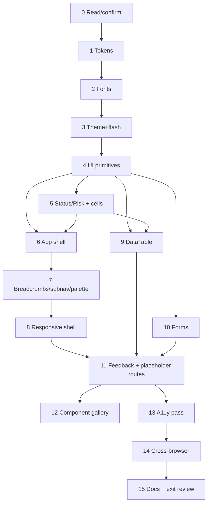

# FILE: /docs/design/phase-3-implementation-plan.md

> **Document status:** Phase 3A design — the ordered plan Codex follows in **Phase 3B**. **Design-system + shell + placeholder pages only.**
> **Hard boundary — this plan MUST NOT let Codex:** create business DB tables · build authentication · add real organization switching · add real projects/documents · call unimplemented APIs · create fake production analytics · add billing/integrations/AI/external portals · weaken the CSP or runtime gates · expose dev-only routes in production · add public storage · bypass the package architecture. Mock data is static/in-repo and clearly labeled; **no Phase 4 auth or business logic**.
> **Depends on:** all sibling design docs; and Phase 2 foundation (existing `packages/ui`, `packages/config`, `apps/web`, nonce CSP, `/playground` gating, `check-boundaries.mjs`).
> **Legend:** *Screens?* = capture screenshots for review. *Founder approval?* = needs founder visual sign-off before proceeding.

---

## Task 0 — Read & confirm (gate)
- **Objective:** Read all Phase 1, Phase 2, and Phase 3 design docs; confirm the constraints (no business tables/auth/APIs, dev-gallery gating, nonce-CSP compatibility, token-first, a11y-as-DoD). Report contradictions, don't invent.
- **Files/dirs:** none (read-only). **Deps:** none.
- **Components/Routes:** none.
- **Tests/A11y/Responsive:** none.
- **Completion:** short confirmation listing the boundaries it will enforce.
- **Screens?** No. **Founder approval?** No.

## Task 1 — Design tokens
- **Objective:** Implement the full token system from [design-tokens.md](./design-tokens.md) into `packages/ui/src/tokens.css` (light + `.dark`) and expose via `packages/config/tailwind.preset.ts`. Replace the minimal token set; keep it CSS-variable + Tailwind-mapped. Update `--radius` to 0.5rem and add the semantic/status/dimension/motion/z-index tokens.
- **Files:** `packages/ui/src/tokens.css`, `packages/config/tailwind.preset.ts`, maybe `apps/web/app/globals.css` (remove placeholder Arial font-family; wire fonts in Task 2).
- **Deps:** Task 0.
- **Components/Routes:** none.
- **Tests:** Vitest: token presence/naming smoke; a **contrast test** asserting key token pairs meet AA (both themes). **A11y:** contrast pass. **Responsive:** n/a.
- **Completion:** tokens compile; `pnpm build`/`lint`/`typecheck` green; contrast test passes.
- **Screens?** No. **Founder approval?** **Yes — approve palette + radius direction** (light + dark swatch screenshot).

## Task 2 — Fonts
- **Objective:** Load **IBM Plex Sans + IBM Plex Mono** via `next/font/google` (self-hosted, `display: swap`, subset latin, preload), wire to `--font-sans`/`--font-mono`; system fallback stack. No CDN (nonce-CSP safe).
- **Files:** `apps/web/app/layout.tsx` (font setup), `globals.css`/tokens (family vars).
- **Deps:** Task 1.
- **Tests:** Vitest/E2E: font variables applied; fallback present. **A11y:** text remains legible pre-swap. **Responsive:** n/a.
- **Completion:** fonts render locally; no layout shift on swap (metrics-adjusted fallback); build green.
- **Screens?** Yes (type specimen). **Founder approval?** **Yes — approve typeface** (or trigger Inter fallback per OD-1).

## Task 3 — Theme provider & flash prevention
- **Objective:** Implement light/dark/system theme with persistence (`localStorage cof-theme`) and **flash-free init** via a **nonce'd inline script** in `<head>` that sets `class="dark"` before paint; `<html suppressHydrationWarning>`; `color-scheme` synced. Density preference (`cof-density`) same mechanism. Sidebar-collapsed (`cof-sidebar`) too.
- **Files:** `apps/web/app/layout.tsx`, a small `theme` module in `apps/web/components`, nonce wiring (reuse existing middleware nonce).
- **Deps:** Tasks 1–2.
- **Tests:** Vitest (theme logic), Playwright (toggle switches theme; **no FOUC**; reduced-motion respected). **A11y:** toggle labelled, keyboard operable. **Responsive:** n/a.
- **Completion:** theme toggle works, persists, no flash; CSP unchanged (script carries nonce). Build/E2E green.
- **Screens?** Yes (light+dark). **Founder approval?** No (visual approved in Task 1).

## Task 4 — UI primitives (packages/ui)
- **Objective:** Build/upgrade the **P3-Required primitives** from [components.md §4](./components.md) on tokens + Radix + cva: Button (add destructive/link/loading), IconButton, Input, Textarea, Label, Field, Select, Combobox, Multi-select, Checkbox, Radio, Switch, Badge, Avatar, Tooltip, Popover, DropdownMenu, Dialog, AlertDialog, Drawer/Sheet, Tabs, Accordion, Collapsible, Card, Alert, Banner, Toast (upgrade), Skeleton, Spinner, Progress, Separator, ScrollArea, EmptyState, ErrorState, PermissionDenied, KeyValue/Metadata, ResponsiveStack, Calendar, DateInput, MetricCard, FileUploadPlaceholder(visual only). Migrate existing Button/Card off hardcoded `blue-*`/`slate-*`.
- **Files:** `packages/ui/src/*` (+ `__tests__`). **Deps:** Tasks 1–3.
- **Tests:** Vitest+TL per component (render, variants, disabled/loading, keyboard, `aria-*`); **no `@closeoutflow/db`/`authz`/`@supabase` imports** (boundary check stays green). **A11y:** roles/labels/focus ring on each. **Responsive:** primitives fluid.
- **Completion:** all primitives pass tests; boundaries/lint/typecheck green; Radix a11y intact.
- **Screens?** Yes (via gallery, Task 12). **Founder approval?** No (approved at gallery review).

## Task 5 — Domain-presentational components (apps/web)
- **Objective:** `StatusBadge` (maps **every** [statuses.md](../product/statuses.md) status → tone+icon+label, single source of truth), `RiskIndicator`, Overdue/Missing flag, cell renderers (Status/Date/File/User/Actions). No data fetching.
- **Files:** `apps/web/components/*`. **Deps:** Task 4.
- **Tests:** Vitest: StatusBadge covers each status enum value; RiskIndicator levels; cells render. **A11y:** icon+label (never color-only); dates have accessible absolute value. **Responsive:** badges wrap.
- **Completion:** status/risk mapping tested exhaustively; green checks.
- **Screens?** Via gallery. **Founder approval?** **Yes — approve the status color/icon system** (it's product-wide).

## Task 6 — Application shell (layout, header, sidebar)
- **Objective:** Build the shell from [application-shell.md](./application-shell.md): `(app)` route group layout with grid (sidebar + header + content), Sidebar (6 items + collapse rail + active state), Header (org switcher placeholder, breadcrumbs slot, search entry, notifications placeholder, help, user menu with theme/density), Skip link.
- **Files:** `apps/web/app/(app)/layout.tsx`, `apps/web/components/shell/*`. **Deps:** Tasks 4–5.
- **Routes:** the `(app)` shell wrapping all internal routes.
- **Tests:** Vitest (nav rendering, active state), Playwright (nav works, sidebar collapse persists, skip link focuses main). **A11y:** landmarks, `aria-current`, focusable skip link, keyboard nav. **Responsive:** sidebar fixed/rail ≥ lg.
- **Completion:** shell renders, nav works, collapse persists; a11y + boundary checks green.
- **Screens?** **Yes.** **Founder approval?** **Yes — approve shell look/feel** (desktop light+dark).

## Task 7 — Navigation: breadcrumbs, project sub-nav, settings nav, command palette
- **Objective:** Breadcrumbs (route-derived), project sub-nav (Tabs incl. disabled tabs), Settings two-pane nav, Command palette (`⌘K`, nav + mock search, keyboard). Org/project quick switcher (placeholder).
- **Files:** `apps/web/components/shell/*`, `apps/web/components/command/*`. **Deps:** Task 6.
- **Tests:** Vitest (breadcrumb from route, palette filtering), Playwright (`⌘K` opens/closes, arrow/enter/esc, focus trap+return). **A11y:** nav landmarks/labels, combobox+listbox semantics, focus management. **Responsive:** sub-nav scrollable, palette full-screen on mobile.
- **Completion:** palette + navs work and are accessible; green checks.
- **Screens?** Yes (palette). **Founder approval?** No.

## Task 8 — Responsive shell (mobile nav, drawers, sheets)
- **Objective:** Off-canvas sidebar drawer (< lg), header condensation, mobile project sub-nav ("Section ▾"), dialog→bottom-sheet and filters→sheet behaviors, sticky mobile page actions.
- **Files:** shell components + `ui` Drawer/Sheet. **Deps:** Tasks 6–7.
- **Tests:** Playwright at mobile viewports (drawer open/close, focus trap, sticky actions). **A11y:** drawer dialog semantics + return focus. **Responsive:** matrix in [accessibility-and-responsive.md §13](./accessibility-and-responsive.md).
- **Completion:** shell fully usable on phone/tablet (not a shrunk desktop); green.
- **Screens?** **Yes (mobile + tablet).** **Founder approval?** **Yes — approve mobile shell.**

## Task 9 — DataTable (wraps TanStack Table)
- **Objective:** Shared `DataTable` + Table toolbar (search, Filter, density, column selector), Pagination, selection + bulk-action bar, sticky header/first-col, horizontal-scroll container, standard cell renderers, empty/loading(skeleton)/error/no-results, and **< md card fallback**. Client-side over mock data. Features never import TanStack directly.
- **Files:** `apps/web/components/table/*`. **Deps:** Tasks 4–5. **Add dependency `@tanstack/react-table`** (allowed — it's a UI utility, placed in `apps/web`, behind the wrapper; note in the PR).
- **Tests:** Vitest (sort/filter/select/column logic), Playwright (keyboard sort/select, card fallback). **A11y:** `aria-sort`, `<th scope>`, labelled checkboxes, scrollable region reachable. **Responsive:** card fallback < md.
- **Completion:** DataTable behaves per [patterns.md §5](./patterns.md); green.
- **Screens?** Yes. **Founder approval?** No.

## Task 10 — Forms system
- **Objective:** Standard form patterns from [patterns.md §8](./patterns.md): Field/Label/help/error, validation timing (submit + blur), error summary + focus management, sections, disabled/read-only, **disabled file-upload placeholder**, unsaved-changes confirm. **Use `react-hook-form` + `zod`** (already in stack) for the demo forms — no real submission/persistence.
- **Files:** `apps/web/components/form/*`, demo usage in Settings pages (Task 11). **Deps:** Tasks 4–5.
- **Tests:** Vitest (validation timing, error assoc), Playwright (submit focuses first error, unsaved-changes guard). **A11y:** labels, `aria-invalid`/`describedby`, `role="alert"`. **Responsive:** single-column mobile.
- **Completion:** form primitives + validation demo work, no persistence; green.
- **Screens?** Yes. **Founder approval?** No.

## Task 11 — Feedback components & placeholder routes
- **Objective:** Wire toasts (tones), banners (read-only/permission), empty/loading/error/permission-denied states; then build **all Phase 3 placeholder routes** from [phase-3-placeholder-pages.md](./phase-3-placeholder-pages.md) (Dashboard, Projects + Project workspace tabs, Companies, Team, Settings/*, disabled Reports) using the shell, DataTable, forms, and the **static mock module** (`apps/web/src/mock/*`, clearly labeled). Every page shows the **"Preview — not yet functional"** marker; disabled actions/tabs per spec.
- **Files:** `apps/web/app/(app)/**`, `apps/web/src/mock/*`. **Deps:** Tasks 6–10.
- **Routes:** all 26 in-app routes (see [navigation-and-routes.md §5](./navigation-and-routes.md)).
- **Tests:** Playwright smoke each route (renders, marker present, disabled controls inert); Vitest for page-level logic where any. **A11y:** axe on Dashboard, a List page, a Form/Settings page, a dialog, the palette (light+dark). **Responsive:** each archetype at desktop+mobile.
- **Completion:** every route renders honest placeholder content; **no API calls, no business tables**; axe/keyboard/responsive green.
- **Screens?** **Yes (all key routes, desktop+mobile, light+dark).** **Founder approval?** **Yes — approve overall product look.**

## Task 12 — Component gallery (dev-only, production-safe)
- **Objective:** Build `/design` gallery (or upgrade `/playground`) showing every primitive/variant/state + theme + density switch + contrast readout. **Runtime-gated to `APP_ENV ∈ {local,test}`, dynamic render, 404 in prod, not linked in nav** (addresses P2C-006). Reuse/extend the existing gating pattern (`playground/access.ts`).
- **Files:** `apps/web/app/(dev)/design/*` or existing playground path + `access` guard. **Deps:** Tasks 4–10.
- **Tests:** Vitest/E2E: gallery renders in local/test; **returns 404 when APP_ENV=production** (regression test for the gate). **A11y:** axe over gallery. **Responsive:** stacks.
- **Completion:** gallery is the living reference; **provably inaccessible in production**; green.
- **Screens?** Yes. **Founder approval?** No (internal tool).

## Task 13 — Accessibility & reduced-motion test pass
- **Objective:** Complete the a11y test plan ([accessibility-and-responsive.md §14](./accessibility-and-responsive.md)): axe (light+dark) on representative pages, keyboard-only traversal, focus-trap/return, reduced-motion, contrast — as Playwright + Vitest suites. Fix any violations found.
- **Files:** `apps/web/e2e/*`, component `__tests__`. **Deps:** Tasks 6–12.
- **Tests:** the a11y suite itself. **A11y:** must pass AA. **Responsive:** covered.
- **Completion:** a11y suite green; zero axe violations on tested pages.
- **Screens?** No. **Founder approval?** No.

## Task 14 — Cross-browser & responsive verification
- **Objective:** Extend Playwright projects to **Chromium, WebKit, Firefox** (builds on P2C-010) + mobile viewports; run shell + key routes smoke across all. Fix breakage.
- **Files:** `playwright.config.ts`, e2e specs. **Deps:** Task 13.
- **Tests:** cross-browser smoke + responsive matrix. **Completion:** green on all browsers/viewports.
- **Screens?** Yes (browser matrix). **Founder approval?** No.

## Task 15 — Documentation update & Phase 3 exit review (gate)
- **Objective:** Update `docs/README` index + `AGENTS.md`/`CLAUDE.md` pointers to the design docs; add a `docs/design/phase-3-exit-review.md` confirming the design-review checklist and that **no Phase 4/business functionality was added**. Do **not** start Phase 4.
- **Files:** `docs/**`, `AGENTS.md`, `CLAUDE.md`. **Deps:** Tasks 1–14.
- **Tests:** doc-link check; full suite green. **Completion:** signed exit review; boundaries confirmed.
- **Screens?** No. **Founder approval?** **Yes — final Phase 3 sign-off.**

---

## Dependency order (summary)

## What this plan must NOT do (recap for every task)
No business tables/migrations · no auth · no real org switching · no real projects/documents/reviews · no API calls · no fake production analytics · no billing/integrations/AI/external portals · no CSP/runtime-gate weakening · no dev routes in production · no public storage · no cross-boundary imports. **Mock data is static and labeled. Phase 3B stops before Phase 4.**

---

*Continue to [open-design-decisions.md](./open-design-decisions.md).*
