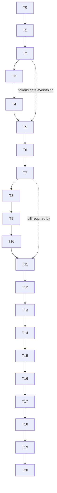

# FILE: /docs/design/phase-3e-implementation-plan.md

> **Document status:** Phase 3E-A — the ordered Phase 3E-B plan for Codex. **Visual polish only.**
> **Hard boundary — Phase 3E-B must preserve:** all 26 placeholder routes · Closeout branding + closeoutflow.com metadata · nonce CSP + security headers · RLS/audit foundation (untouched — no migrations) · route gating + `/design` production 404 · server-first architecture (no new client islands for styling) · accessibility foundation · cross-browser support · all Phase 4A docs. **No** authentication, business behavior, API calls, or Phase 4/5 entities. No dependency additions (styling is tokens + Tailwind + existing Radix).
> **Global per-task requirements (apply to every task; not repeated below):** light **and** dark theme verified · comfortable **and** compact density verified · AA contrast checks pass · reduced-motion respected · existing Vitest/Playwright/axe suites stay green · `pnpm check` + `pnpm test` before completion · screenshots captured via the repo's Playwright (as done in 3E-A).
> **Task order rationale:** tokens → typography → shell → primitives → composition (dashboard last of the big visuals) so every later task builds on stable foundations; states/themes/responsive verification after composition; gallery + regression at the end. This differs from the suggested order only by folding "light theme" into Task 2 (the tinted canvas IS the light-theme change) and keeping a dedicated dark pass later.

---

## Task 0 — Review & screenshot baseline
**Objective:** read Phase 3E docs + inspect current UI; commit a `work/`-external baseline screenshot set (dashboard/projects/workspace/team/settings × light/dark × 1440/834/390) for before/after comparison. **Files:** none (screenshots to PR artifacts). **Checkpoint:** baseline attached to PR. **Founder:** no. **Done when:** baseline exists + boundary confirmation posted.

## Task 1 — Defect sweep (pre-polish)
**Objective:** fix the three functional defects so polish isn't built on bugs: (a) DataTable select labels → **sr-only** (`table/data-table.tsx`); (b) **remove floating theme FAB**, add theme radio group to user menu (`shell/app-header.tsx`, `theme/theme-toggle.tsx`); (c) remove expanded-item "Navigation item" tooltips (`shell/primary-navigation.tsx`). **Tests:** update affected unit/e2e assertions; axe re-run. **Checkpoint:** projects table + sidebar screenshots. **Founder:** no. **Done:** labels invisible-but-announced; no FAB; suites green.

## Task 2 — Token & surface refinement (light theme core)
**Objective:** apply the exact token list from [visual-direction §12](./phase-3e-visual-direction.md): tinted canvas, border, muted-foreground, radius-lg 10px, `--shadow-card`, `--sidebar-w: 15rem`; map `--shadow-card` in the Tailwind preset; add automated **contrast test updates** for changed pairs. **Files:** `packages/ui/src/tokens.css`, `packages/config/tailwind.preset.ts`, token tests. **Routes:** all (global). **Checkpoint:** dashboard light before/after. **Founder:** **soft sign-off on the tinted canvas** (OD-3E-1). **Done:** canvas/paper separation visible; contrast tests green.

## Task 3 — Dark-theme refinement
**Objective:** apply the [direction §6](./phase-3e-visual-direction.md) desaturated stepped dark palette (background/surface/raised/sunken/borders/foregrounds; status sets −15% sat). **Files:** `tokens.css` `.dark` block + contrast tests. **Checkpoint:** dashboard + team dark. **Founder:** soft. **Done:** three visible graphite steps; no navy monotony; AA holds.

## Task 4 — Typography & spacing refinement
**Objective:** type ladder ([direction §4](./phase-3e-visual-direction.md)): display 32, h1 24, overline style utility, darker muted; card padding 20/16; section rhythm 32px; content-max outer gutter fix at exactly-1440. **Files:** `tokens.css`, `globals.css`, `ui/card.tsx`, page-layout classes. **Checkpoint:** dashboard + settings light. **Done:** six-level ladder demonstrable; no overflow regressions.

## Task 5 — Sidebar polish
**Objective:** [component-polish §1](./phase-3e-component-polish.md): 240px, canvas bg, borderless items, active pill, brand row, bottom utility spacing, collapse icon-button, rail behavior. **Files:** `shell/sidebar.tsx`, `primary-navigation.tsx`, `brand.tsx`. **Tests:** nav unit + e2e (collapse persist, aria-current). **Checkpoint:** sidebar expanded + collapsed, light + dark. **Founder:** soft. **Done:** lighter shell; rail tooltips only.

## Task 6 — Header & org-switcher polish
**Objective:** §2–3: canvas header, ghost search with ⌘K chip, 36px icon buttons, org-switcher chip button with mark + truncation + tooltip; mobile header condensation + org truncation fix. **Files:** `shell/app-header.tsx`. **Checkpoint:** header desktop + mobile. **Done:** header quiet; org name never mid-truncates without tooltip.

## Task 7 — Page-header system & PreviewPill
**Objective:** §4–5: new `PreviewPill` (+popover); PageHeader title/meta rows; **remove all secondary preview text** (descriptions-as-disclaimers, per-card "Sample …" captions, per-row "Sample driver explanation"/"Static provenance example", Filters "Mock" tag) across all pages; future-phase actions → locked-outline pattern (**delete Customize slab**). **Files:** `shell/page-header.tsx`, new `shell/preview-pill.tsx`, `pages/*.tsx`, `table/*`. **Tests:** e2e updated (preview pill present exactly once per placeholder page — new assertion); honesty preserved. **Checkpoint:** dashboard + projects. **Founder:** **soft — confirm single-pill honesty is acceptable (OD-3E-2).** **Done:** one preview indicator per page; zero dead slabs.

## Task 8 — Button, badge & status polish
**Objective:** §9–10: locked-button pattern, press micro-interaction, quiet tier usage; badges 20px quiet ink; muted text-only closed states; risk drivers → popover. **Files:** `ui/button.tsx`, `ui/primitives.tsx` (Badge), `status/*`. **Tests:** StatusBadge mapping tests unchanged-and-green; new muted-state snapshot-free assertions; popover a11y. **Checkpoint:** gallery statuses section. **Done:** status ink quieter; drivers accessible via popover.

## Task 9 — Card/section hierarchy & tabs
**Objective:** §6 + §11: paper Card (shadow-card/radius/padding), overline section headers, **eliminate nested cards everywhere**, sub-nav/tab polish. **Files:** `ui/card.tsx`, `shell/project-subnav.tsx`, `settings-navigation.tsx`, affected page compositions. **Checkpoint:** project workspace. **Done:** zero nested bordered cards in the app.

## Task 10 — Table & operational-list polish
**Objective:** §7 + §20: transparent header, full-row hover, selected tint, paper container with integrated toolbar, hover-revealed row actions (focus-safe), date/number alignment. **Files:** `table/data-table.tsx`, `cells.tsx`. **Tests:** DataTable unit suite green; keyboard e2e; mobile card fallback re-verified. **Checkpoint:** projects + requirements tables, light + dark, both densities. **Done:** tables read as premium paper records.

## Task 11 — Dashboard redesign
**Objective:** implement [phase-3e-dashboard-redesign.md](./phase-3e-dashboard-redesign.md) exactly: StatStrip, Needs-attention queue, rail (reviews + deadlines), Project health rows, icon-dot activity; delete Customize; server-component composition (`components/dashboard/`), no new client islands. **Files:** `pages/dashboard-page.tsx` → recomposed + new presentational files; mock data additions (deadlines/health fractions) in `src/mock/`. **Tests:** e2e dashboard assertions updated; axe light+dark. **Checkpoint:** **all five dashboard viewports + empty/loading states.** **Founder:** **soft review gate before Task 12.** **Done:** first viewport = command center; no boxes-of-boxes.

## Task 12 — Empty/loading/error-state polish
**Objective:** §15–17: compact branded empty pattern, matched-layout skeletons (no shift), inline error/retry, restyled 404/error pages, spec-consistent permission/suspended patterns (visual only). **Files:** `ui/primitives.tsx` (EmptyState/ErrorState), `app/not-found.tsx`, `app/error.tsx`, page empty variants. **Checkpoint:** empty + error captures. **Done:** states feel designed; zero layout shift on load.

## Task 13 — Forms & settings surfaces
**Objective:** §8: read-only display rows (replace disabled-input walls), settings paper groups with overlines, label sizing, locked Save. **Files:** `pages/settings-pages.tsx`, `form/sample-form.tsx`, `ui` Field label size. **Checkpoint:** settings light + dark. **Done:** settings reads as a document, not dead controls.

## Task 14 — Overlays & command palette polish
**Objective:** §12–14: dialog/sheet radius-shadow-motion, menu styling, palette restage (input, group overlines, kbd footer). **Files:** `ui/overlays.tsx`, `ui/toast.tsx`, `shell/command-palette.tsx`. **Tests:** overlay a11y suites green (focus trap/return). **Checkpoint:** palette + dialog. **Done:** overlays match the new system.

## Task 15 — Mobile & tablet polish
**Objective:** [dashboard §4–5](./phase-3e-dashboard-redesign.md) + [component-polish §21]: 2×2 stat grid, mobile section order, drawer restyle, safe-area padding, tablet two-up rail, sticky-action verification, long-name truncation audit across shell. **Files:** dashboard components, `shell/*` responsive classes. **Tests:** Playwright mobile/tablet projects green; touch-target audit. **Checkpoint:** mobile dashboard + drawer + tablet dashboard. **Done:** mobile first screen is operational, no disabled buttons, no giant voids.

## Task 16 — Motion & micro-interactions
**Objective:** [direction §9](./phase-3e-visual-direction.md): sidebar width transition, menu rise, dialog scale, button press, row hover timing — all on existing duration tokens; verify reduced-motion zeroes everything. **Files:** class-level changes across shell/ui. **Tests:** reduced-motion e2e (existing) green. **Checkpoint:** none (motion — verify live). **Done:** motion present, quiet, optional.

## Task 17 — Design-gallery update
**Objective:** [component-polish §23](./phase-3e-component-polish.md): restage `/design` (surfaces, ladder, tokens+contrast readouts, shell specimens, StatStrip, card rules, tables, buttons incl. locked, quiet statuses, forms+read-only, states, density/theme, mobile frames, **public-auth-card pattern demo** for Phase 4 readiness). Gating untouched. **Files:** `gallery/design-gallery.tsx`. **Tests:** gallery gating e2e (404 prod) re-verified. **Checkpoint:** gallery light + dark. **Done:** gallery documents the 3E system.

## Task 18 — Visual regression, accessibility & responsive validation
**Objective:** full suite: Vitest + Playwright (5 browser projects) + axe (light+dark on dashboard/list/settings/dialog/palette) + brand assertions + CSP/gating/security regressions; fix fallout. Add the **screenshot-checkpoint script** (Playwright) to `work/`-style tooling or a package script for repeatable captures. **Done:** everything green cross-browser.

## Task 19 — Final screenshot review (founder gate)
**Objective:** produce the complete required set — dashboard (desktop light, desktop dark, laptop 1280, tablet, mobile), projects, project workspace, companies, team, settings, empty state, error state, design gallery, sidebar expanded, sidebar collapsed, mobile drawer — attach before/after pairs vs Task 0 baseline. **Founder:** **soft approval checkpoint** (blocks only on major contradiction). **Done:** set delivered + notes on any deviations.

## Task 20 — Documentation & exit review
**Objective:** write `docs/design/phase-3e-implementation-progress.md` + `phase-3e-exit-review.md` (validation checklist from the 3E-A prompt §15 items); update `design-tokens.md`/`design-direction.md` amendment notes and `AGENTS.md`/`CLAUDE.md` pointers; confirm **no Phase 4B work started**. **Done:** signed exit review → ready for Phase 4B.

---

## Screenshot checkpoint index (required)
Dashboard desktop light · dashboard desktop dark · dashboard 1280 laptop · dashboard tablet · dashboard mobile · projects · project workspace · companies · team · settings · empty state · error state · design gallery · sidebar expanded · sidebar collapsed · mobile navigation drawer. (Tasks 2–17 each carry their local checkpoints; Task 19 assembles the canonical set.)

## Dependency graph

Sequential by design — each task is small and the visual system compounds; parallelization is not worth merge-conflict risk in shared token/shell files.
