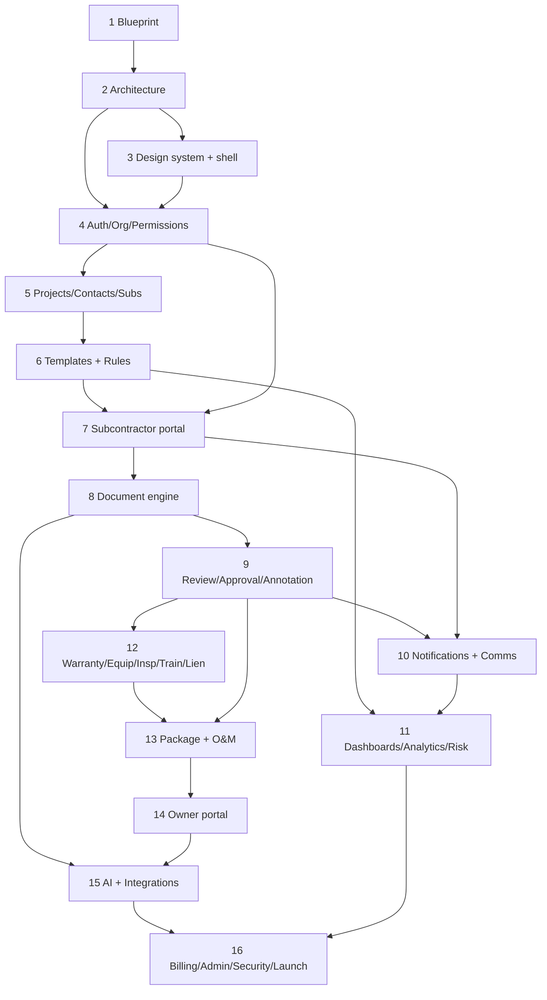

# FILE: /docs/product/feature-roadmap.md

> **Document status:** Phase 1 blueprint — permanent phased roadmap.
> **Companion documents:** [product-requirements.md](./product-requirements.md), [user-roles.md](./user-roles.md), [workflows.md](./workflows.md), [statuses.md](./statuses.md).
> **How to read:** The 16 phases below are build order, not calendar. Each phase lists what it delivers, what it explicitly defers, and the gate ("Definition of Done") that must pass before the next phase begins. Requirement IDs (e.g., `AUTH-001`) reference [product-requirements.md §G](./product-requirements.md#g-functional-requirements).

---

## Feature classification (applies across phases)

| Class | Meaning | Examples |
|-------|---------|----------|
| **Launch-critical** | Must ship in the first sellable release. | Auth, orgs, permissions, projects, requirements, subcontractor portal, document engine, review/approval, notifications+reminders, package builder, owner portal, billing, audit logging, tenant isolation. |
| **Post-launch expansion** | Valuable soon after launch; not required to sell. | Analytics, project-risk engine, warranty alerts, QR codes, advanced search, reports, rules-engine depth, SMS, metadata-extraction automation, storage integrations. |
| **Enterprise** | For larger customers / higher tier. | SSO/SCIM, public API + webhooks, Procore/ACC integrations, advanced audit exports, division-scoped administration, two-person approvals. |
| **Experimental** | Prove value before committing. | AI completeness scoring depth, predictive risk, auto-structured O&M generation, smart requirement suggestions. |

**Design-early / implement-later** (design data models and interfaces now so later phases drop in cleanly, but do not build):
- Rules engine depth (design the condition model in Phase 6; implement advanced conditions in Phase 15).
- Owner-portal longevity + org-deletion continuity (design storage/retention in Phase 2; enforce in Phases 14/16).
- API/webhook surface (design event names in Phase 2 audit design; implement in Phase 16).
- Integration abstraction layer (design boundaries in Phase 2; implement adapters in Phase 15).
- AI suggestion contract ("suggest, human confirms") — design the interface in Phase 8; add models in Phase 15.

---

## Phase 1 — Product blueprint
- **Objective:** Define the product precisely enough to build without inventing requirements.
- **Included:** The six blueprint documents (this set).
- **Excluded:** Any code, schema, or design.
- **Dependencies:** None.
- **Required documents:** product-requirements, user-roles, workflows, statuses, feature-roadmap, glossary.
- **Expected DB areas:** None (conceptual entities only: org, project, requirement, submission, document, review, equipment, warranty, package).
- **Main screens:** None.
- **Main risks:** Ambiguity or internal inconsistency carried into build.
- **Security considerations:** Establish principles (tenant isolation, human-controlled AI, auditability).
- **Test requirements:** Internal consistency review across the six documents.
- **Exit criteria:** Six documents complete, consistent, and specific.
- **Definition of done:** `READY FOR PHASE 2` verdict in the completion review.

## Phase 2 — Technical architecture and repository setup
- **Objective:** Choose the stack and lay foundations that enforce the blueprint's principles.
- **Included:** Repo structure, environments, CI/CD, chosen stack, data-model foundations, multi-tenant isolation strategy, audit-event catalog, storage/retention design, secrets management, observability baseline.
- **Excluded:** Product features/UI.
- **Dependencies:** Phase 1.
- **Required documents:** Architecture decision records; entity/data model; audit-event catalog; storage & retention design.
- **Expected DB areas:** Tenancy primitives (organizations, memberships), audit log, users/identities.
- **Main screens:** None (scaffolding only).
- **Main risks:** Poor isolation model; unscalable storage/audit design.
- **Security considerations:** Tenant isolation baked into the data layer; encryption at rest/in transit; secrets handling; deny-by-default authorization primitives.
- **Test requirements:** CI green; a failing-closed authorization test harness exists; isolation test scaffold.
- **Exit criteria:** Deployable skeleton with auth-less health check, audit logging primitive, isolation-enforcing data layer.
- **Definition of done:** New feature work can be added without re-deciding architecture.

## Phase 3 — Design system and application shell
- **Objective:** Reusable UI foundation and responsive/PWA shell.
- **Included:** Component library, layout shell, navigation, theming (incl. dark), accessibility baseline (NFR-A11Y-001), responsive/mobile-first patterns (NFR-MOB-001), PWA installability.
- **Excluded:** Feature logic.
- **Dependencies:** Phase 2.
- **Required documents:** Design-system spec; accessibility checklist.
- **Expected DB areas:** None.
- **Main screens:** Shell, empty states, error/loading states, sign-in scaffold.
- **Main risks:** Inaccessible or non-responsive foundation forcing rework.
- **Security considerations:** No sensitive data in the client; safe error rendering.
- **Test requirements:** Accessibility automated checks; responsive verification; browser matrix (NFR-BROWSER-001).
- **Exit criteria:** Shell renders across the browser/device matrix, installable as PWA, passes a11y baseline.
- **Definition of done:** Feature phases can build screens from shared components.

## Phase 4 — Authentication, organizations, and permissions
- **Objective:** Identity, tenancy, and the permission model.
- **Included:** AUTH-001..008, ORG-001..005, TEAM-001..004, SEC-001..002, BILL trial hooks; MFA; account-free link primitive (AUTH-003); audit for all of the above.
- **Excluded:** SSO/SCIM (Enterprise, Phase 16), per-project billing depth.
- **Dependencies:** Phases 2–3.
- **Required documents:** user-roles.md (authoritative); auth flows.
- **Expected DB areas:** users, memberships, roles/grants, organizations, offices/divisions, invitations, sessions, audit log, secure links.
- **Main screens:** Sign-up/in, MFA, org settings, team/user management, invitations, division setup.
- **Main risks:** Privilege escalation; cross-tenant leakage; link scope errors.
- **Security considerations:** Deny-by-default enforcement (SEC-002); step-up MFA (AUTH-007); tenant isolation tests (ORG-004); link scoping (AUTH-003).
- **Test requirements:** Authorization matrix tests per [user-roles §B](./user-roles.md); isolation tests; link expiry/revocation tests.
- **Exit criteria:** Users can register orgs, invite/manage scoped roles, and no action crosses tenant/scope boundaries.
- **Definition of done:** The permission model from user-roles.md is enforced and tested end-to-end.

## Phase 5 — Projects, contacts, and subcontractor directory
- **Objective:** The project container and its people.
- **Included:** PROJ-001..004, CONT-001, SUB-001..002, TRADE-001, IMP-001 (contacts/subs subset), project lifecycle statuses ([statuses §A](./statuses.md)).
- **Excluded:** Requirements, uploads, reviews.
- **Dependencies:** Phase 4.
- **Required documents:** statuses.md (project lifecycle); import mapping spec.
- **Expected DB areas:** projects, contacts, subcontractors, contributors, trades/divisions, project-status history, import jobs.
- **Main screens:** Project list/create, project settings, contacts, sub directory, CSV import.
- **Main risks:** Data mis-scoping; bad imports.
- **Security considerations:** Project-scope enforcement; import validation (no silent partial import).
- **Test requirements:** Project lifecycle transition tests; import validation tests; scope tests.
- **Exit criteria:** Projects created and populated with scoped contacts/subs; lifecycle transitions enforced.
- **Definition of done:** A project can hold people and move through early lifecycle states with audit.

## Phase 6 — Requirement templates and rules engine
- **Objective:** Define what a project owes and generate it.
- **Included:** TMPL-001..003, TMPL-002 starter library (construction-pro reviewed), RULE-001 (basic conditions), REQ-001..007, requirement lifecycle ([statuses §B](./statuses.md)), exceptions/N/A/waiver.
- **Excluded:** Advanced rule conditions (design now, implement Phase 15), subcontractor invites/uploads.
- **Dependencies:** Phase 5.
- **Required documents:** Template/rule model; requirement lifecycle.
- **Expected DB areas:** templates + versions, template items, rules, project requirements, requirement-status history, exceptions/waivers.
- **Main screens:** Template builder, rules config, apply-template preview, project requirements board, exception/waiver/N/A actions.
- **Main risks:** Requirement-vs-document confusion; opaque rule logic; template sprawl.
- **Security considerations:** Only authorized roles edit templates/waive (gated); audit on waive/N/A.
- **Test requirements:** Rule explainability tests (each item shows why); dedupe on multi-template apply; waiver-vs-N/A semantics tests.
- **Exit criteria:** Applying a template produces an explainable, concrete requirement set with full lifecycle.
- **Definition of done:** Requirements exist, are assignable, and separate cleanly from documents/reviews.

## Phase 7 — Subcontractor portal
- **Objective:** Let external subs fulfill requirements with no login.
- **Included:** PORT-001..003, AUTH-003/008 in the external context, REQ-003 assignment + invite (workflows §8–11), mobile-first upload, submission confirmation/status.
- **Excluded:** AI classification depth, full review chains (Phase 9), bulk-folder edge polish (basic bulk here).
- **Dependencies:** Phase 6, Phase 4 (links).
- **Required documents:** External-access spec ([user-roles §C](./user-roles.md)); portal UX.
- **Expected DB areas:** submissions, secure-link tokens, external identities, upload jobs.
- **Main screens:** Assignment + invite, external checklist portal (mobile), submission confirmation, sub status view.
- **Main risks:** Low sub completion (R-2); link leakage; wrong-file uploads.
- **Security considerations:** Strict link scoping; no PII in URLs (NFR-PRIV-002); identity confirmation; revocation.
- **Test requirements:** Link scope/expiry/revocation; mobile-browser flows (NFR-MOB-001); "only my items" isolation.
- **Exit criteria:** A sub can open a link on a phone and submit documents in under two minutes, seeing only their items.
- **Definition of done:** Requirements move `Requested → Submitted` via external, account-free submission with audit.

## Phase 8 — Document-management engine
- **Objective:** Reliable storage, versioning, classification.
- **Included:** DOC-001..006, PORT-002 (bulk/folder), version integrity, malware scan/quarantine, classification (manual + AI-suggestion contract), document lifecycle ([statuses §C](./statuses.md)); AI *interface* only (models added Phase 15).
- **Excluded:** Deep metadata-extraction automation (Phase 15), PDF annotation (Phase 9).
- **Dependencies:** Phase 7.
- **Required documents:** Document lifecycle; storage/versioning design; AI-suggestion contract.
- **Expected DB areas:** documents + versions, storage refs, classification, extraction results, processing jobs, quarantine.
- **Main screens:** Document viewer, version history, classification/reclassification, bulk-upload manager.
- **Main risks:** Storage cost (R-4); processing failures (R-10); silent overwrite (violates version integrity).
- **Security considerations:** Encryption at rest; malware quarantine; deny serving quarantined; audit on version/replace.
- **Test requirements:** Version-integrity tests (no silent overwrite); failed-processing retry; quarantine never served; bulk partial-failure handling.
- **Exit criteria:** Files upload, version, classify, and never overwrite silently; failures are visible and retriable.
- **Definition of done:** A durable, versioned, classified document store with audit and a suggestion-only AI seam.

## Phase 9 — Review, approval, and annotation workflows
- **Objective:** Human-controlled approval that drives requirement completion.
- **Included:** REV-001..006 (single/multi/parallel, reasons/conditions, reassignment, **no AI auto-approve**), ANNO-001, review lifecycle ([statuses §D](./statuses.md)), external reviewer access.
- **Excluded:** Advanced annotation tooling (Expansion).
- **Dependencies:** Phase 8.
- **Required documents:** Review lifecycle; reviewer access spec.
- **Expected DB areas:** reviews + stages, decisions, conditions, annotations, reviewer assignments.
- **Main screens:** Review queue, document review/annotate, decision (approve/condition/reject), multi-stage chain view, external reviewer portal.
- **Main risks:** Bottlenecks; AI approving important docs (must be impossible); stale reviews on supersede.
- **Security considerations:** Approval gates (▲/step-up); external reviewer scope; audit every decision with human actor.
- **Test requirements:** Requirement completes **only** via review approval; AI cannot reach an approved terminal (REV-006); supersede cancels stale reviews; sequential gating; parallel policy.
- **Exit criteria:** Requirements reach `Complete` exclusively through human-approved review chains.
- **Definition of done:** Full submission→review→approval loop works internally and with external reviewers, fully audited.

## Phase 10 — Notifications and communication center
- **Objective:** Keep everyone moving; record communication.
- **Included:** NOTIF-001..003 (email + in-app, reminders, escalation), COMM-001..002, notification lifecycle ([statuses §G](./statuses.md)), preferences, deliverability handling.
- **Excluded:** SMS (Expansion).
- **Dependencies:** Phases 7–9.
- **Required documents:** Notification lifecycle; escalation config spec.
- **Expected DB areas:** notifications, delivery events, reminder schedules, escalation rules, messages/threads, internal notes.
- **Main screens:** Notification center/preferences, reminder/escalation config, requirement + project message threads.
- **Main risks:** Deliverability; over-notification; internal↔external leakage.
- **Security considerations:** Internal notes never exposed externally (default-internal); authenticated sending (NFR-EMAIL-001); transactional vs. marketing suppression.
- **Test requirements:** Reminder cadence + stop-on-submission; escalation ladder; internal-note isolation; bounce/suppression handling; reminder delivery audit.
- **Exit criteria:** Reminders and escalations fire correctly and are audited; internal/external communication is cleanly separated.
- **Definition of done:** The chase is automated and recorded end-to-end.

## Phase 11 — Dashboards, analytics, and project-risk engine
- **Objective:** Visibility and explainable risk.
- **Included:** DASH-001..002, ANALYTICS-001, RISK-001 (explainable), scope-aware aggregation.
- **Excluded:** Predictive risk (Experimental), scheduled reports (Phase 16/Expansion).
- **Dependencies:** Phases 6–10 (data to aggregate).
- **Required documents:** Metric definitions ([product-requirements §J](./product-requirements.md#j-product-success-metrics)); risk-driver spec.
- **Expected DB areas:** aggregation/reporting views, risk-score records + drivers.
- **Main screens:** Project dashboard, portfolio dashboard, risk detail (drivers + weights).
- **Main risks:** Metric mistrust; black-box risk; scope leakage in aggregates.
- **Security considerations:** Aggregates respect scope (assigned-only never see portfolio); no cross-tenant data.
- **Test requirements:** Metric-definition correctness; risk explainability (every score shows drivers); scope-filtered aggregation tests.
- **Exit criteria:** Accurate, scope-correct dashboards and an explainable risk score.
- **Definition of done:** Leaders can see at-risk projects with reasons; no unexplained numbers.

## Phase 12 — Warranty, equipment, inspection, training, and lien-waiver modules
- **Objective:** Capture the durable building record and compliance items.
- **Included:** WARR-001 (+002 Expansion), EQUIP-001 (+002 Expansion), INSP-001, TRAIN-001, LIEN-001, ASBUILT-001; links to documents; workflows §26–31.
- **Excluded:** QR + warranty alerts may be Expansion; legal-validity assertions (never).
- **Dependencies:** Phases 8–9 (documents/approvals).
- **Required documents:** Register data models; **legal caveats** (attorney review for LIEN/WARR).
- **Expected DB areas:** equipment, warranties, inspections/certificates, training records, lien-waiver tracking, drawing revisions.
- **Main screens:** Equipment registry, warranty register, inspections/certificates, training, lien-waiver tracker, as-built revisions.
- **Main risks:** Data-accuracy/liability (R-5); jurisdictional variance (lien waivers).
- **Security considerations:** Human confirmation on extracted data; disclaimers; audit on record creation.
- **Test requirements:** Extracted-data-requires-confirmation; CO/temporary-CO distinction; waiver-type labeling; no legal-validity claims.
- **Exit criteria:** Registers capture equipment/warranty/inspection/training/waiver/drawing data with document links and disclaimers.
- **Definition of done:** The building record exists and feeds the package/owner portal.

## Phase 13 — Closeout package and digital O&M manual builder
- **Objective:** Assemble and validate the deliverable.
- **Included:** PKG-001..004, OM-001, package lifecycle ([statuses §E](./statuses.md)), completeness check with explanations, async generation.
- **Excluded:** Rich interactive O&M (Expansion); publishing/owner portal (Phase 14).
- **Dependencies:** Phases 9, 12.
- **Required documents:** Package lifecycle; completeness-check rules.
- **Expected DB areas:** packages + versions, package contents/structure, generation jobs, completeness results.
- **Main screens:** Package builder, structure editor, completeness results, generation progress.
- **Main risks:** Incomplete/incorrect packages; generation failures on large sets.
- **Security considerations:** Only approved items included by default; explicit choice for waived/N/A; audit on build.
- **Test requirements:** Completeness explainability; N/A excluded correctly; no partial-artifact publish; large-package generation reliability.
- **Exit criteria:** A validated, well-structured package + digital O&M can be generated reliably.
- **Definition of done:** Package reaches `Ready for review`/`Approved` with an accurate completeness check.

## Phase 14 — Owner handoff portal
- **Objective:** Deliver and preserve the building record.
- **Included:** OWNER-001..003, OWNER-009 (long-term access + org-deletion continuity design enforced), publish flow (workflows §34–37), owner search/download, branding, download policy.
- **Excluded:** Owner-facing advanced analytics.
- **Dependencies:** Phase 13.
- **Required documents:** Owner-access spec; retention/continuity policy.
- **Expected DB areas:** published portals, owner invitations, owner access grants, download audit.
- **Main screens:** Publish, owner-rep invite, owner portal (browse/search/download), version history.
- **Main risks:** Long-term access/cost (R-4); accidental exposure of drafts/internal notes.
- **Security considerations:** Only published, approved, current-version records exposed; scoped to building; download policy; portal survives archive; org-deletion continuity decision required (OWNER-009).
- **Test requirements:** Owner sees only published records; scope isolation; publish immutability + supersede; portal persists after archive; continuity gate on org deletion.
- **Exit criteria:** Owners access a branded, searchable, permanent portal for their building; updates version cleanly.
- **Definition of done:** End-to-end closeout — from requirement to owner handoff — works and endures.

## Phase 15 — AI automation and integrations
- **Objective:** Add intelligence (suggestion-only) and external connections.
- **Included:** DOC-003/004/006 model depth, RULE-001 advanced conditions, INT-001 (storage/email/SMS), INT-002 (Procore/ACC, Enterprise), metadata-extraction automation — all honoring "suggest, human confirms" and "never auto-approve."
- **Excluded:** Predictive/experimental risk unless validated.
- **Dependencies:** Phases 8–14 (stable seams).
- **Required documents:** AI-suggestion contract; integration abstraction spec.
- **Expected DB areas:** AI suggestions/confidence, extraction records, integration connections/tokens, sync state.
- **Main screens:** AI suggestion review, integration setup/management, sync status.
- **Main risks:** AI errors misleading users (R-6); fragile integrations (R-3); hidden second system of record.
- **Security considerations:** Human confirmation required; explainable suggestions (confidence + rationale); scoped OAuth; disconnect revokes; never auto-approve (REV-006).
- **Test requirements:** No code path lets AI reach an approved terminal; suggestions always overridable; integration disconnect revokes access; standalone operation unaffected by integration outages.
- **Exit criteria:** AI accelerates classification/extraction without ever making final decisions; integrations are additive and safe.
- **Definition of done:** Intelligence and connectivity added without compromising human control or standalone operation.

## Phase 16 — Billing, platform administration, security, testing, and launch
- **Objective:** Commercialize and harden for launch.
- **Included:** BILL-001..002, ADMIN-001..002 (consented/audited impersonation), API-001 + webhooks (Enterprise), AUTH-009 SSO/SCIM (Enterprise), full audit exports, security hardening/pen test, comprehensive test suite, monitoring/alerting, DR/backup validation, launch readiness.
- **Excluded:** New product surface area.
- **Dependencies:** All prior phases.
- **Required documents:** Billing spec; admin/support-access policy; security & DR runbooks; launch checklist.
- **Expected DB areas:** subscriptions/invoices, plans/flags, API keys/scopes, webhooks, SSO config, support sessions.
- **Main screens:** Billing/plans, platform admin console, API/webhook management, SSO setup, audit-log viewer/export.
- **Main risks:** Dunning errors; over-broad support access; security gaps at launch.
- **Security considerations:** MFA-gated billing/admin; consented+audited impersonation (ADMIN-002); subscription lifecycle ([statuses §H](./statuses.md)) never destroys data in retention; pen-test remediation; break-glass documented.
- **Test requirements:** Full regression; subscription lifecycle; impersonation always audited/attributed; DR restore test; security review sign-off.
- **Exit criteria:** Product is billable, administrable, secure, monitored, and passes launch readiness.
- **Definition of done:** `LAUNCH READY` — sellable, operable, and defensible.

---

## Dependency graph

**Hard gates (a phase cannot begin until its foundation is stable):**
- Nothing builds features before **Phase 2** (architecture) and **Phase 4** (permissions/tenancy) are stable — isolation and authorization are load-bearing for everything.
- **Phase 8** (documents) must be version-safe before **Phase 9** (reviews) — reviews assume immutable versioned documents.
- **Phase 9** (human approval) must be solid before **Phase 13** (packages) — packages assume approved items.
- **Phase 13** (packages) precedes **Phase 14** (owner portal) — the portal publishes packages.
- **Phase 15** (AI/integrations) requires stable seams from Phases 8–14 — it augments, never blocks, core flows.
- **Phase 16** (launch hardening) is last — it hardens the whole.

---

*End of feature-roadmap.md. Continue to [glossary.md](./glossary.md).*
