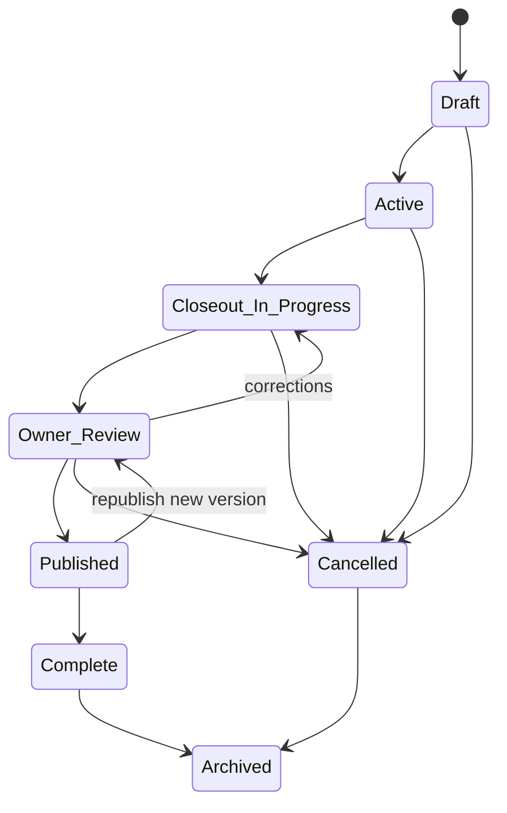
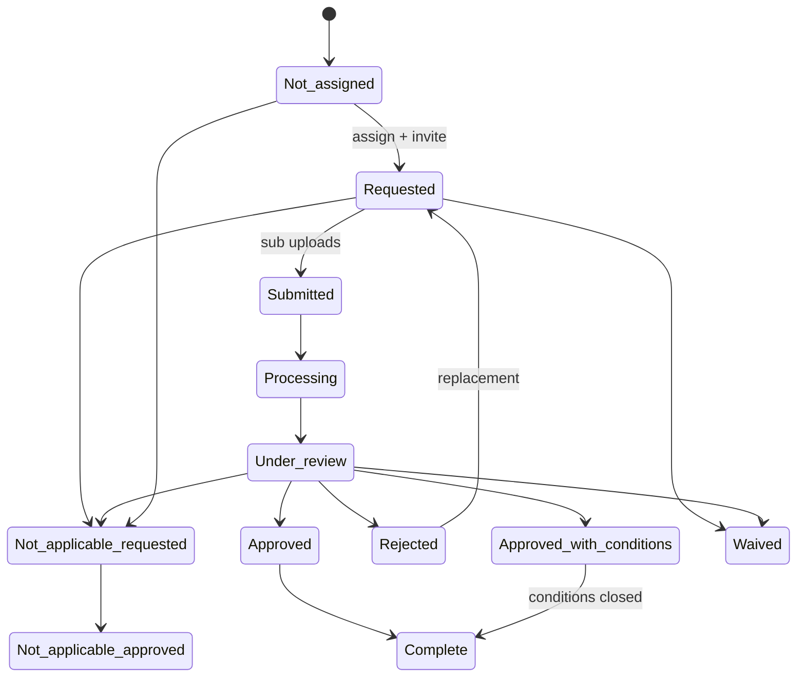
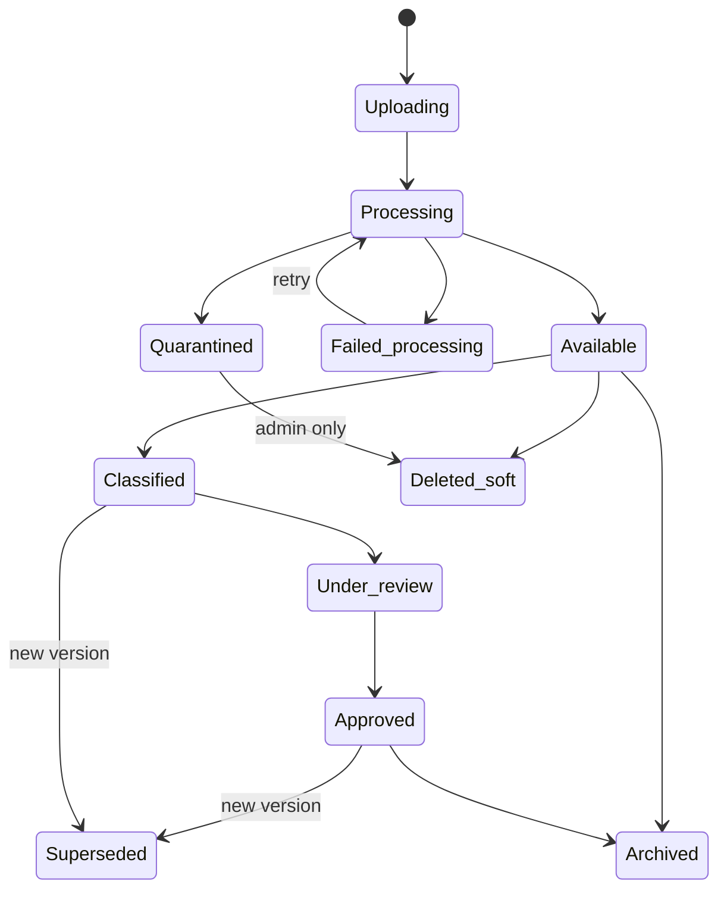
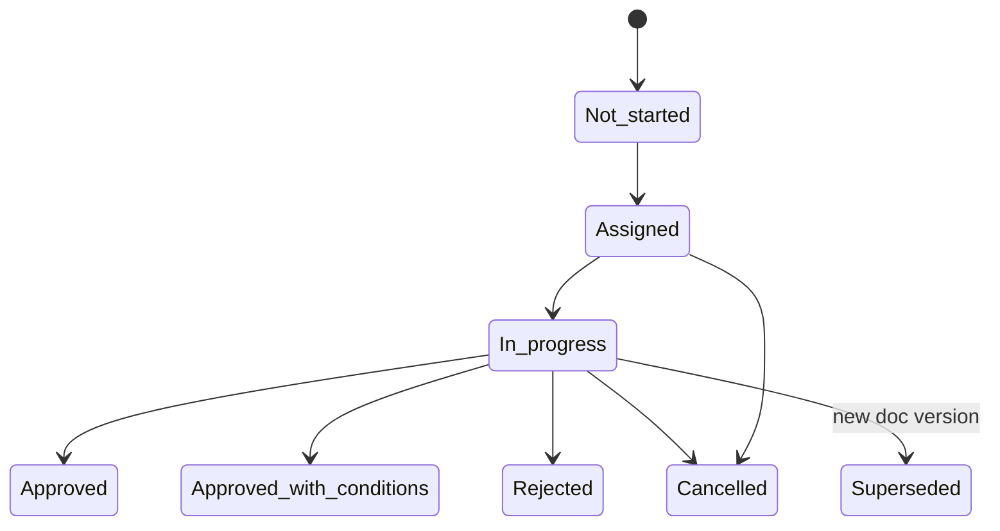
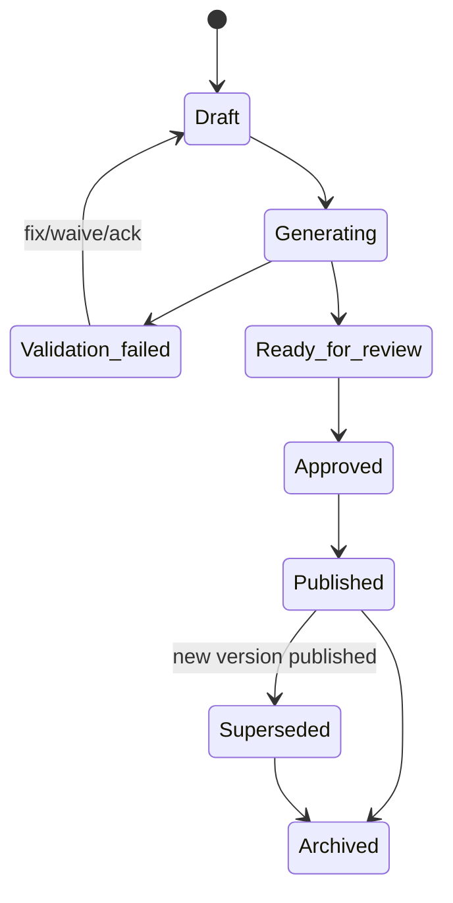
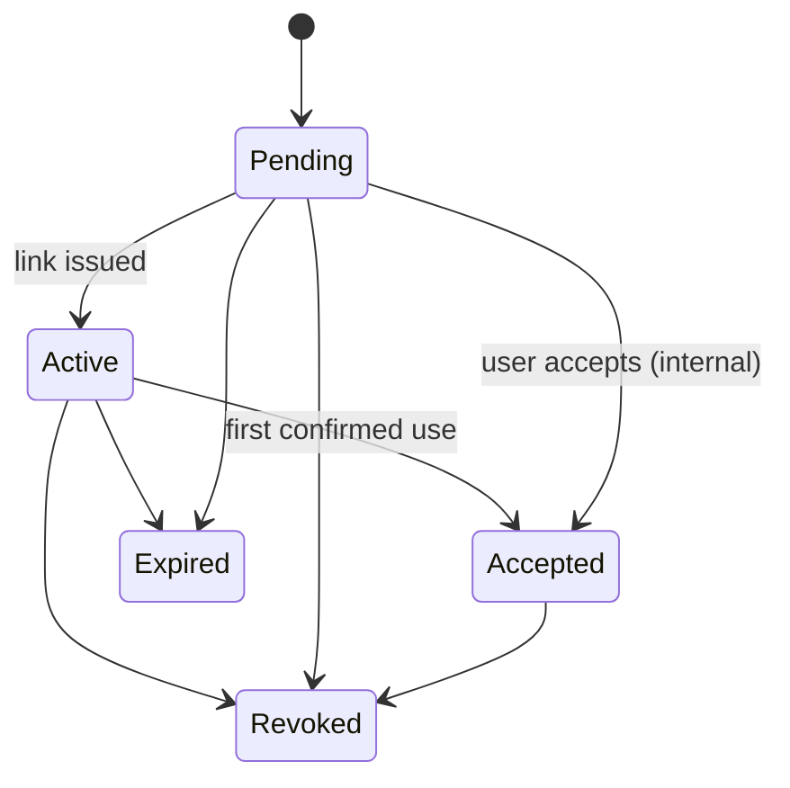
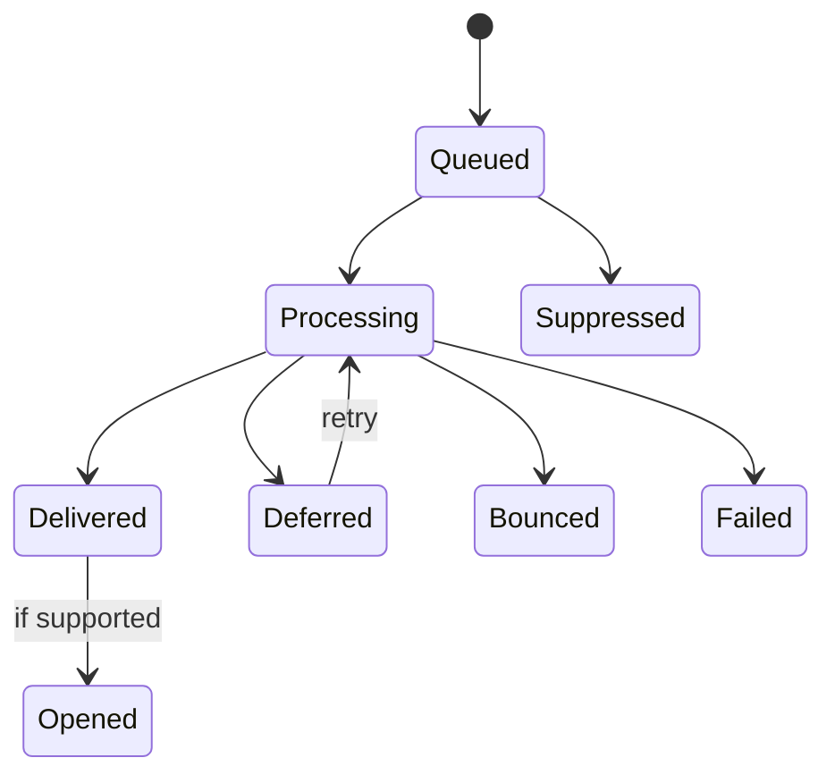
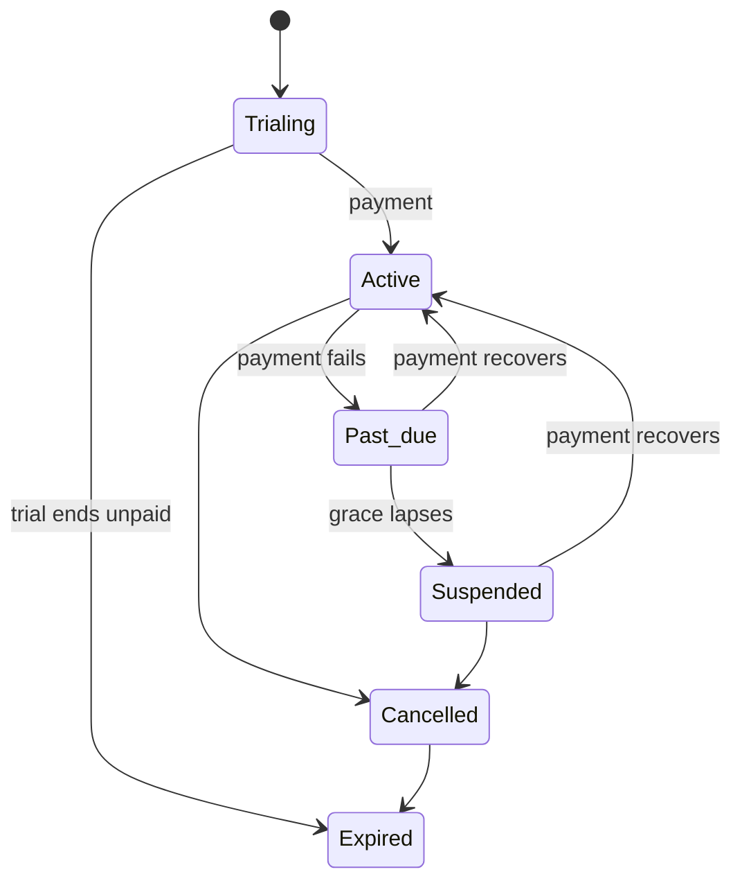

# FILE: /docs/product/statuses.md

> **Document status:** Phase 1 blueprint — permanent lifecycle & status source of truth.
> **Companion documents:** [product-requirements.md](./product-requirements.md), [workflows.md](./workflows.md), [user-roles.md](./user-roles.md).
> **Design principle (critical):** *Statuses* describe where a record is in its lifecycle. They are **not** permissions, **not** boolean flags, and **not** workflow events. Where a concept from the source brief is better modeled as a flag or a separate field, this document says so explicitly. Every status transition emits an audit event (SEC-001).

---

## Modeling decisions (status vs. flag vs. field)

| Concept from brief | Decision | Rationale |
|--------------------|----------|-----------|
| "Corrections required" (project) | **Derived indicator**, not a stored status | It is an aggregate of rejected/overdue requirements; storing it duplicates truth. |
| "Collecting documents" / "Under review" (project) | **Sub-phase of one status** (`Closeout In Progress`) surfaced via dashboard indicators | Avoids status explosion; the project is in closeout regardless of which items are collecting vs. reviewing. |
| "Missing" (requirement) | **Flag** on `Requested`/overdue, not a separate lifecycle status | "Missing" = requested-and-past-due-with-no-submission; it is a computed condition. |
| "Approved with conditions" | **Status** with an associated **open-conditions field** | The condition set must be tracked to closure separately. |
| "Not applicable requested" vs "approved" | **Statuses** (request → decision) | The request and the decision are distinct lifecycle points. |
| "Opened" (notification) | **Status only when the channel supports it** (email opens are best-effort) | Not all channels report opens reliably. |
| "Processing" (requirement) | **Transient status** while documents process | Distinct from review. |
| "Quarantined" (document) | **Status** (security hold) | Must block serving; not a flag. |

---

## A. Project lifecycle

**Chosen model (clean, minimal):**

`Draft → Active → Closeout In Progress → Owner Review → Published → Complete → Archived`, with `Cancelled` reachable from any pre-`Complete` state.

The verbose brief concepts ("Preparing for closeout", "Collecting documents", "Under review", "Corrections required", "Ready to publish") are **dashboard sub-indicators within `Closeout In Progress`/`Owner Review`**, not separate stored statuses.

| Status | Meaning | Enter from | Who transitions |
|--------|---------|-----------|-----------------|
| `Draft` | Being set up; not yet active. | (created) | PM/Admin |
| `Active` | Construction ongoing; closeout planned. | Draft | PM |
| `Closeout In Progress` | Requirements being collected, reviewed, approved. | Active | PM |
| `Owner Review` | Package assembled; owner/AE final review underway. | Closeout In Progress | PM |
| `Published` | Package published; owner portal live. | Owner Review | PM (gated) |
| `Complete` | Handoff acknowledged / closeout finished. | Published | PM |
| `Archived` | Read-only long-term record; portal remains live. | Complete, Cancelled | PM/Admin |
| `Cancelled` | Project stopped before completion. | Draft, Active, Closeout In Progress, Owner Review | PM/Admin (gated) |

**Prohibited:** `Draft → Published` (must pass through review); `Archived → Active` except via explicit audited *unarchive*; `Complete → Cancelled` (a completed project cannot be cancelled — correct via new version/unarchive).
**Reversibility:** `Owner Review → Closeout In Progress` allowed (corrections). `Published → Owner Review` only by creating a new package version. `Archived` reversible via unarchive (audited).
**Related records on transition:** Entering `Published` freezes a package version and activates the owner portal. `Cancelled` preserves all records read-only. `Archived` freezes editing but keeps the owner portal live.
**Audit:** `project.status_changed{from,to,actor}` on every transition.

---

## B. Requirement lifecycle

**Chosen statuses** (with `Missing` modeled as a **flag**, not a status):

`Not assigned → Requested → Submitted → Processing → Under review → (Approved | Approved with conditions | Rejected)`; plus exception branch `Not applicable requested → Not applicable approved`, and `Waived`; terminal success is `Complete`.

| Status | Meaning | Notes |
|--------|---------|-------|
| `Not assigned` | Instantiated, no responsible party. | From template/rules/ad-hoc. |
| `Requested` | Assigned + invited; awaiting submission. | `Missing` **flag** applies when past due with no submission. |
| `Submitted` | Documents submitted, not yet processed. | Submission record created. |
| `Processing` | Uploaded documents processing (scan/convert). | Transient. |
| `Under review` | In a review chain (single/multi/parallel). | Distinct from document status. |
| `Approved` | Review chain approved. | Precondition for `Complete`. |
| `Approved with conditions` | Approved pending open conditions. | Carries **open-conditions field**. |
| `Rejected` | A review rejected; needs replacement. | Alias surface: `Replacement requested`. |
| `Not applicable requested` | Exception proposed to mark N/A. | Awaiting PM decision. |
| `Not applicable approved` | Confirmed never required. | Excluded from missing counts. |
| `Waived` | Required but excused unmet. | Distinct from N/A; documented reason. |
| `Complete` | Fully satisfied and closed. | Reached from `Approved`/`Approved with conditions` (conditions closed). |

**Key rule (separation of concerns):** A requirement becomes `Complete` **only** through its review chain's approval — **never** by the mere act of uploading a document. Requirement completion ≠ document approval ≠ document upload.
**Prohibited:** `Complete → Rejected` (reopen creates a new review, not a status regression on the same terminal); `Not applicable approved → Under review` (reverse only via explicit audited reversal); skipping `Under review` to `Approved`.
**Who transitions:** PM/Coordinator (assign, N/A, waive), Reviewers (approve/reject), System (processing).
**Reversibility:** `Not applicable approved`, `Waived` reversible by PM (audited). `Complete` reopened only by creating a new submission/version.
**Related records:** `Rejected`/replacement supersedes prior document version. `Waived`/`N/A` update package completeness math.
**Audit:** `requirement.status_changed{from,to,actor,reason?}`.

---

## C. Document lifecycle

`Uploading → Processing → Available → Classified → Under review → Approved`; plus `Failed processing`, `Superseded`, `Quarantined`, `Archived`, `Deleted (soft)`.

| Status | Meaning |
|--------|---------|
| `Uploading` | Transfer in progress. |
| `Processing` | Scanning (malware), converting, indexing. |
| `Available` | Stored and usable. |
| `Failed processing` | Processing failed; retriable. |
| `Classified` | Type + requirement link confirmed. |
| `Under review` | Part of an active review. |
| `Approved` | Approved as part of a review outcome. |
| `Superseded` | Replaced by a newer version (retained). |
| `Quarantined` | Security hold (malware/suspect); never served. |
| `Archived` | Retained, read-only (with project archive). |
| `Deleted (soft)` | Removed from active views; audit + retention preserved; hard-delete is a separate gated action. |

**Version integrity rule:** An approved document is **never silently overwritten**. Replacement creates a new version; the prior becomes `Superseded` (retained), and any dependent review restarts.
**Prohibited:** `Quarantined → Available` (only admin-mediated release after clearance); `Superseded → Approved` (approve the new version, not the old); `Deleted (soft)` does not erase audit records.
**Who transitions:** System (processing/quarantine), Uploaders (upload/replace), Reviewers (review/approve), Admin (release quarantine, hard-delete gated).
**Reversibility:** `Failed processing → Processing` (retry). Soft-delete recoverable within retention; hard-delete irreversible and gated.
**Audit:** `document.status_changed`, `document.version_created`, `document.quarantined|released`, `document.deleted`.

---

## D. Review lifecycle

Applies per review (a stage in single/multi/parallel).

`Not started → Assigned → In progress → (Approved | Approved with conditions | Rejected)`; plus `Cancelled`, `Superseded`.

| Status | Meaning |
|--------|---------|
| `Not started` | Review defined but not yet active (later stage waiting). |
| `Assigned` | Reviewer assigned; awaiting action. |
| `In progress` | Reviewer working. |
| `Approved` | Approved. |
| `Approved with conditions` | Approved with tracked conditions. |
| `Rejected` | Rejected with reason. |
| `Cancelled` | Voided (e.g., document superseded, requirement waived). |
| `Superseded` | Replaced because a new document version restarted review. |

**Prohibited:** `Approved → In progress` (create a new review for a new version). `Rejected → Approved` on the same review (new submission → new review).
**Who transitions:** Assigned reviewer (decisions), PM/Admin (reassign/cancel), System (supersede).
**Reversibility:** Terminal states are final for that review instance; corrections happen via new reviews.
**Related records:** Stage approval opens the next stage (sequential); rejection returns the requirement to the assignee.
**Audit:** `review.stage_opened|assigned|decided|cancelled|superseded`.

---

## E. Package lifecycle

`Draft → Generating → (Validation failed | Ready for review) → Approved → Published → Superseded → Archived`.

| Status | Meaning |
|--------|---------|
| `Draft` | Scope/structure being defined. |
| `Generating` | Artifacts being produced (async). |
| `Validation failed` | Completeness check found blocking gaps. |
| `Ready for review` | Generated; awaiting internal/owner review. |
| `Approved` | Cleared for publishing. |
| `Published` | Immutable, owner portal live. |
| `Superseded` | Replaced by a newer published version (retained). |
| `Archived` | Read-only with project archive. |

**Immutability rule:** `Published` is immutable. Corrections require a **new version** (Draft→…→Published) that supersedes the prior; the prior is retained for audit.
**Prohibited:** editing a `Published` package in place; `Published → Draft` (must branch a new version).
**Who transitions:** PM/Coordinator (build), System (generate/validate), PM (publish, gated).
**Reversibility:** Publishing is not reversed; a superseding version is issued instead.
**Related records:** `Published` activates/updates the owner portal; `Superseded` keeps history visible per policy.
**Audit:** `package.created|generated|validated|published|superseded|archived`.

---

## F. Invitation lifecycle

Covers four invitation kinds; they share a common shape with kind-specific notes.

| Status | User invite | Sub secure link | External reviewer invite | Owner portal invite |
|--------|-------------|-----------------|--------------------------|---------------------|
| `Pending` | Sent, not accepted | n/a | Sent, not accessed | Sent, not accessed |
| `Active` | (n/a — becomes membership) | Link usable | Access usable | Access usable |
| `Accepted` | Became a member | First use confirmed | First use confirmed | First use confirmed |
| `Expired` | Past expiry | Past expiry | Past expiry | Past expiry |
| `Revoked` | Cancelled by admin | Revoked (fails closed) | Revoked | Revoked |

**Rules:** All external links carry expiry and are instantly revocable (fail closed). Revocation is audited. Re-issuing creates a new invitation record (old one retained).
**Who transitions:** Issuer/Admin (revoke), System (expire), Recipient (accept).
**Audit:** `invite.issued|accepted|expired|revoked`.

---

## G. Notification lifecycle

`Queued → Processing → (Delivered | Deferred | Bounced | Failed | Suppressed)`; `Opened` only where the channel reports it.

| Status | Meaning |
|--------|---------|
| `Queued` | Accepted for sending. |
| `Processing` | Being handed to the channel provider. |
| `Delivered` | Provider confirmed delivery. |
| `Deferred` | Temporarily delayed (retryable). |
| `Bounced` | Hard/soft bounce. |
| `Failed` | Non-recoverable send failure. |
| `Suppressed` | Blocked by unsubscribe/suppression list. |
| `Opened` | Recipient opened (best-effort; email/where supported). |

**Rules:** Transactional messages (invites, rejections, escalations) are not suppressible by marketing opt-out; non-transactional respect unsubscribe. Bounces update recipient deliverability state. `Opened` is advisory (never used to gate workflow).
**Audit:** `notification.status_changed`; reminder deliveries specifically audited (`reminder.sent`).

---

## H. Subscription lifecycle

`Trialing → Active → Past due → Suspended → Cancelled → Expired`.

| Status | Meaning |
|--------|---------|
| `Trialing` | Free trial period. |
| `Active` | Paid and current. |
| `Past due` | Payment failed; grace period active. |
| `Suspended` | Access limited after grace period lapses. |
| `Cancelled` | Cancelled; access until period end. |
| `Expired` | Term ended; access removed per retention policy. |

**Rules:** `Suspended`/`Expired` never destroy data during the retention window; owner portals for published projects follow the owner-continuity policy (OWNER-009), not the billing state, unless explicitly terminated. Billing transitions are gated (§D of user-roles) and audited.
**Reversibility:** `Past due`/`Suspended → Active` on recovered payment. `Expired` requires a new subscription.
**Audit:** `subscription.status_changed`.

---

## I. Transition rules summary

| Lifecycle | Reversible transitions | Never reversible | Primary initiator | Key audit events |
|-----------|------------------------|------------------|-------------------|------------------|
| Project | Owner Review↔Closeout; Archive↔Unarchive | Complete→Cancelled | PM/Admin | `project.status_changed` |
| Requirement | N/A/Waived reversal | Complete via same submission | PM/Reviewer | `requirement.status_changed` |
| Document | Failed→Processing (retry); soft-delete recover | Hard-delete; Quarantine auto-release | System/Uploader/Admin | `document.status_changed`,`version_created` |
| Review | (none — new review for changes) | Terminal decisions | Reviewer/PM | `review.*` |
| Package | Validation failed→Draft | Edit a Published version | PM/System | `package.*` |
| Invitation | Re-issue (new record) | Un-revoke (issue new) | Issuer/System | `invite.*` |
| Notification | Deferred→retry | Delivered→undo | System | `notification.*` |
| Subscription | Past due/Suspended→Active | Expired→same term | Owner/System | `subscription.status_changed` |

**Global rules:**
1. Every transition emits an audit event with actor, timestamp, from/to, and reason where applicable.
2. No AI actor may perform an approval transition (REV-006).
3. Statuses never encode permissions; permission checks are independent (user-roles §A).
4. Related-record effects (supersede, portal update, completeness recompute) are part of the transition, executed atomically (NFR-ERR-001).

---

*End of statuses.md. Continue to [feature-roadmap.md](./feature-roadmap.md).*
