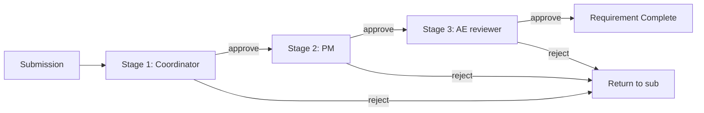
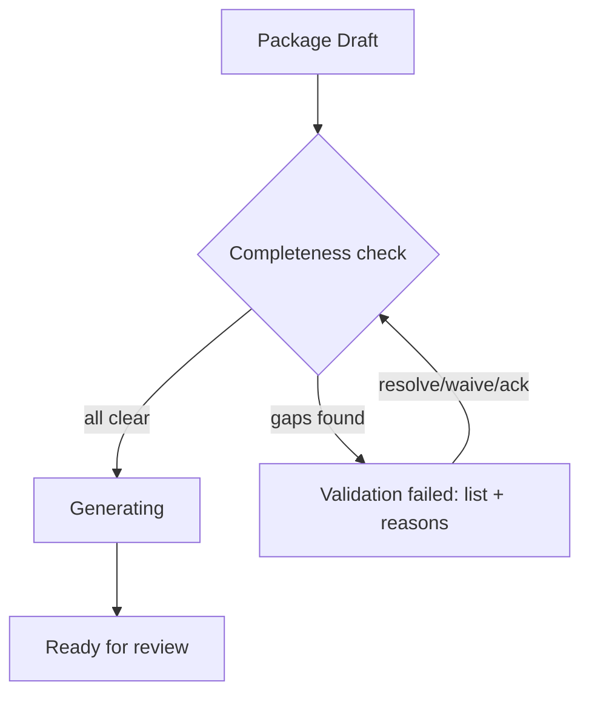
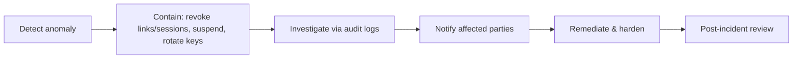

# FILE: /docs/product/workflows.md

> **Document status:** Phase 1 blueprint — permanent workflow source of truth.
> **Companion documents:** [product-requirements.md](./product-requirements.md), [user-roles.md](./user-roles.md), [statuses.md](./statuses.md).
> **Reading key for each workflow:** Trigger · Participants · Preconditions · Main flow · Alternative flows · Failure states · Notifications · Audit events · Final result · Related statuses · Permissions.
> **Conventions:** "Audited" means an immutable SEC-001 event. Status names reference [statuses.md](./statuses.md). Every state-changing action requires the permission named in [user-roles.md](./user-roles.md).

---

## Core end-to-end picture

```mermaid
flowchart LR
  A[Org created] --> B[Users invited]
  B --> C[Project created]
  C --> D[Contacts & subs added]
  D --> E[Template applied + rules]
  E --> F[Requirements assigned]
  F --> G[Sub upload via secure link]
  G --> H[Classification]
  H --> I[Review & approval]
  I -->|approved| J[Requirement complete]
  I -->|rejected| G
  J --> K[Equipment/warranty/cert/training records]
  K --> L[Package builder + completeness check]
  L --> M[Publish package]
  M --> N[Owner portal + long-term access]
```

---

## 1. Company registration and organization creation
- **Trigger:** A prospective customer signs up.
- **Participants:** Founding user (→ Org Owner).
- **Preconditions:** Valid, verifiable email; not already the owner of a conflicting org (multi-org allowed).
- **Main flow:** Register → verify email (AUTH-001) → create organization (ORG-001) → creator becomes Owner → default template library seeded (TMPL-002) → prompted to start a trial (BILL-001).
- **Alternative flows:** Email already a platform user → add a new org membership without a new account; invited to an existing org instead of creating one.
- **Failure states:** Verification expired → re-request; org creation fails → no partial org persisted (NFR-ERR-001).
- **Notifications:** Verification email; welcome email.
- **Audit events:** `org.created`, `user.registered`, `membership.owner_assigned`.
- **Final result:** Isolated organization with an Owner and starter templates.
- **Related statuses:** Subscription → `Trialing`.
- **Permissions:** Any authenticated user (create org).

## 2. Employee invitation and role assignment
- **Trigger:** Owner/Admin invites a teammate.
- **Participants:** Owner/Admin (inviter), invitee.
- **Preconditions:** Seat available (BILL-001); inviter has manage-users.
- **Main flow:** Enter email + role + scope (org/division/project) (TEAM-001) → invitation sent → invitee accepts → role active → appears in team list.
- **Alternative flows:** Invitee already has a platform account → membership added directly; role changed later (TEAM-002); invite revoked before acceptance.
- **Failure states:** No seats → prompt to adjust plan; invalid email → bounce handling.
- **Notifications:** Invitation email; acceptance confirmation to inviter.
- **Audit events:** `user.invited`, `invite.accepted|revoked`, `role.assigned`.
- **Final result:** New member with a scoped role.
- **Related statuses:** Invitation → `Pending`→`Accepted`/`Revoked`/`Expired`.
- **Permissions:** Invite/manage users (Owner/Admin; PM only if granted).

## 3. Project creation
- **Trigger:** New job reaches (or anticipates) closeout planning.
- **Participants:** PM/Admin/Coordinator.
- **Preconditions:** Org active; creator can create projects.
- **Main flow:** Enter name, type, owner, address, target closeout date, division (PROJ-001) → project created in `Draft` → assign PM.
- **Alternative flows:** Created from a duplicate/clone of a prior project; created without owner contact (added before publish).
- **Failure states:** Missing required field blocks creation; billing gate if per-project plan (BILL-002).
- **Notifications:** Assigned PM notified.
- **Audit events:** `project.created`, `project.pm_assigned`.
- **Final result:** Project in `Draft`.
- **Related statuses:** Project → `Draft`.
- **Permissions:** Create projects.

## 4. Importing project contacts and subcontractors
- **Trigger:** PM/Coordinator populates the project's people.
- **Participants:** Coordinator/PM; optionally Admin.
- **Preconditions:** Project exists; subs may already be in the org directory (SUB-001).
- **Main flow:** Add contacts manually or import CSV (SUB-002/IMP-001) → preview + map fields → validate → commit → link subs from directory or create new → assign roles (owner, AE, consultant, sub).
- **Alternative flows:** Reuse an existing directory sub across projects; single manual add; import with duplicates → dedupe prompt.
- **Failure states:** Malformed rows quarantined with row-level errors (no silent partial import).
- **Notifications:** None automatic (invites are separate, §9).
- **Audit events:** `contact.created|imported`, `subcontractor.linked`.
- **Final result:** Project populated with contacts/subs.
- **Related statuses:** —
- **Permissions:** Add/edit contacts & subs.

## 5. Creating a requirement template
- **Trigger:** Admin/PM standardizes a closeout checklist.
- **Participants:** Admin/PM.
- **Preconditions:** Trade taxonomy available (TRADE-001).
- **Main flow:** Create template → add items (type, trade, mandatory/optional, expected format, default reviewer chain) (TMPL-001) → save as version 1.
- **Alternative flows:** Copy a starter template and edit; edit later → creates a new version (existing projects keep the applied version).
- **Failure states:** Template with zero items warned; naming collisions allowed.
- **Notifications:** —
- **Audit events:** `template.created|versioned`.
- **Final result:** Reusable versioned template.
- **Related statuses:** Template version state (draft/published — internal).
- **Permissions:** Create/edit templates (gated ▲).

## 6. Applying a template to a project
- **Trigger:** PM sets up the project's requirements.
- **Participants:** PM/Coordinator.
- **Preconditions:** Project exists; template exists; project attributes set (for rules).
- **Main flow:** Select template → rules engine evaluates conditions (RULE-001) → preview generated requirement set with per-item rationale ("included because trade X present") → confirm → concrete requirements created in `Not assigned` (REQ-001).
- **Alternative flows:** Apply multiple templates (dedupe by item key, TMPL-003); re-apply an updated template (merge, never destroy submitted items).
- **Failure states:** Contradictory rules → precedence resolves; user can override before confirm.
- **Notifications:** —
- **Audit events:** `template.applied`, `requirement.created` (bulk).
- **Final result:** Project requirement set instantiated.
- **Related statuses:** Requirements → `Not assigned`.
- **Permissions:** Create project requirements.

## 7. Adding project-specific requirements
- **Trigger:** A one-off obligation not covered by templates.
- **Participants:** PM/Coordinator.
- **Preconditions:** Project exists.
- **Main flow:** Add ad-hoc requirement (type, trade, due date, reviewer chain) (REQ-002) → behaves like any requirement → optionally promote to a template item.
- **Alternative flows:** Duplicate-of-template flagged.
- **Failure states:** Missing required attributes blocks save.
- **Notifications:** —
- **Audit events:** `requirement.created`.
- **Final result:** Additional requirement in `Not assigned`.
- **Permissions:** Create project requirements.

## 8. Assigning requirements to a subcontractor
- **Trigger:** Requirement needs an owner responsible for fulfillment.
- **Participants:** PM/Coordinator.
- **Preconditions:** Requirement exists; sub/contact available.
- **Main flow:** Select requirement(s) → choose responsible sub company/contact → set due date (REQ-003) → status → `Requested` when the invite is sent (§9).
- **Alternative flows:** Bulk-assign many requirements to one sub; reassign later (preserves prior submissions); assign to an internal party.
- **Failure states:** Assign without contact → allowed but flagged; unassigned + due → `Missing`.
- **Notifications:** Assignment triggers invite in §9.
- **Audit events:** `requirement.assigned|reassigned`.
- **Final result:** Requirement has a responsible party.
- **Related statuses:** `Not assigned`→`Requested`.
- **Permissions:** Assign requirements.

## 9. Sending an account-free upload invitation
- **Trigger:** Coordinator invites a sub to upload.
- **Participants:** Coordinator/PM; recipient sub.
- **Preconditions:** Requirement assigned; recipient email known.
- **Main flow:** Generate secure tokenized link scoped to the sub's assigned checklist (AUTH-003) → email invitation → link has expiry, is revocable → requirement(s) → `Requested`.
- **Alternative flows:** Reissue/extend an expired link; send to multiple contributors at one sub; optional one-time code for higher assurance.
- **Failure states:** Email bounce flagged (NOTIF); revoked link fails closed.
- **Notifications:** Invitation email (and reminders per §22).
- **Audit events:** `invite.link_issued`, `notification.sent`.
- **Final result:** Sub can access their checklist without an account.
- **Related statuses:** Requirement `Requested`; Link `Active`.
- **Permissions:** Assign requirements / issue links.

## 10. Subcontractor opening the secure link
- **Trigger:** Sub clicks the invitation link.
- **Participants:** Sub contributor.
- **Preconditions:** Link active, not expired/revoked.
- **Main flow:** Open link (mobile-first) → optional identity confirmation (AUTH-008) → see only their assigned requirement checklist with descriptions and expected formats (PORT-001) → no other project data visible.
- **Alternative flows:** Expired/revoked → re-request flow; forwarded link used by a different person → identity captured/flagged.
- **Failure states:** Invalid token → generic denial (no info leak).
- **Notifications:** Optionally notify coordinator that the link was opened.
- **Audit events:** `link.opened`, `identity.confirmed`.
- **Final result:** Sub views their checklist.
- **Related statuses:** Requirement unchanged (`Requested`).
- **Permissions:** Account-free link scope.

## 11. Subcontractor submitting documents
- **Trigger:** Sub uploads files for a requirement.
- **Participants:** Sub contributor.
- **Preconditions:** Link active; requirement `Requested`/`Missing`.
- **Main flow:** Select requirement → upload file(s) (PORT-001, DOC-001) → malware scan → processing → documents `Available` → a **submission** is recorded fulfilling the requirement → requirement → `Submitted`/`Processing` → confirmation shown (PORT-003).
- **Alternative flows:** Multiple files/photos per item; replace a prior file (new version, DOC-002); submit part now, more later.
- **Failure states:** Malware → `Quarantined`, not accepted; unsupported/zero-byte rejected; interrupted large upload resumes (NFR-FILE-003).
- **Notifications:** Coordinator notified of submission; sub gets confirmation.
- **Audit events:** `document.uploaded`, `submission.created`, `requirement.status_changed`.
- **Final result:** Documents attached; requirement awaiting review.
- **Related statuses:** Requirement `Submitted`→`Processing`→`Under review`; Document `Uploading`→`Processing`→`Available`.
- **Permissions:** Upload to assigned requirements.

## 12. Bulk document upload
- **Trigger:** Many files or folders uploaded at once.
- **Participants:** Sub or Coordinator.
- **Preconditions:** Access to target requirement(s).
- **Main flow:** Select multiple files/folders (PORT-002) → per-file progress → each processed independently → successes persist even if some fail → user maps unclassified files to requirements.
- **Alternative flows:** Zip handling per policy; nested folders preserved as hints.
- **Failure states:** Partial failures reported per file; no all-or-nothing loss.
- **Notifications:** Summary of succeeded/failed.
- **Audit events:** `document.uploaded` (per file), `bulk.upload_completed`.
- **Final result:** Batch of documents available for classification.
- **Related statuses:** Documents `Available`/`Failed processing`.
- **Permissions:** Upload.

## 13. AI-assisted classification
- **Trigger:** New document becomes `Available`.
- **Participants:** System (suggest); Coordinator (confirm).
- **Preconditions:** Document available; classifier enabled.
- **Main flow:** AI proposes document type + candidate requirement + confidence + rationale (DOC-003) → shown as a **suggestion** → coordinator accepts/overrides → on accept, document links to requirement.
- **Alternative flows:** Low confidence → routed to manual queue (§14); metadata extraction proposed (DOC-004) for equipment/warranty.
- **Failure states:** Classifier error → falls back to manual; never auto-approves (REV-006).
- **Notifications:** Items needing manual classification surfaced.
- **Audit events:** `document.classified` (with `by=AI-suggested/human-confirmed`).
- **Final result:** Document typed and linked (pending human confirmation).
- **Related statuses:** Document `Classified`.
- **Permissions:** Classify (human confirm).

## 14. Manual document classification
- **Trigger:** No/low-confidence AI result, or override needed.
- **Participants:** Coordinator.
- **Preconditions:** Document available.
- **Main flow:** Coordinator selects document type + target requirement manually (DOC-003) → links document → optionally records why override.
- **Alternative flows:** Reclassify a previously misclassified document (audited).
- **Failure states:** Wrong requirement chosen → correctable, preserves history.
- **Notifications:** —
- **Audit events:** `document.classified` (human).
- **Final result:** Document correctly linked.
- **Related statuses:** Document `Classified`.
- **Permissions:** Classify.

## 15. Single-stage document review
- **Trigger:** Submission ready for review.
- **Participants:** One reviewer (internal or external).
- **Preconditions:** Document `Available`, requirement `Under review`; reviewer assigned.
- **Main flow:** Reviewer opens submission → views/annotates (ANNO-001) → decides Approve / Approve-with-conditions / Reject with reason (REV-001, REV-004) → outcome recorded.
- **Alternative flows:** Approve-with-conditions carries open conditions to closure; reassign to another reviewer (REV-005).
- **Failure states:** Document superseded mid-review → stale review cancelled.
- **Notifications:** Assignee notified of decision; conditions communicated.
- **Audit events:** `review.decided` (approve/condition/reject).
- **Final result:** Requirement advances or returns to sub.
- **Related statuses:** Review `In progress`→terminal; Requirement → `Approved`/`Approved with conditions`/`Rejected`.
- **Permissions:** Review + approve/reject (approve is gated ▲).

## 16. Multi-stage sequential review
- **Trigger:** Requirement configured with an ordered reviewer chain.
- **Participants:** Reviewers in order (e.g., Coordinator → PM → AE → Owner rep).
- **Preconditions:** Chain defined; submission ready.
- **Main flow:** Stage 1 approves → stage 2 opens → … each gates the next (REV-002) → final approval completes the requirement.

- **Alternative flows:** Rejection returns to sub (default) or to a prior stage (configurable); conditional approval passes conditions forward; skip a stage requires explicit authority.
- **Failure states:** External reviewer unavailable/removed → stage returns to internal queue.
- **Notifications:** Each stage's reviewer notified when their turn opens; assignee notified on any rejection.
- **Audit events:** `review.stage_opened|decided` per stage.
- **Final result:** Requirement `Complete` only after final stage approves.
- **Related statuses:** Requirement `Under review`→`Complete`/`Rejected`.
- **Permissions:** Per-stage review/approve.

## 17. Parallel review
- **Trigger:** Requirement configured for simultaneous reviewers.
- **Participants:** Multiple reviewers at once.
- **Preconditions:** Parallel policy set (all/any/quorum) (REV-003).
- **Main flow:** All assigned reviewers review concurrently → completion evaluated by policy (default: any rejection blocks; all-approve required).
- **Alternative flows:** Quorum approval; mixed decisions resolved by rule.
- **Failure states:** Conflicting decisions → requirement not complete; recorded.
- **Notifications:** All reviewers notified; assignee notified of aggregate outcome.
- **Audit events:** `review.decided` per reviewer; `review.aggregated`.
- **Final result:** Requirement complete only if policy satisfied.
- **Related statuses:** Requirement `Under review`→terminal.
- **Permissions:** Per-reviewer review/approve.

## 18. Document rejection and replacement
- **Trigger:** A reviewer rejects, or a better version is needed.
- **Participants:** Reviewer; sub (replacement).
- **Preconditions:** Submission exists.
- **Main flow:** Reviewer rejects with reason (REV-001) → requirement → `Replacement requested`/`Rejected` → sub notified → sub uploads a **new version** (DOC-002, never silent overwrite) → review re-triggered.
- **Alternative flows:** Coordinator requests replacement without full rejection; replacement during active review supersedes the in-flight version with notice.
- **Failure states:** Sub uploads same defective file → re-rejected; link expired → reissue.
- **Notifications:** Rejection reason to sub; new-version notice to reviewer.
- **Audit events:** `review.rejected`, `document.version_created`, `review.restarted`.
- **Final result:** New version under review; old version superseded (retained).
- **Related statuses:** Document old→`Superseded`, new→`Under review`.
- **Permissions:** Reject (reviewer); upload (sub).

## 19. Requesting a requirement exception
- **Trigger:** Sub/internal user cannot fulfill as specified.
- **Participants:** Requester (sub/internal); PM (decider).
- **Preconditions:** Requirement not already complete.
- **Main flow:** Requester submits exception (extension / alternative document / propose N/A) with reason (REQ-005) → PM reviews → approve/deny → status reflects outcome.
- **Alternative flows:** Extension granted (new due date); alternative document accepted (proceeds to review); escalates to N/A (§20) or waiver (§21).
- **Failure states:** Exception on approved requirement blocked.
- **Notifications:** Requester notified of decision.
- **Audit events:** `exception.requested|approved|denied`.
- **Final result:** Requirement path adjusted with recorded justification.
- **Related statuses:** e.g., `Not applicable requested`.
- **Permissions:** Request (assignee/internal); decide (PM).

## 20. Marking a requirement Not Applicable
- **Trigger:** Requirement determined to have never applied.
- **Participants:** PM.
- **Preconditions:** Requirement exists.
- **Main flow:** PM marks N/A with reason (REQ-006) → removed from "missing" counts, remains visible with reason/actor → `Not applicable approved`.
- **Alternative flows:** Reversible (audited); N/A after submissions exist warns and preserves them.
- **Failure states:** N/A on a legally sensitive item surfaces a warning.
- **Notifications:** Team/assignee informed.
- **Audit events:** `requirement.marked_na`.
- **Final result:** Requirement excluded from completeness gaps.
- **Related statuses:** `Not applicable approved`.
- **Permissions:** Mark N/A.

## 21. Waiving a requirement
- **Trigger:** Requirement applies but will be excused unmet.
- **Participants:** PM (optionally two-person / owner-level for P0).
- **Preconditions:** Requirement exists.
- **Main flow:** PM waives with justification and authority (REQ-007) → status `Waived` → distinct from N/A (waiver = required-but-excused) → package check accounts for it.
- **Alternative flows:** Two-person approval for sensitive items (§D); reversible.
- **Failure states:** Waiving a legally sensitive requirement surfaces a warning and may require owner permission.
- **Notifications:** Team informed; recorded on package.
- **Audit events:** `requirement.waived`.
- **Final result:** Requirement excused with documented reason.
- **Related statuses:** `Waived`.
- **Permissions:** Waive (gated ▲, owner-level for P0).

## 22. Automated reminders
- **Trigger:** Requirement outstanding as reminder cadence elapses.
- **Participants:** System; assignee (recipient).
- **Preconditions:** Requirement `Requested`/`Missing`; reminders enabled.
- **Main flow:** Scheduler evaluates outstanding items → sends timezone-aware reminders per cadence (NOTIF-002) → stops on submission → each delivery audited.
- **Alternative flows:** Coordinator adjusts cadence; manual nudge; throttling prevents over-notification.
- **Failure states:** Bounce flagged; suppressed address respected.
- **Notifications:** Reminder emails (SMS Expansion).
- **Audit events:** `reminder.sent` (with delivery status).
- **Final result:** Assignee nudged; response tracked (metric J).
- **Related statuses:** Notification lifecycle; requirement unchanged until submission.
- **Permissions:** Configure reminders (PM/Coordinator).

## 23. Escalation after missed deadlines
- **Trigger:** Requirement overdue beyond a threshold.
- **Participants:** System; internal ladder (Coordinator → PM → Org leader).
- **Preconditions:** Overdue; escalation configured (NOTIF-003).
- **Main flow:** Threshold crossed → escalate up the ladder → escalation surfaced on dashboards/risk engine.
- **Alternative flows:** Escalation suppressed if waived/N/A; custom ladders.
- **Failure states:** No configured escalatee → defaults to PM.
- **Notifications:** Escalation notices to internal roles.
- **Audit events:** `escalation.triggered`.
- **Final result:** Overdue item gets internal attention.
- **Related statuses:** Requirement `Missing`/overdue flag; risk driver added.
- **Permissions:** Configure escalation (PM/Admin).

## 24. Requirement-level communication
- **Trigger:** A question/clarification about one requirement.
- **Participants:** Coordinator/reviewer ↔ assigned sub/reviewer.
- **Preconditions:** Requirement exists; participant assigned.
- **Main flow:** Threaded message scoped to the requirement (COMM-001) → external participant sees only messages intended for them; internal notes stay internal.
- **Alternative flows:** Attach reference; convert into an exception request (§19).
- **Failure states:** External participant removed → loses future access; history preserved internally.
- **Notifications:** New-message notifications to thread participants.
- **Audit events:** `message.posted` (scope=requirement).
- **Final result:** Recorded, scoped conversation.
- **Related statuses:** —
- **Permissions:** Requirement messaging.

## 25. Project-level communication
- **Trigger:** Internal coordination about the project.
- **Participants:** Internal team.
- **Preconditions:** Project exists.
- **Main flow:** Internal messages/notes at project scope (COMM-002) → never exposed externally by default.
- **Alternative flows:** Convert a note into a task/reminder (Expansion).
- **Failure states:** Accidental external exposure prevented (default-internal).
- **Notifications:** Mentions/notifications to internal members.
- **Audit events:** `message.posted` (scope=project, internal).
- **Final result:** Internal record preserved.
- **Permissions:** Project messaging/internal notes (internal only).

## 26. Creating an equipment record from a submitted document
- **Trigger:** A submitted O&M/warranty/manual references a building asset.
- **Participants:** Coordinator (confirm); System (suggest).
- **Preconditions:** Document classified.
- **Main flow:** Metadata extraction proposes manufacturer/model/serial/location (DOC-004) → coordinator confirms → equipment record created (EQUIP-001) and linked to the document.
- **Alternative flows:** Manual equipment entry; link additional docs/warranties; generate QR (EQUIP-002).
- **Failure states:** Wrong extraction corrected; never overwrites human-entered values.
- **Notifications:** —
- **Audit events:** `equipment.created`, `document.linked`.
- **Final result:** Asset registered for O&M/owner portal.
- **Related statuses:** —
- **Permissions:** Create equipment (Coordinator/PM).

## 27. Creating a warranty record
- **Trigger:** A warranty document is submitted/approved.
- **Participants:** Coordinator; System (suggest).
- **Preconditions:** Document available/classified.
- **Main flow:** Extract/enter type (manufacturer/contractor), coverage, start/end dates, responsible party (WARR-001) → confirm → warranty registered, linked to equipment/document → appears in owner portal.
- **Alternative flows:** Start date tied to substantial completion event; expiration alerts enabled (WARR-002).
- **Failure states:** Unknown start date flagged; **legal-accuracy caveat** shown (R-5).
- **Notifications:** Optional expiration reminders later.
- **Audit events:** `warranty.created`.
- **Final result:** Warranty in the register.
- **Related statuses:** —
- **Permissions:** Create warranty (Coordinator/PM).

## 28. Tracking inspections and certificates
- **Trigger:** An inspection occurs or a certificate (incl. CO) is issued.
- **Participants:** Coordinator.
- **Preconditions:** Project exists.
- **Main flow:** Create inspection/certificate record with issuing authority, dates, result, document (INSP-001) → CO/temporary CO tracked distinctly → feeds package/owner portal.
- **Alternative flows:** Conditional/temporary CO vs. final CO; re-inspection.
- **Failure states:** Missing issuing authority flagged.
- **Notifications:** Team informed of key certs (e.g., CO received).
- **Audit events:** `inspection.recorded`, `certificate.recorded`.
- **Final result:** Compliance records tracked.
- **Permissions:** Create inspection/cert (Coordinator).

## 29. Recording owner training
- **Trigger:** Owner training session held.
- **Participants:** Coordinator; owner attendees.
- **Preconditions:** Project exists; equipment/systems recorded (helpful).
- **Main flow:** Record session, attendees, materials, linked systems/equipment; optional owner acknowledgment (TRAIN-001) → included in handoff.
- **Alternative flows:** Multiple sessions; attach recording/materials.
- **Failure states:** Attendance disputes noted.
- **Notifications:** Owner sign-off request (optional).
- **Audit events:** `training.recorded`, `training.acknowledged`.
- **Final result:** Training documented for handoff.
- **Permissions:** Create training records (Coordinator).

## 30. Tracking lien waivers
- **Trigger:** A pay milestone or final payment requires waivers.
- **Participants:** Coordinator/PM; subs (submit waiver docs).
- **Preconditions:** Subs on project.
- **Main flow:** Create waiver tracking items by sub + milestone with type (conditional/unconditional, progress/final) (LIEN-001) → collect signed documents → track status. **Status tracking only — no legal-validity assertion.**
- **Alternative flows:** Advisory gate: warn if final payment precedes final waiver.
- **Failure states:** Jurisdictional variance → advisory only; **attorney review required**.
- **Notifications:** Reminders for outstanding waivers.
- **Audit events:** `lien_waiver.recorded|status_changed`.
- **Final result:** Waiver status visible; documents stored.
- **Permissions:** Manage lien waivers (Coordinator/PM).

## 31. Managing as-built drawing revisions
- **Trigger:** As-built/record drawings submitted or updated.
- **Participants:** Coordinator; AE reviewer.
- **Preconditions:** Drawing documents uploaded.
- **Main flow:** Organize revision sets with version history (ASBUILT-001, DOC-002) → route for AE review → identify latest approved set → feed package/O&M.
- **Alternative flows:** Partial sheet updates; superseded sets retained.
- **Failure states:** Large files handled (NFR-FILE); mismatched sheet sets flagged.
- **Notifications:** Reviewer notified of new revisions.
- **Audit events:** `drawing.revision_added`, `drawing.approved`.
- **Final result:** Authoritative as-built set identified.
- **Permissions:** Manage drawings (Coordinator); review (AE).

## 32. Creating a closeout package
- **Trigger:** Project nears handoff.
- **Participants:** PM/Coordinator.
- **Preconditions:** Requirements largely complete.
- **Main flow:** Start a package → select scope (approved requirements, equipment, warranties, certs, training, drawings) and structure (PKG-001) → package in `Draft`.
- **Alternative flows:** Include a waived/N/A item explicitly (annotated); multiple package scopes.
- **Failure states:** Including unapproved items requires explicit choice.
- **Notifications:** —
- **Audit events:** `package.created`.
- **Final result:** Draft package defined.
- **Related statuses:** Package `Draft`.
- **Permissions:** Build package (PM/Coordinator).

## 33. Running a package completeness check
- **Trigger:** Before generating/publishing.
- **Participants:** System; PM/Coordinator.
- **Preconditions:** Draft package exists.
- **Main flow:** Run check → list missing/rejected/open-condition items with explanations (PKG-002) → resolve, waive, or acknowledge → generation allowed per policy.

- **Alternative flows:** N/A items correctly excluded; P0 gaps block or require gated acknowledgment.
- **Failure states:** False "missing" from N/A must not appear.
- **Notifications:** Results shown to builder.
- **Audit events:** `package.completeness_checked`.
- **Final result:** Package validated or flagged.
- **Related statuses:** Package `Generating`/`Validation failed`.
- **Permissions:** Build package.

## 34. Publishing a package
- **Trigger:** Package approved for owner delivery.
- **Participants:** PM (gated).
- **Preconditions:** Completeness check passed/acknowledged; package `Ready for review`/`Approved`.
- **Main flow:** Confirm publish (▲ confirm) → package version frozen and immutable (PKG-004) → owner portal made available (OWNER-001) → project → `Published`.
- **Alternative flows:** Republish after corrections creates a new version (superseding prior).
- **Failure states:** Generation failure → retry; never publish partial artifacts.
- **Notifications:** Owner-rep invitations (§35); internal confirmation.
- **Audit events:** `package.published`, `project.status_changed`.
- **Final result:** Immutable published package + live owner portal.
- **Related statuses:** Package `Published`; Project `Published`.
- **Permissions:** Publish (gated ▲).

## 35. Inviting owner representatives
- **Trigger:** After (or with) publishing.
- **Participants:** PM/Admin; owner reps.
- **Preconditions:** Package published.
- **Main flow:** Invite owner reps via secure link or optional account scoped to their building (OWNER-002) → set download policy → reps gain read/search/download of published records.
- **Alternative flows:** Multiple reps; revoke/reissue as owner staff change.
- **Failure states:** Revoked link fails closed.
- **Notifications:** Owner invitation email.
- **Audit events:** `owner.invited`, `owner_link.issued`.
- **Final result:** Owner reps can access the portal.
- **Related statuses:** Owner invitation lifecycle.
- **Permissions:** Invite owner reps (gated ▲).

## 36. Owner searching and downloading records
- **Trigger:** Owner needs a manual/warranty/cert/equipment info.
- **Participants:** Owner rep.
- **Preconditions:** Portal published; rep has access.
- **Main flow:** Browse/search within their building scope (OWNER-003, SEARCH-001) → download subject to policy → downloads audited.
- **Alternative flows:** Bulk download full package; QR scan resolves to an equipment record (EQUIP-002).
- **Failure states:** Restricted files honored (view-only/blocked); expired link → re-request.
- **Notifications:** Optional download receipts.
- **Audit events:** `owner.searched`, `owner.downloaded`.
- **Final result:** Owner retrieves needed records.
- **Permissions:** Owner-portal read/download (▲ per policy).

## 37. Updating a published package
- **Trigger:** A correction/addition is needed after publishing.
- **Participants:** PM/Coordinator (build); PM (publish).
- **Preconditions:** A published package exists.
- **Main flow:** Create a new package version from the published one → make changes → completeness check → publish new version (PKG-004) → owner portal updates to current version with change visibility → prior version retained for audit.
- **Alternative flows:** Minor metadata fix vs. added documents; notify owner of update.
- **Failure states:** Cannot mutate a published version in place.
- **Notifications:** Owner update notice (optional).
- **Audit events:** `package.version_created|published`, `package.superseded`.
- **Final result:** New current published version; history preserved.
- **Related statuses:** Prior package `Superseded`; new `Published`.
- **Permissions:** Build + publish (gated ▲).

## 38. Archiving a completed project
- **Trigger:** Project fully closed out.
- **Participants:** PM/Admin.
- **Preconditions:** Project `Complete` (or `Cancelled`).
- **Main flow:** Archive (PROJ-003) → project read-only → owner portal remains live → still searchable by authorized users.
- **Alternative flows:** Unarchive (audited) to make corrections; project transfer before archive (see below).
- **Failure states:** Archive with unresolved P0 items warns.
- **Notifications:** Team informed.
- **Audit events:** `project.archived|unarchived`.
- **Final result:** Read-only project; persistent owner portal.
- **Related statuses:** Project `Archived`.
- **Permissions:** Archive (PM/Admin).

## 39. Exporting organization data
- **Trigger:** Backup, migration, or compliance request.
- **Participants:** Owner/Admin (gated).
- **Preconditions:** Authorized; MFA.
- **Main flow:** Request export (EXP-001, gated ▲) → consistent snapshot assembled asynchronously → structured archive (documents + metadata) delivered securely → audited.
- **Alternative flows:** Scoped export (single project); scheduled exports (Expansion).
- **Failure states:** Export during active changes uses a snapshot; large exports chunked.
- **Notifications:** Export-ready notice.
- **Audit events:** `export.requested|completed`.
- **Final result:** Complete data archive.
- **Related statuses:** —
- **Permissions:** Export (gated ▲, owner/admin).

## 40. Deleting or closing an organization
- **Trigger:** Customer offboards.
- **Participants:** Owner (gated, MFA, two-person, delayed).
- **Preconditions:** Owner; export offered first; owner-portal continuity decision required.
- **Main flow:** Initiate closure (ORG-005) → forced export prompt → **explicit decision on published owner portals** (transfer/retain/terminate) (OWNER-009) → confirmation + MFA + grace period → hard deletion after grace period → audit record of the deletion action retained.
- **Alternative flows:** Cancel during grace period; downgrade instead of delete.
- **Failure states:** Deletion blocked while active owner portals lack a continuity decision.
- **Notifications:** Warnings to owner; notice to affected owner reps if portals terminated.
- **Audit events:** `org.deletion_requested|confirmed|completed`.
- **Final result:** Org data removed per policy; owner continuity handled explicitly; deletion audited.
- **Related statuses:** Subscription `Cancelled`→`Expired`.
- **Permissions:** Delete org (gated ▲▲, owner-only).

## 41. Platform support accessing a customer account
- **Trigger:** Support ticket requires investigation.
- **Participants:** Platform Admin; (customer consent where required).
- **Preconditions:** Justification recorded; consent policy per plan.
- **Main flow:** Start impersonation session with reason (ADMIN-002) → time-boxed, fully logged → every action attributed as support → session surfaced in the org's own audit log.
- **Alternative flows:** Read-only support view without impersonation; break-glass for emergencies (documented).
- **Failure states:** No document-content access without a consented, logged session.
- **Notifications:** Org notified of support access (per policy).
- **Audit events:** `support.session_started|action|ended` (visible to org).
- **Final result:** Issue investigated with full traceability.
- **Related statuses:** —
- **Permissions:** Support impersonation (platform-only, gated + consent).

## 42. Security incident or unauthorized-access response
- **Trigger:** Suspected breach, leaked link, or anomalous access.
- **Participants:** Platform Admin, affected Org Owner/Admin.
- **Preconditions:** Detection/monitoring alert (NFR-MON-001).
- **Main flow:** Detect → contain (revoke links/sessions, suspend accounts, rotate keys) → investigate via audit logs (SEC-001) → notify affected parties per policy → remediate → post-incident review.

- **Alternative flows:** Scoped to one tenant vs. platform-wide; false alarm closed with record.
- **Failure states:** Incomplete audit trail is itself a critical finding.
- **Notifications:** Affected orgs/users notified per legal/policy timelines.
- **Audit events:** `security.incident_opened|contained|resolved`, `link.revoked`, `session.revoked`.
- **Final result:** Contained incident with documented response.
- **Related statuses:** Affected users may be `Suspended`; links `Revoked`.
- **Permissions:** Platform Admin (containment); Org Owner/Admin (their scope).

---

*End of workflows.md. Continue to [statuses.md](./statuses.md).*
