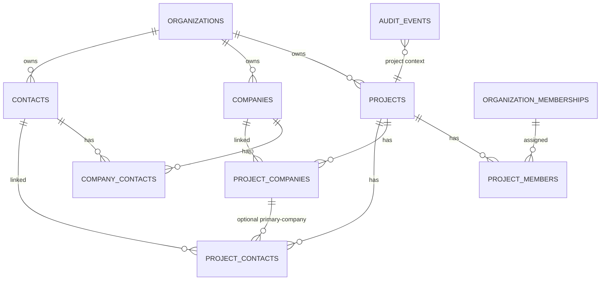

# FILE: /docs/projects/phase-5-data-model.md

> **Document status:** Phase 5A specification — conceptual schema, ER, functions, transactions, migration plan. **No production SQL. No requirement/document/portal tables.**
> **Conventions inherited (verified in Phase 4):** UUID `id` default `gen_random_uuid()`; `created_at`/`updated_at timestamptz` + `set_updated_at` trigger; UTC; snake_case; **`text` + `check`** for status/role (evolvable); every tenant table carries `organization_id` (denormalized) + forced RLS; migrations append-only; mutations via SECURITY DEFINER RPC; audit via `write_audit_event`.
> **Related:** [phase-5-permissions-and-rls.md](./phase-5-permissions-and-rls.md), [projects-and-lifecycle.md](./projects-and-lifecycle.md), [companies-and-contacts.md](./companies-and-contacts.md), [project-participants-and-access.md](./project-participants-and-access.md).

---

## 1. ER diagram

## 2. Tables (minimum complete set — 7)

Chosen minimum: `projects`, `companies`, `contacts`, `company_contacts`, `project_companies`, `project_contacts`, `project_members`. **No** separate `project_tags` (use `tags text[]`) and **no** `project_activity_events` (audit + a derived view handle activity — see [phase-5-audit-events.md](./phase-5-audit-events.md)).

### 2.1 `projects`
- **Purpose:** the construction project record.
- **Key columns:** `id`, `organization_id` (FK→organizations, on delete cascade), `name`, `project_number`, `status` (check: draft/active/closeout_in_progress/owner_review/published/complete/archived/cancelled; default `draft`), `project_type`, `delivery_method`, `description`, address fields, `country` (default 'US'), `region`, `postal_code`, `timezone`, date fields (`planned_start_date`, `substantial_completion_date`, `final_completion_date`, `closeout_target_date`, `actual_completion_date`), `cover_image_url` (reserved), `tags text[]`, `notes`, `created_by`, `archived_by`, `archive_reason`, timestamps + `archived_at`.
- **Constraints:** PK; FK org; **partial unique `(organization_id, project_number) where project_number is not null`**; check status; check `name` length 2–160; check date ordering (where present). 
- **Indexes:** `(organization_id, status)`, `(organization_id, created_at desc)`, `(organization_id, closeout_target_date)`, **trigram GIN** on lower(name)/project_number for search, GIN on `tags`.
- **RLS:** `can_access_project(id)` SELECT; update via fn (perm + not archived). **Audit:** created/updated/status_changed/archived/restored.

### 2.2 `companies`
- **Purpose:** reusable org-scoped company directory.
- **Key columns:** `id`, `organization_id`, `display_name`, `legal_name`, `dba`, `website`, `website_domain` (derived), `email`, `phone`, address fields, `classifications text[]`, `trade`, `license_number`, `vendor_number`, `status` (active/archived), `notes`, `tags text[]`, `normalized_name` (derived, not null), `created_by`, timestamps + `archived_at`.
- **Constraints:** PK; FK org; check status; `display_name` 2–160. **No hard unique on name** (dedupe is advisory).
- **Indexes:** `(organization_id, status)`, trigram GIN on `normalized_name`, index on `website_domain`, GIN on `classifications`/`tags`.
- **RLS:** `company.view` SELECT; update/archive via fn. **Audit:** created/updated/archived/restored.

### 2.3 `contacts`
- **Purpose:** reusable org-scoped people directory. **Never auth users.**
- **Key columns:** `id`, `organization_id`, `first_name`, `last_name`, `preferred_name`, `email citext`, `normalized_email citext` (derived), `phone`, `mobile_phone`, `job_title`, `department`, `timezone`, `locale`, `status`, `notes`, `linked_user_id uuid null` (**reserved**, Phase 7), `portal_status text default 'none'` (**reserved**), `created_by`, timestamps + `archived_at`.
- **Constraints:** PK; FK org; check status; names required. No hard unique on email (advisory dedupe).
- **Indexes:** `(organization_id, status)`, trigram GIN on lower(first||last), index on `normalized_email`.
- **RLS:** `contact.view` SELECT; update/archive via fn. **Audit:** created/updated/archived/restored.

### 2.4 `company_contacts`
- **Purpose:** contact↔company affiliation with history.
- **Key columns:** `id`, `organization_id`, `company_id` (FK on delete cascade), `contact_id` (FK on delete cascade), `job_title`, `department`, `is_primary_contact bool`, `preferred_email citext`, `preferred_phone`, `status` (active/ended), `started_on date`, `ended_on date`, timestamps.
- **Constraints:** PK; FKs; **partial unique `(company_id) where is_primary_contact and status='active'`** (≤1 primary); check same org (company.org = contact.org = organization_id, trigger/check).
- **Indexes:** `(company_id, status)`, `(contact_id, status)`.
- **RLS:** org member SELECT; via fn. **Audit:** company_contact linked/ended (folded into contact/company audit metadata — low-severity).

### 2.5 `project_companies`
- **Purpose:** company assigned to a project with a **project-specific role**.
- **Key columns:** `id`, `organization_id`, `project_id` (FK cascade), `company_id` (FK restrict), `role` (check: owner/general_contractor/subcontractor/architect/engineer/consultant/supplier/manufacturer/commissioning_agent/testing_agency/other), `trade_scope`, `contract_number`, `vendor_number`, `primary_contact_id` (FK contacts, null), `status` (active/removed), `notes`, `started_on`, `ended_on`, `added_by`, timestamps + `removed_at`.
- **Constraints:** PK; FKs; **unique `(project_id, company_id)`** (one role per company per project); check role; same-org check (project.org = company.org = organization_id).
- **Indexes:** `(project_id, status)`, `(company_id, status)`, `(project_id, role)`.
- **RLS:** `can_access_project(project_id)` SELECT; via fn (`project.manage_companies`). **Audit:** company_added/role_changed/removed.

### 2.6 `project_contacts`
- **Purpose:** contact participating in a project with a **project responsibility**.
- **Key columns:** `id`, `organization_id`, `project_id` (FK cascade), `contact_id` (FK restrict), `project_company_id` (FK project_companies, null), `project_title`, `is_primary_contact bool`, `is_closeout_contact bool` (**reserved**), `is_document_recipient bool` (**reserved**), `is_review_contact bool` (**reserved**), `status`, `notes`, `started_on`, `ended_on`, `added_by`, timestamps + `removed_at`.
- **Constraints:** PK; FKs; **unique `(project_id, contact_id)`**; same-org check; consistency guard (if `project_company_id` set, its project = this project — trigger).
- **Indexes:** `(project_id, status)`, `(contact_id, status)`.
- **RLS:** `can_access_project(project_id)` SELECT; via fn (`project.manage_contacts`). **Audit:** contact_added/responsibility_changed/removed.

### 2.7 `project_members`
- **Purpose:** internal (authenticated) member assigned to a project with a responsibility. **Separate from `organization_memberships`.**
- **Key columns:** `id`, `organization_id`, `project_id` (FK cascade), `membership_id` (FK→organization_memberships, restrict) **or** `user_id` (FK auth.users) — **decision: `membership_id`** (ties project assignment to an active org membership; if the membership is removed, the project assignment is invalidated by the access helper), `project_role` (check: project_administrator/project_manager/closeout_coordinator/internal_reviewer/viewer), `status` (active/removed), `assigned_by`, timestamps + `removed_at`.
- **Constraints:** PK; FKs; **unique `(project_id, membership_id)`**; check role.
- **Indexes:** `(project_id, status)`, `(membership_id, status)`.
- **RLS:** self-row OR `can_access_project` (direct predicate, recursion-safe); via fn (`project.manage_team`). **Audit:** member_assigned/role_changed/removed.

## 3. Lifecycle & archive behavior
Status + `archived_at`/`removed_at` timestamps; **no hard client deletes** (functions/soft-status only; org-deletion cascade is the only row removal). Archive on projects/companies/contacts hides from active lists; relationship rows use `status` (removed/ended) preserving history. Approved audit rows never deleted.

## 4. Functions & triggers (justified only)
- **Triggers:** `set_updated_at` (existing) on all 7 tables; **same-org consistency triggers** on the three join tables (ensure `organization_id` matches parents); `project_contacts` company-consistency trigger. Derived-column triggers for `normalized_name`/`normalized_email`/`website_domain` (or computed in the create/update functions — decision: compute in functions for control).
- **SECURITY DEFINER functions:** the full set in [phase-5-permissions-and-rls.md §6](./phase-5-permissions-and-rls.md) (create/update/status/archive/restore for projects/companies/contacts; assign/change/remove for the three relationship tables; search + overview + activity readers). All: `search_path=''`, narrow grants, internal authorization, inline audit, pgTAP.
- **No business-workflow logic in triggers** — triggers only enforce invariants (org consistency, updated_at). Workflows are explicit functions.

## 5. Transaction boundaries (atomic units)
| Operation | Atomic |
|-----------|--------|
| Create project | `projects` row + creator `project_members` row + `project.created` audit |
| Assign project company | `project_companies` row + audit (+ optional `companies` dedupe already resolved client-side) |
| Assign project contact | `project_contacts` row (+ optional `company_contacts` ensure) + audit |
| Assign project member | `project_members` row + audit |
| Status change / archive / restore | status update + audit |
| Company/contact create | row + derived normals + audit |

Audit is written **inside** the function transaction for sensitive actions → failure rolls back (Phase 4 pattern). Best-effort side effects (search reindex — none needed) run after.

## 6. Search strategy
PostgreSQL only. Normalized columns (`normalized_name`, `normalized_email`, lower(name)) + **`pg_trgm` GIN indexes** for `ILIKE '%q%'`; `unaccent` for accent-folding on the normalized column; all searches run under RLS (org-scoped). Prefix search uses `text_pattern_ops`/trigram; contains uses trigram. No tsvector needed for Phase 5. Cursor pagination on `(sort_key, id)`. Details in [routes-and-workflows.md §search/pagination](./routes-and-workflows.md).

## 7. Ordered migration plan (append-only; SQL written in 5B, not now)

| # | Migration | Contents |
|---|-----------|----------|
| `0012` | project extensions & helpers | ensure `pg_trgm`, `unaccent`; `can_access_project`, `project_permission` helpers; **update `validate-migrations.mjs` allowlist** (allow the 7 Phase 5 tables; still forbid requirements/documents/reviews/packages) |
| `0013` | projects | `projects` table; indexes; RLS enable+**force**+policies; `create_project`/`update_project`/`set_project_status`/`archive_project`/`restore_project`; audit |
| `0014` | companies | `companies`; normals; RLS+force; create/update/archive/restore; search fn |
| `0015` | contacts & company_contacts | `contacts`, `company_contacts`; RLS+force; create/update/archive; link/end; consistency triggers |
| `0016` | project_companies | table; RLS+force; assign/update/remove; same-org guard |
| `0017` | project_contacts | table; RLS+force; assign/update/remove; company-consistency guard |
| `0018` | project_members | table; RLS+force (recursion-safe); assign/change/remove; creator auto-assign wired into `create_project` (in 0013) — verify |
| `0019` | search, overview & activity readers | `search_*`, `get_project_overview`, `get_project_activity`; grants; parity helper |
| `0020` | seed & pgTAP | deterministic non-prod seed (2 orgs, projects, companies, contacts, assignments, a second org for isolation); full pgTAP (RLS/isolation/parity/lifecycle/relationship/search) |

Each migration: RLS **enable + force**, revoke-then-grant, pgTAP for new policies/functions, **regenerate + commit `types.generated.ts`** (schema public). Append-only. **No requirement/document tables in any migration** — the updated validator still blocks them.

> **Migration-validator note:** `scripts/validate-migrations.mjs` currently allows the Phase 4 identity tables and forbids business tables. Extend the **allowlist** with the 7 Phase 5 tables (a small reviewed change) while keeping `requirements, submissions, documents, reviews, packages, equipment, warranties, inspections` **forbidden**, and add a test asserting a forbidden table (e.g., `create table public.requirements`) still fails.

---

*Continue to [routes-and-workflows.md](./routes-and-workflows.md).*
