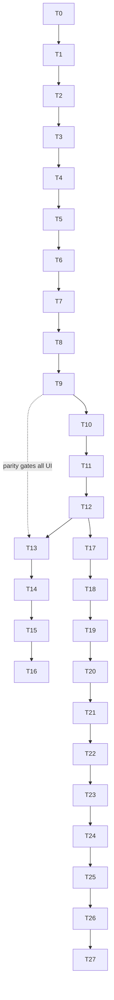

# FILE: /docs/projects/phase-5-implementation-plan.md

> **Document status:** Phase 5A specification — the ordered Phase 5B plan for Codex. **Projects/companies/contacts/teams only.**
> **Hard boundary — Phase 5B MUST NOT:** create requirement/template/document/version/review/annotation/package/warranty/equipment/inspection/training/lien-waiver/drawing tables or features; build subcontractor/owner **portals** or secure external links; add billing/AI/OCR/integrations/public API/heavy search; weaken RLS/CSP/gates; use service-role for tenant CRUD; trust client `organization_id`/`project_id` for authz; make requirement/document routes appear functional; edit applied migrations. **No fake requirement/document records.**
> **Grounding:** builds on the verified Phase 4 patterns (SECURITY DEFINER RPCs + forced RLS + `authz` parity + audit RPC), Phase 3E design system, migrations through `0011`. Phase 5 migrations start at `0012`.
> **Global per-task requirements (apply to every task):** light+dark verified; comfortable+compact density; AA contrast; reduced-motion; existing Vitest/pgTAP/Playwright/axe/brand suites stay green; `pnpm check` + `pnpm test` (+ `pnpm test:db` when touching schema/RLS) before completion; pgTAP RLS tests run as constrained `authenticated` roles.

**Task-order rationale:** permissions → validator → schema (project → company → contact → relationships → members) → RLS/grants/parity → audit → server logic → UI (create → list → overview → settings → directories → relationships → team → checklist → activity) → polish → validation → docs. Schema-before-UI (expand/contract); RLS/parity load-bearing before any UI ships; directories before project-relationships (relationships reuse directory records).

---

## Task 0 — Review, baseline screenshots, branch prep
- **Objective:** Read all Phase 1–5 docs + inspect current placeholder routes; capture baseline screenshots (projects/overview/companies/dashboard × light/dark/mobile); create branch `codex/phase-5b-projects`; post the boundary confirmation (no requirement/doc tables, RLS isolation, project-access separate from org role, no client-trusted ids, brand Closeout). **Founder:** no. **DoD:** confirmation + baseline attached.

## Task 1 — Permissions & authorization additions
- **Objective:** Add `project.*`/`company.*`/`contact.*` to `packages/authz` (`permissions`, `rolePermissions`, project-context in `Actor`, `can()` project resolution); extend `authorizeProjectAction` helper. **Files:** `packages/authz/src/*`, `apps/web/lib/authorization.ts`. **Migrations:** none. **Tests:** authz project matrix (Vitest) — deny-by-default, suspended/removed/archived, unassigned denial. **DoD:** matrix green; no SQL yet. **Founder:** no.

## Task 2 — Migration validator update
- **Objective:** Extend `scripts/validate-migrations.mjs` allowlist with the 7 Phase 5 tables; keep `requirements/submissions/documents/reviews/packages/equipment/warranties/inspections/training/lien_waivers/drawings` **forbidden**; add tests (allowed passes, forbidden fails, unknown fails) + a Phase-6 extension comment. **Files:** `scripts/validate-migrations.mjs`, its test. **DoD:** `db:validate` passes; forbidden-table test fails as expected. **Founder:** no.

## Task 3 — Project schema & lifecycle (migration 0012–0013)
- **Objective:** `0012` extensions/helpers (`pg_trgm`,`unaccent`,`can_access_project`,`project_permission`); `0013` `projects` table + indexes + RLS enable+**force**+policies + `create_project`/`update_project`/`set_project_status`/`archive_project`/`restore_project` (with creator auto-assign wired after 0018 members exist — or create member table earlier; **see ordering note**). **Migrations:** yes. **Audit:** project.* events. **Tests:** pgTAP (lifecycle transitions, archive write-block, RLS project-access), authz parity. **Screenshot:** none. **DoD:** project CRUD + lifecycle isolated + tested. **Founder:** no.
  - **Ordering note:** `create_project` needs `project_members`; either create `project_members` in `0013` alongside `projects`, or make creator auto-assign a follow-up in `0018`. **Decision: create `project_members` in the same migration as `projects` (0013)** so creation is atomic; company/contact tables follow.

## Task 4 — Company schema (0014)
- **Objective:** `companies` + normals (`normalized_name`,`website_domain`) + trigram indexes; RLS+force; `create/update/archive/restore_company`; `search_companies`. **Tests:** pgTAP (RLS isolation, dedupe-warning helper, archive), search. **DoD:** directory schema isolated + searchable. **Founder:** no.

## Task 5 — Contact & company_contacts schema (0015)
- **Objective:** `contacts` (+ `normalized_email`, reserved `linked_user_id`/`portal_status`) + `company_contacts` (primary uniqueness, effective dates, same-org guard); RLS+force; create/update/archive; link/end affiliation; `search_contacts`. **Tests:** pgTAP (isolation, affiliation history, primary uniqueness, no-auth-user invariant). **DoD:** contact directory + affiliations. **Founder:** no.

## Task 6 — Project-company schema (0016)
- **Objective:** `project_companies` (role-per-project, unique (project,company), same-org guard); RLS (`can_access_project`)+force; `assign/update/remove_project_company`. **Tests:** pgTAP (role-per-project, isolation, archived-company block). **DoD:** company↔project relationships. **Founder:** no.

## Task 7 — Project-contact schema (0017)
- **Objective:** `project_contacts` (reserved responsibility flags, company-consistency guard, unique (project,contact)); RLS+force; assign/update/remove. **Tests:** pgTAP (consistency guard, isolation). **DoD:** contact↔project relationships. **Founder:** no.

## Task 8 — Internal project-team (folded into 0013 or 0018)
- **Objective:** finalize `project_members` (recursion-safe RLS, `assign/change/remove_project_member`, creator auto-assign in `create_project`). **Tests:** pgTAP (recursion-safe, project-access via assignment, unassigned denial, suspended-member denial, unique assignment). **DoD:** assignment grants access; parity green. **Founder:** no.

## Task 9 — RLS, forced RLS, grants & authz parity (0019 readers + parity)
- **Objective:** complete/verify RLS on all 7 tables; add `get_project_overview`,`get_project_activity`,`search_projects`; grants census (anon 0); the **authz⇔RLS parity harness** (enumerate every permission, cross-check both sides). **Tests:** cross-tenant pgTAP matrix (all tables/ops), project-access matrix, parity. **DoD:** zero cross-tenant proven; parity green. **Founder:** no.

## Task 10 — Audit integration
- **Objective:** wire the full [phase-5-audit-events.md](./phase-5-audit-events.md) catalog through the functions (blocking, in-transaction, `project_id` set, real `request_id`, PII/secret redaction whitelist). **Tests:** pgTAP+Vitest (each mutation writes its event; audit-failure rolls back; no email/phone value in events; immutability). **DoD:** catalog complete + tested. **Founder:** no.

## Task 11 — Seed & generated types (0020)
- **Objective:** deterministic non-prod seed (2 orgs, projects across statuses, reusable directory, assignments, second org for isolation, suspended/unassigned members); regenerate + commit `types.generated.ts`. **Tests:** `db:reset` clean; seed powers E2E. **DoD:** reproducible local data. **Founder:** no.

## Task 12 — Project queries & server logic
- **Objective:** server-action + query layer (`apps/web/actions/projects.ts`, `companies.ts`, `contacts.ts`, `project-members.ts`, `project-companies.ts`, `project-contacts.ts`), each: Zod validation → active-org/project resolution + revalidation → `authz.can` → RPC → friendly error mapping → rate limit. **Tests:** server-action tests (authz + validation + error mapping). **DoD:** all mutations dual-authorized (app+DB). **Founder:** no.

## Task 13 — Project creation flow
- **Objective:** New-project dialog (name + optional number/type) + `/projects/new` fallback; duplicate-name soft warning; success → overview + checklist + toast; command-palette "Create project". **Routes:** `/projects/new`. **Components:** reuse Dialog/Field/Button. **Tests:** component + E2E (fast-create journey). **A11y/Responsive/Visual/Commercial:** dialog focus trap; mobile sheet; <60s create. **Screenshot:** create desktop+mobile, empty state. **Founder:** soft (creation polish). **DoD:** create works end-to-end.

## Task 14 — Project list, search, filtering, pagination
- **Objective:** functional `/projects` `DataTable` (lean columns, status, closeout date, team stack); toolbar search/filter (status, assigned-to-me, type, archived)/sort; URL-serialized filters; cursor pagination; card fallback. **Tests:** component + E2E + pagination/search unit. **Screenshot:** projects desktop light/dark/mobile. **Founder:** soft. **DoD:** list scales + filters + mobile cards.

## Task 15 — Project overview
- **Objective:** real overview (identity header, **setup checklist**, dates, team, companies-by-role, contacts, activity, honest closeout placeholder, recommended next step) from real data via `get_project_overview`. **Tests:** component + E2E + a11y. **Screenshot:** overview desktop+mobile, setup checklist. **Founder:** **soft review gate** (the "value before requirements" claim). **DoD:** overview useful with zero requirements.

## Task 16 — Project settings & lifecycle actions
- **Objective:** `/settings` sectioned form (identity/dates/location/notes, per-section save, concurrency guard); status change / cancel (gated dialog) / archive (dialog+reason) / restore. **Tests:** component + E2E (lifecycle) + concurrency. **Screenshot:** settings, archive confirmation. **DoD:** edit + lifecycle safe + audited.

## Task 17 — Company directory
- **Objective:** functional `/companies` list (search/filter/new) + card fallback; add "Contacts" sidebar item + `/contacts` shell. **Tests:** component + E2E + a11y. **Screenshot:** companies desktop+mobile. **DoD:** directory list functional.

## Task 18 — Company detail, edit, archive/restore, dedupe
- **Objective:** company detail (identity, associated contacts, associated projects+roles) + edit + archive/restore + **create-time duplicate warning**. **Tests:** dedupe (warn-not-block), lifecycle, E2E. **Screenshot:** company detail, duplicate warning. **DoD:** rich reusable directory record.

## Task 19 — Contact directory
- **Objective:** functional `/contacts` list (search/filter/new) + card fallback. **Tests:** component + E2E + a11y. **Screenshot:** contacts desktop+mobile. **DoD:** contact list functional.

## Task 20 — Contact detail, edit, archive/restore, dedupe
- **Objective:** contact detail (identity, current+past affiliations, project participations, communication fields), edit, archive/restore, **duplicate-email warning**, external-record framing (never "user"). **Tests:** dedupe, affiliation history, lifecycle, E2E. **Screenshot:** contact detail. **DoD:** contact record complete + honest external framing.

## Task 21 — Project companies & contacts
- **Objective:** `/projects/[id]/companies` (by role, add-by-search or create-inline w/ dedupe, role/scope/contract, remove) + `/contacts` (project title, primary/closeout(reserved) flags, optional company link, remove). **Tests:** relationship + consistency guard + E2E (reuse journey). **Screenshot:** project companies, project contacts. **DoD:** reuse-first relationships work.

## Task 22 — Internal project-team management
- **Objective:** `/projects/[id]/team` (add active org member by search, responsibility select, change/remove, distinct-from-org-Team copy); assignment grants access; suspended/removed members handled. **Tests:** assignment access E2E (assigned opens, unassigned denied), permission. **Screenshot:** internal project team. **DoD:** team assignment governs access.

## Task 23 — Project setup checklist
- **Objective:** derived setup-completeness checklist on the overview (per-step CTAs, progress meter, honest "Continue to requirements — Phase 6"); resume/skip stateless. **Tests:** component (derived from real data), E2E. **Screenshot:** setup checklist. **Founder:** soft. **DoD:** guides setup without gating.

## Task 24 — Activity presentation
- **Objective:** `/projects/[id]/activity` from `get_project_activity` (human phrasing, cursor pagination, redaction, cross-project isolation, mobile timeline, empty state). **Tests:** pgTAP isolation + component. **Screenshot:** (covered in overview). **DoD:** activity from audit only (no parallel system).

## Task 25 — Responsive, a11y, visual & commercial polish
- **Objective:** finalize mobile card fallbacks, sheets, sticky actions, long-name truncation, empty states, preview-marker conversion (convert projects/companies/contacts/overview/settings/team/activity; **keep requirements/documents/etc. as honest previews**); dashboard real project data (counts/activity; requirement metrics stay honest). **Tests:** brand/preview regression (converted routes drop marker; preview routes keep it), a11y (light+dark), mobile. **Screenshot:** loading, error, permission-denied. **Founder:** **soft overall review.** **DoD:** premium, honest, mobile-intentional.

## Task 26 — Full validation
- **Objective:** run the entire [phase-5-testing.md](./phase-5-testing.md) suite; fix gaps: cross-tenant + project-access pgTAP matrix, parity, lifecycle/relationship/dedupe/search/pagination/audit/concurrency, commercial-journey E2E, a11y, Chromium/Firefox/WebKit, mobile; server-only boundary; validator. **DoD:** all DoD criteria + 22 gates pass; screenshots assembled.

## Task 27 — Documentation & exit review
- **Objective:** `docs/projects/phase-5-implementation-progress.md` + `phase-5-exit-review.md`; update `AGENTS.md`/`CLAUDE.md` pointers to `docs/projects/*`; confirm **no Phase 6 tables/features**; record founder-action status. **Do not start Phase 6.** **Founder:** approve. **DoD:** signed exit review → ready for Phase 5C audit.

---

## Dependency graph

Sequential by design (shared schema/authz/RLS files); directories (17–20) before project-relationships (21) because relationships reuse directory records; T9 (RLS/parity) is load-bearing before any UI mutation ships.

## What this plan must NOT do (recap)
No requirement/document/review/package/warranty/equipment/inspection/training/lien-waiver/drawing tables or features; no portals/secure links; no billing/AI/OCR/integrations/public API; no CSP/RLS/gate weakening; no service-role tenant CRUD; no client-trusted ids; no faux-functional requirement/document routes; no edits to applied migrations. **Stops before Phase 6.**
