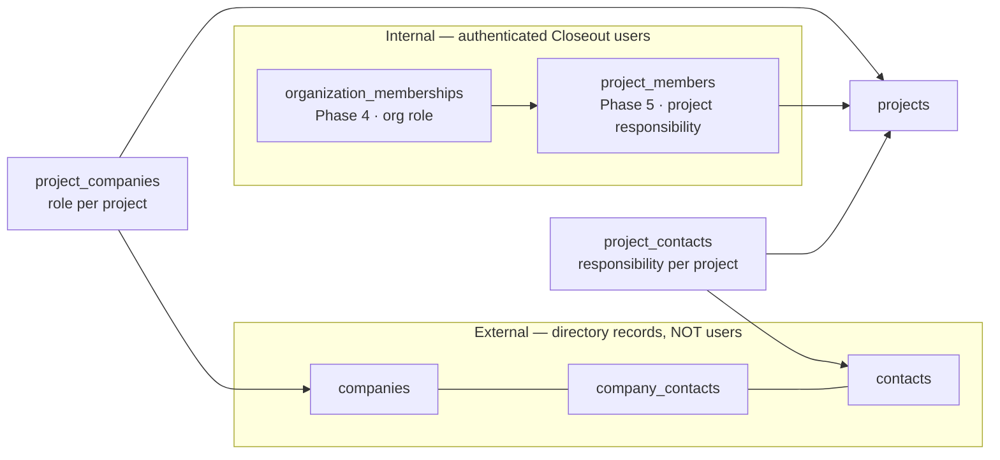

# FILE: /docs/projects/project-participants-and-access.md

> **Document status:** Phase 5A specification — internal project team, project-company/contact relationships, project roles, and the project-access model. **Specification only.**
> **Related:** [phase-5-permissions-and-rls.md](./phase-5-permissions-and-rls.md), [companies-and-contacts.md](./companies-and-contacts.md), [phase-5-data-model.md](./phase-5-data-model.md).
> **Anchor decisions:** organization membership (Phase 4) and project assignment (Phase 5) are **separate concepts**; internal users and external contacts are **never conflated**; a company's role is **per project**.

---

## 1. Three participant kinds (kept distinct)

- **Internal team** = authenticated org members assigned to a project (`project_members`).
- **External companies/contacts** = reusable directory records linked to a project (`project_companies`, `project_contacts`). **Never** auth users in Phase 5.
- The UI renders these in visually distinct sections with distinct affordances ([routes-and-workflows.md §external-participant UX](./routes-and-workflows.md)).

## 2. Internal project team (`project_members`)

A **separate table from `organization_memberships`** (does not duplicate Phase 4). It references an active org membership and adds a **project responsibility**.

| Field | Notes |
|-------|-------|
| `id` | PK. |
| `organization_id` | tenant owner (denormalized for RLS). |
| `project_id` | the project. |
| `membership_id` (or `user_id`) | references the org membership / auth user (must be an **active** member of the same org). |
| `project_role` | responsibility: `project_administrator`, `project_manager`, `closeout_coordinator`, `internal_reviewer`, `viewer`. |
| `status` | `active` / `removed`. |
| `assigned_by` | actor. |
| `assigned_at`/`created_at`/`updated_at`/`removed_at` | lifecycle. |
| unique | `(project_id, membership_id)` — one assignment per member per project. |

**Project responsibility vs org role:**
- **Org role** (Phase 4) governs org-wide capability (who can create projects, manage the org, see all projects).
- **Project responsibility** (Phase 5) governs *what a member does on this project* and, for non-admins, **grants project access** (see §4).
- They are **independent labels**: a member with org role `project_manager` might be assigned as `closeout_coordinator` on a specific project, or as `viewer`. Org role sets the ceiling of org-wide permissions; project role sets project-scoped responsibility/access.

**Future project-scope compatibility:** `project_members.project_role` is the seam Phase 6+ will read to grant requirement/document/review permissions **per project** without changing org roles. Phase 5 defines the labels + access; later phases attach finer capabilities. No fake future permissions now.

## 3. Project↔company (`project_companies`) — role per project

| Field | Notes |
|-------|-------|
| `id`, `organization_id`, `project_id`, `company_id` | link (all same org — enforced). |
| `role` | **authoritative project role**: `owner`, `general_contractor`, `subcontractor`, `architect`, `engineer`, `consultant`, `supplier`, `manufacturer`, `commissioning_agent`, `testing_agency`, `other`. |
| `trade_scope` | e.g., "HVAC", "Roofing" — the scope of work on this project. |
| `contract_number` | project-specific. |
| `vendor_number` | project-specific AP ref (may differ from company global). |
| `primary_contact_id` | a `contacts` id (must relate to this company/project — see §5). |
| `status` | `active`/`removed`. |
| `notes` | project-specific. |
| `started_on`/`ended_on` | effective dates (when the company joined/left the project). |
| `added_by`/`created_at`/`updated_at`/`removed_at` | lifecycle. |
| unique | `(project_id, company_id, role)` — same company can hold **different roles** on the same project only if genuinely distinct; typically one role per company per project. **Decision: unique `(project_id, company_id)`** (a company has one role per project; changing role edits the row) — simpler and matches reality. |

A company may be `subcontractor` on Project A and `general_contractor` on Project B — because the role is on the join row, the same reusable `companies` record serves both. **Do not** put project roles on the company.

## 4. Project-level access model (final)

**Decision — a hybrid "admins see all, others see assigned" model:**

| Org role | Project visibility (Phase 5) |
|----------|------------------------------|
| **Owner**, **Administrator** | **All** organization projects (implicit `project.view_all`). Full project management. |
| **Project Manager**, **Closeout Coordinator** | **Assigned** projects only, **plus** they hold `project.create` (they create projects and are auto-assigned as `project_administrator`/`project_manager` on creation). No org-wide project read unless assigned. |
| **Internal Reviewer** | **Assigned** projects only (read + review-oriented; no create). |
| **Viewer** | **Assigned** projects only, **read-only**. |

Rules:
- **Assignment grants access.** A non-admin member sees/opens a project **iff** they have an active `project_members` row (or org role = owner/administrator). RLS enforces this via a `can_access_project(project_id)` helper.
- **Access can exist without a "responsibility" beyond the assignment** — the `viewer` project role is the minimal assignment (access, no mutation).
- **Owners/Admins always** see all org projects (they manage the org); this is the pragmatic default contractors expect (a PM lead/owner oversees everything) and avoids forcing self-assignment to every project.
- **Creator auto-assignment:** creating a project inserts a `project_members` row for the creator (`project_administrator` if Owner/Admin, else `project_manager`) so PMs immediately have their project.
- **Archived project:** read-only for anyone who could access it; no mutations (RLS write-block on `status='archived'`).
- **Suspended/removed org member:** denied everything (Phase 4 membership status gates first).
- **Removed project assignment** (`project_members.status='removed'`): loses project access immediately (non-admin); history retained.
- **External access stays separate:** companies/contacts never grant login/portal access; Phase 7 secure links are a wholly separate mechanism.

**Reconsideration trigger:** if customers want PMs to browse all org projects by default, flip PM/Coordinator to `project.view_all` via an org setting (the permission already exists; only the default assignment changes) — no schema rework.

## 5. Project↔contact (`project_contacts`)

| Field | Notes |
|-------|-------|
| `id`, `organization_id`, `project_id`, `contact_id` | link. |
| `project_company_id` | optional FK to the `project_companies` row this contact represents on the project (keeps company/contact consistent — a contact on a project should belong to a company that's on the project, where applicable). |
| `project_title` | responsibility on this project (may differ from global/company title). |
| `is_primary_contact` | primary point of contact for the project or for their company on the project. |
| `is_closeout_contact` | **reserved responsibility flag** — who receives closeout requests later (Phase 6/7 reads it; Phase 5 just stores it). |
| `is_document_recipient` / `is_review_contact` | **reserved** readiness flags (Phase 8/9). Not functional now, but the responsibility can be recorded. |
| `status` | `active`/`removed`. |
| `notes`, `started_on`/`ended_on`, `added_by`, timestamps | lifecycle. |
| unique | `(project_id, contact_id)`. |

**Consistency guard:** when `project_company_id` is set, a check/trigger ensures the referenced `project_companies` row is on the same project and the contact is affiliated (via `company_contacts`) with that company — preventing "Ace Mechanical's contact listed under a company not on the project." Where the affiliation is loose (independent consultant), `project_company_id` is null. Enforced pragmatically (warn, not hard-fail, if data is messy) to avoid blocking real workflows.

## 6. Access lifecycle (summary)

| Event | Effect |
|-------|--------|
| Member assigned to project | gains project access (non-admin); audit `project.member_assigned` |
| Project role changed | responsibility changes; audit `project.member_role_changed` |
| Member removed from project | loses access (non-admin); history kept; audit `project.member_removed` |
| Org membership suspended/removed | loses ALL access (Phase 4 gate); project rows retained |
| Project archived | read-only for authorized; audit `project.archived` |
| Company/contact added to project | appears on project; audit `project.company_added`/`contact_added` |
| Company/contact removed from project | soft-removed (history kept); audit `…_removed` |

## 7. What Phase 5 does NOT do (forward compatibility)

Reserved seams (schema fields exist, unused): `contacts.linked_user_id`/`portal_status` (Phase 7), `project_contacts.is_closeout_contact`/`is_document_recipient`/`is_review_contact` (Phase 6/8/9), and the `project_members.project_role` labels that later phases map to requirement/document/review permissions. **No requirement/document/review/portal tables, no secure links, no fake capabilities.** The access helper (`can_access_project`) is designed so future project-scoped permissions layer on top of assignment, not replace it.

---

*Continue to [phase-5-permissions-and-rls.md](./phase-5-permissions-and-rls.md).*
