# FILE: /docs/projects/projects-and-lifecycle.md

> **Document status:** Phase 5A specification — project model, lifecycle, creation, editing, overview. **Specification only.**
> **Source of truth for lifecycle:** [statuses.md §A](../product/statuses.md). **Do not invent states.**
> **Related:** [phase-5-data-model.md](./phase-5-data-model.md), [routes-and-workflows.md](./routes-and-workflows.md), [project-participants-and-access.md](./project-participants-and-access.md).

---

## 1. Project model & field definitions

**Progressive-enrichment principle:** creation asks for the **minimum** (name); everything else is added later on the settings/overview surfaces. Fields are grouped by enrichment stage.

| Field | Type | Stage | Req? | Notes |
|-------|------|-------|:----:|-------|
| `id` | uuid | — | — | PK; route identifier. |
| `organization_id` | uuid | — | ✅ | tenant owner; set from active org server-side. |
| `name` | text | **create** | ✅ | the one required field; 2–160 chars. |
| `project_number` | text | create/settings | ➖ | human ref; **org-unique when present** (see §4). |
| `status` | text | — | ✅ | lifecycle (default `draft` or `active` — see §3/OD). |
| `project_type` | text | settings | ➖ | enum-ish: restaurant, retail, medical, office, warehouse, church, school, municipal, multifamily, other. |
| `delivery_method` | text | settings | ➖ | design_bid_build, design_build, cm_at_risk, cm_agency, ipd, other. |
| `description` | text | settings | ➖ | short summary. |
| `address_line1` / `line2` | text | settings | ➖ | jobsite address. |
| `city` | text | settings | ➖ | |
| `region` | text | settings | ➖ | state/province (US default, intl-ready — OD). |
| `postal_code` | text | settings | ➖ | |
| `country` | text | settings | ➖ | ISO-3166-1 alpha-2; default `US`. |
| `timezone` | text | settings | ➖ | IANA; default from org. |
| `planned_start_date` | date | settings | ➖ | |
| `substantial_completion_date` | date | settings | ➖ | key closeout milestone. |
| `final_completion_date` | date | settings | ➖ | |
| `closeout_target_date` | date | settings | ➖ | the deadline the dashboard tracks. |
| `actual_completion_date` | date | settings | ➖ | set near/at completion. |
| `cover_image_url` | text | settings | ➖ | **reserved**; image upload deferred (initials/typographic cover in Phase 5 — OD). |
| `notes` | text | settings | ➖ | internal freeform. |
| `created_by` | uuid | — | ✅ | actor. |
| `archived_by` | uuid | — | ➖ | on archive. |
| `archive_reason` | text | — | ➖ | on archive. |
| `created_at`/`updated_at` | timestamptz | — | ✅ | |
| `archived_at` | timestamptz | — | ➖ | soft-archive marker. |

**Deliberately NOT columns on `projects`:**
- **Owner org / architect / GC / PM / coordinator / reviewer** → these are **relationships**, not scalar fields. Owner/architect/GC are `project_companies` rows (role-typed); PM/coordinator/reviewer are `project_members` rows. This is the key model decision that keeps projects clean and companies reusable ([project-participants-and-access.md](./project-participants-and-access.md)).
- **Tags** → `project_tags` **only if justified**; Phase 5 uses a `text[]` `tags` column on `projects` (simpler, index with GIN) unless founder wants a normalized tag table (OD). **Decision: `tags text[]` on `projects`** (adequate, importable, low-complexity).
- **Closeout metrics/risk** → derived later (Phase 11); not stored now.

## 2. Required vs optional (final)

- **Required at creation:** `name` (+ server-set `organization_id`, `status`, `created_by`).
- **Everything else optional**, enrichable anytime. `project_number` is optional but **encouraged** (OD-1: whether to require it — default **not required**).
- Server-side validation: name length; date ordering (`planned_start ≤ substantial ≤ final`, `actual` not before `planned_start`) when present; valid IANA timezone; valid country/region codes; `project_number` org-uniqueness ([routes-and-workflows.md §validation](./routes-and-workflows.md)).

## 3. Status lifecycle

**Exact set (from [statuses.md §A](../product/statuses.md)):** `draft`, `active`, `closeout_in_progress`, `owner_review`, `published`, `complete`, `archived`, `cancelled`. Stored snake_case; displayed via the existing `StatusBadge` project mapping (Draft/Active/Closeout In Progress/Owner Review/Published/Complete/Archived/Cancelled).

**Phase 5 scope:** Phase 5 fully exercises `draft`, `active`, `archived`, `cancelled`. The closeout-phase transitions (`closeout_in_progress`, `owner_review`, `published`, `complete`) are **modeled and permitted** but primarily driven by later phases (requirements/package). Phase 5 must not block them, but the UI surfaces them as valid manual transitions for a PM/Admin with honest "these advance as closeout work happens" copy.

```mermaid
stateDiagram-v2
  [*] --> draft: create (default)
  draft --> active
  draft --> cancelled
  active --> closeout_in_progress
  active --> cancelled
  closeout_in_progress --> owner_review
  closeout_in_progress --> cancelled
  owner_review --> published
  owner_review --> closeout_in_progress: corrections
  owner_review --> cancelled
  published --> complete
  published --> owner_review: republish (later phase)
  complete --> archived
  active --> archived: (via cancel or completion path)
  cancelled --> archived
  archived --> active: restore (audited)
  note right of archived: archive is reversible (restore); complete→cancelled is prohibited
```

### Transition rules
| From → To | Who | Confirmation | Required fields | Audit |
|-----------|-----|--------------|-----------------|-------|
| create → draft/active | `project.create` (Owner/Admin/PM/Coordinator per matrix) | — | name | `project.created` |
| draft → active | `project.update` | none | name | `project.status_changed` |
| active → closeout_in_progress | `project.update` | none (soft) | — | `project.status_changed` |
| any → cancelled | `project.update` + **gated** (typed confirm) | dialog + reason | — | `project.status_changed` |
| → archived | `project.archive` | confirm dialog + optional reason | — | `project.archived` |
| archived → active (restore) | `project.restore` | none | — | `project.restored` |
| complete → cancelled | **prohibited** | — | — | — |
| archived → active except restore, draft → published | **prohibited** (must pass through review) | — | — | — |

- **Who can transition:** Owners/Administrators always; PM/Coordinator on **assigned** projects with `project.update`; Reviewer/Viewer cannot transition. Enforced in `authz` + RLS ([phase-5-permissions-and-rls.md](./phase-5-permissions-and-rls.md)).
- **Archived-project access:** read-only for authorized viewers; **no mutations** (RLS blocks writes when `status='archived'` except the restore function); still appears in the archived filter; owner portal/package continuity is a later concern.
- **Completed-project behavior:** read-mostly; can be archived; requirement/package implications handled in later phases (Phase 5 just stores the state).

## 4. Project identifiers & slugs

**Decision: route by UUID** (`/projects/[projectId]` where `projectId` is the UUID). Rationale: stable, non-enumerable, leaks no authorization assumption, survives renames, and matches the Phase 4 convention (memberships/orgs use UUIDs in server logic).

- **`project_number`** (optional human ref, e.g., "2024-118"): displayed prominently, **org-unique when present** (partial unique index `where project_number is not null`), editable (audited); duplicates across orgs are fine (isolation). Not used in routes.
- **`slug`**: **not used for routing or uniqueness in Phase 5.** A cosmetic display slug may be derived for breadcrumb readability but the canonical URL is the UUID. Renaming a project changes `name`/`number`, never the URL. (Reconsideration trigger: if customers demand human-readable shareable project URLs, add `/projects/[slug]` resolving to the UUID with a slug-history table — deferred.)
- **Archived-project routes:** same UUID URL; page renders the read-only archived state (banner + disabled actions), never a 404 (authorized users must reach their archived records).
- **Security:** because access is RLS-enforced by membership/assignment, a UUID in the URL grants nothing without access; guessing a UUID yields a permission-denied/not-found, not data.

## 5. Creation flow (see [routes-and-workflows.md §project creation](./routes-and-workflows.md) for full UX)

**Decision: a short modal (dialog) launched from `/projects` and the command palette**, with a `/projects/new` full-page fallback for deep links/mobile. One field (name) + optional `project_number` + optional type; **"Create"** lands directly on the new project's overview with the **setup checklist** front-and-center. Not a multi-step wizard (wizards feel tedious and create dead-ends); progressive enrichment happens on the overview/settings. Draft-on-create is silent (no separate "save draft" ceremony). Duplicate-name is a **soft warning** ("You already have a project named X" with a link), never a block.

## 6. Editing

Project identity/metadata edited on `/projects/[id]/settings` (sectioned form: Identity, Dates, Location, Notes) — reuses Phase 3E `Field`/read-only-row patterns; per-section save; optimistic concurrency via `updated_at` check ([routes-and-workflows.md §concurrency](./routes-and-workflows.md)); `project.update` gated; `project.updated` audit with changed-field diff (safe metadata only).

## 7. Archive & restore

- **Archive** (`project.archive`, Owner/Admin/PM-on-project): confirm dialog + optional reason → `status='archived'`, `archived_at`, `archived_by`, `archive_reason`; audit `project.archived`. Relationships and history retained; project drops from the default list (visible via Archived filter).
- **Restore** (`project.restore`): archived → active; clears archive fields; audit `project.restored`.
- **Delete:** **restricted/deferred** — no hard-delete UI in Phase 5. Hard deletion only via org-deletion cascade (Phase 4 flow) or a future gated admin action; audit rows always retained.

## 8. Project overview (Phase 5) — see [routes-and-workflows.md §overview](./routes-and-workflows.md)

Provides real value **before** requirements/documents exist:
- **Identity header:** name, `project_number`, `StatusBadge`, type/delivery meta line, closeout-target date; edit + status actions.
- **Setup completeness** (§9): the hero of an under-populated project.
- **Key dates** panel (planned/substantial/final/closeout-target — em-dash where unset, "Add dates" CTA).
- **Internal team** panel (assigned members + roles; "Assign team" CTA).
- **Companies** panel (owner/GC/architect/subs by role; "Add companies" CTA).
- **Key contacts** panel (primary/closeout contacts; "Add contacts" CTA).
- **Recent activity** (from audit events, §activity in [phase-5-audit-events.md](./phase-5-audit-events.md)).
- **Closeout readiness** = an **honest placeholder** card ("Requirements & documents begin in Phase 6") — no fake metrics.
- **Recommended next step** = derived from setup completeness.

## 9. Setup-completeness model

A **derived, non-stored** score computed from real data — never a fabricated metric:
| Step | Complete when | Weight |
|------|---------------|--------|
| Project details | type + at least one date set | ✓ |
| Internal team | ≥1 `project_members` row | ✓ |
| Owner company | a `project_companies` row with role `owner` | ✓ |
| Key companies | ≥1 additional company (GC/architect/sub) | ✓ |
| Key contacts | ≥1 `project_contacts` row | ✓ |

Rendered as a checklist with per-step CTAs and a small progress meter (Phase 3E `Progress`); "Continue to requirements (Phase 6)" appears only as an honest future step. Resume/skip: stateless (derived from data), so it always reflects reality; steps are optional (a project is usable with just a name) — the checklist **guides**, never gates.

---

*Continue to [companies-and-contacts.md](./companies-and-contacts.md).*
