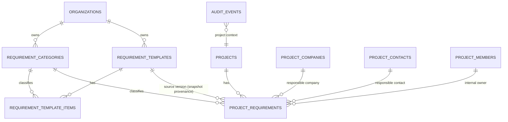

# FILE: /docs/requirements/phase-6-data-model.md

> **Document status:** Phase 6A specification — conceptual schema, ER, functions, transactions, migration plan. **No production SQL. No submission/document/review/portal tables.**
> **Conventions inherited (verified through Phase 5):** UUID `id` default `gen_random_uuid()`; `created_at`/`updated_at timestamptz` + `set_updated_at`; UTC; snake_case; **`text` + `check`** for status (evolvable); every tenant table carries denormalized `organization_id` + forced RLS; migrations append-only; mutations via SECURITY DEFINER RPC; audit via `write_audit_event`; regenerated `types.generated.ts` committed with each migration.
> **Related:** [phase-6-permissions-and-rls.md](./phase-6-permissions-and-rls.md), [requirements-and-lifecycle.md](./requirements-and-lifecycle.md), [requirement-templates.md](./requirement-templates.md).

---

## 1. ER diagram

## 2. Tables (minimum complete set — 4)

Analysis rejected extra tables: no `template_families` (family = `family_id` on template rows), no `template_sections` (shared category taxonomy), no `requirement_status_history` (immutable audit is the history), no `requirement_assignments` join (three nullable FKs — single-assignee-per-slot is the product model), no rules/conditions tables (ROD-6), no import tables.

### 2.1 `requirement_categories`
- **Purpose:** org-scoped grouping taxonomy shared by templates and registers.
- **Key columns:** `id`, `organization_id` (FK cascade), `name` (2–80), `description`, `sort_order int`, `is_system bool default false` (seeded defaults; renameable, archivable, but flagged for starter re-seeding idempotency), `created_by`, timestamps + `archived_at`/`archived_by`.
- **Constraints:** PK; FK org; **unique `(organization_id, lower(name)) where archived_at is null`** (active names unique; friendly conflict message); check name length.
- **Indexes:** `(organization_id, sort_order)`.
- **RLS:** SELECT `is_org_member`; mutations RPC-only. **Audit:** `requirement_category.*`.
- **Archive:** hidden from pickers; referencing rows keep the FK (`on delete restrict`; no hard delete path).

### 2.2 `requirement_templates`
- **Purpose:** one row per template **version** (row-per-version model).
- **Key columns:** `id`, `organization_id` (FK cascade), `family_id uuid not null` (first version's id), `version int not null default 1`, `name` (2–120), `description`, `status` (check: `draft`/`published`/`archived`; default `draft`), `published_at`/`published_by`, `is_starter bool default false` (seeded starter provenance), `source_template_id uuid null` (clone lineage, FK self, `on delete set null`), `created_by`, `updated_by`, timestamps + `archived_at`/`archived_by`.
- **Constraints:** PK; FK org; **unique `(organization_id, family_id, version)`**; check status; check version ≥ 1. No unique on name (advisory duplicate warning).
- **Indexes:** `(organization_id, status)`, `(organization_id, family_id, version desc)`, trigram GIN on `lower(name)`.
- **RLS:** SELECT `has_org_permission(org,'template.view')`; mutations RPC-only. **Audit:** `template.*`.
- **Version/immutability behavior:** `published` rows and their items immutable (function-enforced; no direct grants); archive applies family-wide (function updates all family rows).

### 2.3 `requirement_template_items`
- **Purpose:** the checklist items of one template version.
- **Key columns:** `id`, `organization_id`, `template_id` (FK → requirement_templates, cascade), `item_key text not null` (family-stable slug, ≤ 80), `title` (2–200), `description`, `category_id` (FK → requirement_categories, restrict), `trade`, `priority` (check `low`/`normal`/`high`, default `normal`), `is_optional bool default false`, `default_responsible_role text null` (check: the `project_companies.role` vocabulary), `default_due_anchor text null` (check: `substantial_completion`/`closeout_target`), `default_due_offset_days int null` (−365..730; requires anchor), `sort_order int`, timestamps.
- **Constraints:** PK; FKs; **unique `(template_id, item_key)`**; same-org trigger (item org = template org = category org); check anchor/offset pairing.
- **Indexes:** `(template_id, sort_order)`, `(organization_id)`.
- **RLS:** SELECT via `has_org_permission(org,'template.view')`; mutations RPC-only (draft-parent-only, batch `save_template_items`). **Audit:** folded into `template.updated{items_changed}`.

### 2.4 `project_requirements`
- **Purpose:** the concrete requirement instance on a project — the record all Phase 7–15 systems will reference.
- **Key columns:** `id`, `organization_id`, `project_id` (FK → projects, cascade), `title` (2–200), `description`, `notes`, `category_id` (FK restrict, not null — default category resolved at create), `trade`, `priority` (check, default `normal`), `is_required bool default true`, `record_type text null` (**reserved**, Phase 12; no check values exposed in Phase 6 beyond null), `status` (check: `active`/`not_applicable_approved`; default `active` — assignment completeness is **derived** from the responsibility columns, never encoded in `status`; `archived_at` is independent of `status`), `na_reason text null` (required when N/A — check), `responsible_project_company_id` (FK → project_companies, restrict, null), `responsible_project_contact_id` (FK → project_contacts, restrict, null), `internal_owner_member_id` (FK → project_members, restrict, null), `due_date date null`, `source_template_id` (FK → requirement_templates, restrict, null), `source_item_key text null`, `sort_order int`, `normalized_title text not null` (derived in functions, for duplicate warnings + search), `created_by`, `archived_at`/`archived_by`/`archive_reason`, timestamps.
- **Constraints:** PK; FK org/project; **partial unique `(project_id, source_item_key) where source_item_key is not null and archived_at is null`** (apply idempotency/dedupe); check status; check `(status='not_applicable_approved') = (na_reason is not null)`; same-org + same-project consistency triggers on the three responsibility FKs and the category (category org = row org; responsibility rows' project = row project).
- **Indexes:** `(project_id, archived_at, category_id, sort_order)` (register ordering), `(project_id, status)`, `(project_id, due_date)`, `(project_id, responsible_project_company_id)`, trigram GIN on `normalized_title`, `(organization_id)`.
- **RLS:** SELECT `can_access_project(project_id)`; mutations RPC-only per [phase-6-permissions-and-rls §6](./phase-6-permissions-and-rls.md). **Audit:** `requirement.*` with `project_id` set (flows into activity).
- **Delete behavior:** none (soft archive only; org-deletion cascade is the only row removal).

## 3. Which future phases reference these records

| Future system | References |
|---------------|-----------|
| Phase 7 portal/invitations | `project_requirements` (assignment → secure-link scope; `requested` status; `not_applicable_requested`) |
| Phase 8 documents | submissions/documents FK → `project_requirements.id` |
| Phase 9 reviews | review chains per requirement; `approved`/`complete` statuses |
| Phase 10 notifications | reminder schedules keyed on `due_date` + assignment |
| Phase 11 reporting | aggregates over statuses/categories |
| Phase 12 specialized records | `record_type` + register links |
| Phase 13 packages | completeness math over requirement statuses (incl. N/A exclusion) |

Naming avoids destructive redesign: no column named for a Phase 6-only concept. The stored `active` value is the configuration-stage anchor from which the [statuses §B](../product/statuses.md) operational vocabulary (`requested`, `submitted`, `under_review`, …) is appended by later phases via check-constraint additions — Phase 6 values are never renamed. §B's "Not assigned" condition is derived from the responsibility columns (a computed flag per the statuses.md design principle), not stored.

## 4. Functions, triggers, transactions

- **Triggers:** `set_updated_at` on all 4; same-org/same-project consistency triggers (invariants only — no workflow logic in triggers).
- **Functions:** the full set in [phase-6-permissions-and-rls §6](./phase-6-permissions-and-rls.md). Derived columns (`normalized_title`, `item_key` generation) computed in functions (Phase 5 decision pattern).
- **Transaction boundaries (atomic units):**

| Operation | Atomic contents |
|-----------|-----------------|
| Apply template | validate → insert n `project_requirements` → `template.applied` audit |
| Publish template | status flip + `template.published` audit |
| New version | new template row + copied items + `template.version_created` audit |
| Clone | new family row + copied items + `template.cloned` audit |
| Save template items | batch item upsert/delete/reorder + `template.updated` audit |
| Create/update/N-A/archive requirement | row change + granular audit event(s) |
| Bulk update | all row changes + one `requirement.bulk_updated` audit |
| Ensure defaults | idempotent categories + starter template + items (first-run only; no audit spam on no-op) |

Audit inside the transaction (blocking) for all of the above.

## 5. Search & ordering strategy

PostgreSQL only. Register search: trigram GIN on `normalized_title` (`ILIKE '%q%'`, unaccent-folded); filters hit the composite indexes. Stable ordering: category `sort_order` → requirement `sort_order` → `id`; gapped integers and the Phase 6D `move_project_requirement` path swap one adjacent pair inside the category with optimistic concurrency and blocking audit. Cursor pagination on `(category_sort, sort_order, id)`, default 100/max 200 per page — a 2,000-requirement project pages cleanly; `get_requirement_summary` supplies counts without scanning pages. Template preview reads one version's items (≤ a few hundred rows) in one query.

## 6. Ordered migration plan (append-only; SQL written in 6B)

| # | Migration | Contents |
|---|-----------|----------|
| `0022` | requirement foundations | **validator allowlist update** (script change alongside: allow the 4 tables; keep `requirements`, `submissions`, `documents`, `document_versions`, `reviews`, `packages`, etc. forbidden); extend `has_org_permission`/`project_permission` mappings for `template.*`/`requirement.*`; `requirement_categories` table + RLS enable+force + category functions + `ensure_requirement_defaults` (categories part) |
| `0023` | templates | `requirement_templates` + `requirement_template_items`; RLS+force; template/version/clone/publish/archive/save-items functions; starter-template seeding into `ensure_requirement_defaults`; `get_template_preview` |
| `0024` | project requirements | `project_requirements`; RLS+force; create/update/N-A/archive/restore/reorder functions; consistency triggers |
| `0025` | application, bulk & readers | `apply_requirement_template`; `bulk_update_project_requirements`; `search_project_requirements`; `get_requirement_summary`; grants census |
| `0026` | seed & pgTAP contract | deterministic non-prod seed (starter + custom org template w/ versions, applied requirements across states in both orgs, unassigned/undated/N-A/archived rows, second org mirror for isolation); full pgTAP (RLS/isolation/parity/lifecycle/apply-idempotency/bulk/search/grants) |
| `0027` | Phase 6D update hardening | redefine `update_project_requirement`; authorize every supplied field group; deny read-only empty payloads; authorized empty/same-value payloads return without `UPDATE` or audit |
| `0028` | Phase 6D ordering + overview hardening | remove the unused broad reorder RPC; add concurrency-checked `move_project_requirement`; exclude suspended organization memberships from the active overview-team projection |

Each migration: RLS enable+**force**, revoke-then-grant, pgTAP for new policies/functions, regenerate + commit `types.generated.ts`, `db:validate` green. **No submission/document/review/portal table in any migration** — the validator still blocks them, and 6B adds a test asserting `create table public.submissions` still fails.

> **Validator note:** `scripts/validate-migrations.mjs` — add `requirement_categories`, `requirement_templates`, `requirement_template_items`, `project_requirements` to `approvedApplicationTables`; the bare name `requirements` **stays forbidden**; extend the self-test list. Small reviewed change in the same PR as `0022`.

---

*Continue to [routes-and-workflows.md](./routes-and-workflows.md).*
