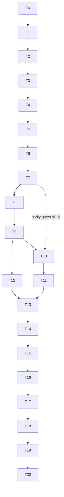

# FILE: /docs/requirements/phase-6-implementation-plan.md

> **Document status:** Phase 6A specification — the ordered Phase 6B plan. **Requirement configuration only.**
> **Hard boundary — Phase 6B MUST NOT:** create submission/document/version/review/annotation/package/portal/notification/billing tables or features; build file upload/storage/previews/OCR; build approval/rejection workflows; send email or reminders; add secure external links; add AI/integrations; build public marketing pages; weaken RLS/CSP/audit/append-only rules; use service-role for tenant CRUD; trust client ids; show fake submission/approval/completion metrics; edit applied migrations.
> **Grounding:** verified Phase 4/5 patterns; migrations continue at `0022`. **Global per-task requirements:** light+dark; AA contrast; reduced motion; all existing suites stay green; `pnpm check` + `pnpm test` (+ `pnpm test:db` on schema/RLS tasks) before completion; pgTAP RLS tests as constrained `authenticated` roles.
> **Stop conditions (abort the task and surface, do not improvise):** any need for a new table beyond the approved 4; any stored status value beyond `{active, not_applicable_approved}` or any stored assignment/attention state (assignment completeness is derived-only); any spec conflict with `docs/product/*`; any temptation to render submission/review language; any migration edit after apply.

**Task-order rationale:** authz → validator → schema (categories → templates → requirements → apply/bulk/readers) → parity/audit → seed/types → server actions → UI (library → builder → register → apply → detail/assignment → bulk → overview) → polish → validation → docs. Schema-before-UI; parity load-bearing before any UI mutation ships.

---

## Task 0 — Review, baseline, branch prep
Read all Phase 6A docs + product/statuses/user-roles; inspect current placeholder routes; baseline screenshots (requirements preview, settings/templates, overview × light/dark/mobile); branch `phase-6b-requirements`; post the boundary confirmation. **DoD:** confirmation + baselines. **Commit:** none.

## Task 1 — Authorization additions (`packages/authz`)
Add the 11 permission ids, org matrix rows (`template.*`), project matrix rows (`requirement.*`, added to `projectScopedPermissions`). **Tests:** full role×permission Vitest matrix incl. deny cases. **DoD:** matrix green; no SQL yet. **Commit 1.**

## Task 2 — Migration validator update
Allowlist the 4 tables; keep later-phase names forbidden; extend self-tests; add the assert-forbidden test (`create table public.submissions` fails). **DoD:** `db:validate` green + forbidden test red-path verified. **Commit 2.**

## Task 3 — Migration `0022`: categories + permission mappings
`requirement_categories` (+RLS enable+force, grants), extend `has_org_permission`/`project_permission` mappings, category functions, `ensure_requirement_defaults` (categories part). **Tests:** pgTAP (isolation, unique active name, archive restrict, function authz). **DoD:** categories isolated + tested; types regenerated. **Commit 3.**

## Task 4 — Migration `0023`: templates + items
`requirement_templates` + `requirement_template_items`; RLS+force; create/update/save-items/publish/version/clone/archive/restore functions; starter-template seed in `ensure_requirement_defaults`; `get_template_preview`. **Tests:** pgTAP (isolation, published immutability, version chain, clone family, draft-only edits, starter idempotency). **DoD:** template engine proven at DB layer. **Commit 4.**

## Task 5 — Migration `0024`: project requirements
`project_requirements`; RLS+force; consistency triggers; create/update/N-A/reverse/archive/restore/reorder functions with granular audit. **Tests:** pgTAP (isolation, project-access, lifecycle legality — `{active, not_applicable_approved}` only, responsibility changes cause no status transition, N-A reason rule + reversal-to-active, archive independent of status, derived unassigned/stale indicators, archived blocks, concurrency code). **DoD:** instance layer proven. **Commit 5.**

## Task 6 — Migration `0025`: apply, bulk, readers
`apply_requirement_template` (atomic, idempotent, dedupe), `bulk_update_project_requirements` (atomic, capped), `search_project_requirements`, `get_requirement_summary`; grants census. **Tests:** pgTAP (idempotent re-apply, additive v2 merge, rollback on partial failure, bulk all-or-nothing, mixed-project rejection, summary correctness). **DoD:** application + bulk proven. **Commit 6.**

## Task 7 — Parity + audit completion
Extend the authz⇔RLS parity harness to all new permissions; wire/verify the full [phase-6-audit-events.md](./phase-6-audit-events.md) catalog (blocking, redaction whitelist, apply suppression of per-row events, activity integration). **Tests:** parity; audit per-event assertions; redaction; immutability. **DoD:** parity + audit green. **Commit 7.**

## Task 8 — Migration `0026`: seed + pgTAP contract; generated types
Deterministic seed per [phase-6-testing §6](./phase-6-testing.md); consolidate pgTAP files; regenerate types (determinism check ×2). **DoD:** `db:reset` clean; `test:db` green. **Commit 8.**

## Task 9 — Server actions & query layer
`apps/web/actions/{templates,requirement-categories,project-requirements}.ts`: Zod → server-resolved org/project → `can()` → RPC → 0021-style error mapping → rate limiting on creates/applies. Register/summary/library server-component queries. **Tests:** action authz/validation/error mapping. **DoD:** all mutations dual-authorized. **Commit 9.**

## Task 10 — Template library UI (`/templates`)
Sidebar item (ROD-4), list + search/filters + empty state + disclaimer, create dialog, clone/archive actions, `/settings/templates` redirect. **Tests:** component + E2E + a11y. **Screenshots:** library populated/empty, desktop/dark/mobile. **DoD:** library functional. **Commit 10.**

## Task 11 — Template builder & versioning UI
Detail route: draft builder (batch item editing, category grouping, drag + keyboard reorder, category manager sheet), publish confirm, version chain, published read-only + "Edit as new version". **Tests:** component + E2E (J2) + a11y (keyboard reorder). **Screenshots:** builder draft, published + versions, tablet. **DoD:** J2 journey complete. **Commit 11.**

## Task 12 — Requirement register UI
Convert `/projects/[id]/requirements`: summary header, category sections, lean rows with derived indicators, toolbar search/filters (URL-serialized), cursor load-more, states (empty/no-results/loading/error/denied/archived). **Tests:** component + E2E + a11y + long-name containment. **Screenshots:** register populated/empty, desktop light/dark, tablet, Pixel 7, iPhone 15. **DoD:** register real and honest. **Commit 12.**

## Task 13 — Apply-template flow
Two-screen sheet (select/preview → configure/confirm) with duplicate detection, optional-item toggles, role-hint resolution, anchor-date resolution, atomic confirm, result highlight + next-action banner; `/requirements/apply` deep link. **Tests:** E2E (J1, J4 re-apply) + a11y. **Screenshots:** preview + confirm, desktop/dark/mobile. **DoD:** J1 < 3 min proven. **Commit 13.**

## Task 14 — Requirement detail, custom create, assignment & dates UI
Detail sheet/page; Add-requirement fast dialog (+ "create & add another", duplicate warning); responsibility pickers (company/contact/owner with escape-hatch links, honest Phase 7 note); due-date editing; N-A + reverse with reason dialog; archive/restore; stale-conflict reconcile. **Tests:** component + E2E (J3) + a11y. **Screenshots:** detail, assign picker, N-A confirm. **DoD:** J3 ≤ 15 s. **Commit 14.**

## Task 15 — Bulk operations UI
Selection mode, bottom action bar, per-action dialogs with typed-count confirms, capped selection, live-region results; stale-responsibility "Needs attention" filter + flags; Phase 5 company-remove preflight note. **Tests:** E2E bulk journey + a11y. **Screenshots:** bulk bar desktop/mobile. **DoD:** bulk atomic + accessible. **Commit 15.**

## Task 16 — Project overview integration
Real requirement panel (counts, categories, upcoming dates, setup-progress bar, deep-filtered CTA); setup-checklist "Add closeout requirements" step activated; deferral copy updates on still-preview panels. **Tests:** component + E2E; assert no fake metrics. **Screenshots:** overview desktop/dark/mobile. **DoD:** overview adds real value. **Commit 16.**

## Task 17 — Responsive, a11y, visual & copy polish
Mobile cards/sheets/sticky actions/safe areas; keyboard sweep; honest-language sweep (no submission/review/overdue implications); preview-marker regression update; light/dark parity; reduced motion. **Tests:** full a11y + brand/preview regression + seven-profile responsive. **DoD:** premium, honest, mobile-intentional. **Commit 17.**

## Task 18 — Scale probe + full validation
2,000-requirement probe; then the entire [phase-6-testing.md](./phase-6-testing.md) suite: typecheck/lint/format/test/build, `test:db`, E2E, a11y, server-only, validator, production probes, determinism. Fix gaps. **DoD:** every gate green. **Commit 18.**

## Task 19 — Mandatory premium visual review
Generate the full [commercial-readiness §7](./commercial-readiness.md) matrix via the deterministic capture harness; review + fix; founder soft-review of register/library/apply. **Phase 6B is not complete without this.** **DoD:** matrix reviewed; no blocking visual issue. **Commit 19 (fixes).**

## Task 20 — Documentation & exit review
`phase-6-implementation-progress.md` + `phase-6-exit-review.md` in `docs/requirements/`; update `AGENTS.md`/`CLAUDE.md` phase pointers; boundary confirmation (no Phase 7+ tables/features; validator forbids them); founder-action status. **Do not start Phase 7.** **DoD:** signed exit review → ready for the independent Phase 6C audit.

---

## Dependency graph

Sequential by design; T7 (parity/audit) is load-bearing before any UI mutation ships; the library/builder (T10–T11) precedes the apply flow (T13) because apply consumes published templates.

## Founder checkpoints
Soft screenshot reviews at T12 (register), T13 (apply), T19 (full matrix). Blocking founder input: none — every open decision has a safe default ([open-decisions.md](./open-decisions.md)).
