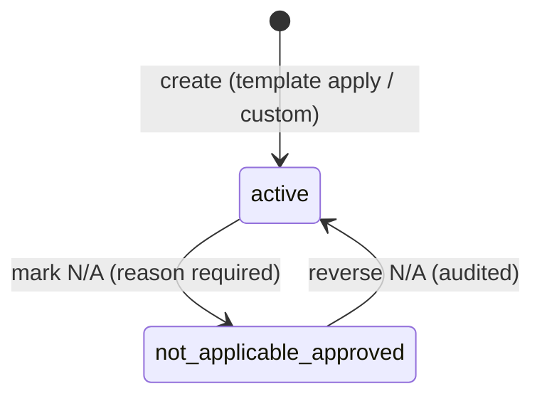

# FILE: /docs/requirements/requirements-and-lifecycle.md

> **Document status:** Phase 6A specification — the project-requirement record and its honest Phase 6 lifecycle. **Specification only.**
> **Source of truth:** [statuses.md §B](../product/statuses.md) defines the permanent requirement lifecycle. Phase 6 stores that lifecycle's field and reaches only the values that are truthful before submissions exist. Nothing here invents a parallel lifecycle.
> **Related:** [requirement-templates.md](./requirement-templates.md), [responsibility-and-dates.md](./responsibility-and-dates.md), [phase-6-data-model.md](./phase-6-data-model.md), [phase-6-audit-events.md](./phase-6-audit-events.md).

---

## 1. What a project requirement is

A **closeout requirement** is a single documentation obligation on one project ("HVAC O&M manual", "Roofing warranty — 20 yr", "Final CO"). It is the obligation, never the file (glossary). In Phase 6 it is a **configuration and tracking record**: what is owed, who owes it, who chases it internally, when it is due, and where it came from. Submissions, documents, reviews, and approvals are separate future entities that will reference it.

Requirements are **specialized-record neutral**: warranties, equipment docs, inspections, training, and lien waivers are ordinary requirements in Phase 6 (distinguished only by category). Phase 12's specialized registers will link to requirements; a reserved nullable `record_type` column keeps that seam open without exposing anything in the UI now.

## 2. Fields (instance record — full DDL in [phase-6-data-model.md §2.4](./phase-6-data-model.md))

| Group | Fields | Notes |
|-------|--------|-------|
| Identity | `title` (required, 2–200), `description`, `notes` | Title-first creation. |
| Classification | `category_id` (FK, required — "Uncategorized" default category exists), `trade` (free text, CSI later), `priority` (`low`/`normal`/`high`, default `normal`), `is_required` (default true; false = optional/nice-to-have), `record_type` (**reserved**, null) | No separate hard-coded "requirement type" enum — category + trade cover Phase 6 (see §6). |
| Responsibility | `responsible_project_company_id`, `responsible_project_contact_id`, `internal_owner_member_id` (all nullable FKs to Phase 5 tables) | Rules in [responsibility-and-dates.md](./responsibility-and-dates.md). |
| Timing | `due_date date` (nullable, date-only, project timezone) | No times, no scheduling engine. |
| Provenance | `source_template_id` (FK → the exact applied template version row), `source_item_key` | Null for custom requirements. UI shows "From: {Template} v{n}" or "Custom". |
| Ordering | `sort_order` (integer, gapped) | Within category; stable tiebreak `(sort_order, id)`. |
| Lifecycle | `status` (§3), `na_reason`, `archived_at`/`archived_by`/`archive_reason` | Soft archive; no hard delete. |
| System | `id`, `organization_id`, `project_id`, `created_by`, `created_at`, `updated_at` | `updated_at` is the optimistic-concurrency token (Phase 5/0021 stale-conflict pattern). |

**Kept separate (later phases):** submissions, documents/versions, reviews/approvals, reviewer chains, expected file formats, completion rules, reminder schedules, portal identity. None of these are columns on the Phase 6 record beyond the reserved `record_type`.

## 3. Lifecycle — honest Phase 6 subset of statuses §B

Stored `status text` with a check constraint. **Phase 6 permitted values:**

| Status | Meaning in Phase 6 | UI label |
|--------|--------------------|----------|
| `active` | The requirement exists and is in force; the request/submission pipeline has not begun (it cannot before Phase 7). Whether responsibility is chosen is **never encoded in the status** — assignment completeness is always derived from the responsibility fields (§5). | Status chip "Planned"; the responsibility column itself communicates "Assigned"/"Unassigned" (derived — the statuses.md "computed condition" principle, like `Missing`). |
| `not_applicable_approved` | An authorized user determined the requirement never applies to this project (REQ-006), with a reason. Excluded from open counts; visible with reason + actor; reversible. | "Not applicable" |

**Assignment is not a lifecycle event.** Setting, changing, or clearing the responsible company/contact/internal owner never transitions `status` — the record stays `active`, only the derived indicators change. This removes the contradiction of a stored "not assigned" value coexisting with an assigned responsible party.

**Relationship to statuses §B:** §B's `Not assigned` describes "instantiated, no responsible party" — a condition Phase 6 derives from the responsibility fields rather than stores (consistent with the statuses.md design principle that computed conditions are flags, not statuses). The stored `active` value is the configuration-stage anchor of the §B pipeline; when Phase 7 introduces invitations it appends `requested` (and the rest of §B in Phases 8–9) via new check-constraint values, transitioning **from `active`** — no Phase 6 value is ever renamed.

**Reserved (schema-evolvable, appended by later phases via new migrations, never pre-created):** `requested` (Phase 7 — assignment + invitation), `submitted`/`processing` (Phase 7/8), `under_review`/`approved`/`approved_with_conditions`/`rejected` (Phase 9), `not_applicable_requested` (Phase 7 — external exception requests, REQ-005), `waived` (ROD-1, with Phase 9 unless pulled earlier), `complete` (Phase 9). The `text + check` convention makes each addition an append-only constraint swap.

**Why no `draft` requirement status:** template application is previewed then atomic, and custom creation is a single dialog — a record either exists in force or does not. A draft state would be a status invented for a UI moment, violating the statuses-are-lifecycle principle. (Templates themselves do have `draft` — that is the reusable definition, not the obligation.)

**Archive is not a status:** matching Phase 5 relationship rows, requirement removal is `archived_at` (soft), preserving §B for fulfillment states. Archived requirements are excluded from the register by default, restorable, and retain full audit history.

## 4. Allowed transitions (Phase 6)

| Transition | Permission | Audit | Notes |
|------------|-----------|-------|-------|
| create → `active` | `requirement.manage` (or `requirement.apply_template`) | `requirement.created` / `template.applied` | Atomic with provenance. |
| assign / reassign / clear responsibility | `requirement.assign` | `requirement.responsibility_changed` | **No status transition** — `status` stays `active`; derived indicators update immediately. |
| `active` → `not_applicable_approved` | `requirement.set_not_applicable` | `requirement.marked_not_applicable{reason}` | Reason required (short label; full text stays on the record). Confirmation dialog. |
| `not_applicable_approved` → `active` | `requirement.set_not_applicable` | `requirement.not_applicable_reversed` | "Reopen" in UI returns the requirement to `active`; clears `na_reason` display but the audit trail preserves it. |
| archive (either status) | `requirement.archive` | `requirement.archived{reason?}` | Soft (`archived_at`), **independent of `status`** — the stored status is untouched; blocked when project archived (whole project is read-only). |
| restore | `requirement.archive` | `requirement.restored` | Clears `archived_at`; prior `status` unchanged. |

**Prohibited in Phase 6 (enforced in function + check constraint):** any transition into a reserved status; any status change on an archived requirement or archived project; N/A without a reason. Bulk transitions apply the same per-row rules atomically (§7).

## 5. Derived indicators (never stored, never fake)

Computed in queries/UI from real configuration data only — assignment completeness is **always** derived from the responsibility fields, never from `status`:

- **Unassigned responsible company** — `active`, not archived, `responsible_project_company_id` null (contact-only responsibility still counts as company-unassigned unless the contact carries a project company).
- **Unassigned internal owner** — `active`, `internal_owner_member_id` null.
- **Missing due date** — `active`, `due_date` null.
- **Planned date passed** — `active`, `due_date` < today (project timezone). Label exactly "Planned date passed" — *not* "overdue submission"; nothing has been requested yet and the UI must not imply it.
- **Stale company/contact/member reference** — a responsibility pointer whose Phase 5 row is no longer active (removed from project, ended affiliation, removed/suspended member, archived directory record) — see [responsibility-and-dates.md §4](./responsibility-and-dates.md). Removing responsibility (or the Phase 5 row's removal) changes this derived attention state automatically; no lifecycle transition occurs.
- **Setup attention required** — the union: unassigned responsible company ∨ unassigned internal owner ∨ missing due date ∨ stale reference. Drives the register's "Needs attention" filter and the overview CTA.
- **Optional** — `is_required = false`.
- **Setup progress** — % of active requirements with responsibility + due date set and no stale reference, labeled "Setup progress" (configuration), never "completion" or "readiness".

## 6. Category vs type vs trade vs role (the taxonomy decision)

| Concept | Model | Rationale |
|---------|-------|-----------|
| **Category** | Org-defined rows in `requirement_categories` (seeded defaults: O&M Manuals · Warranties · As-Built Drawings · Permits & Inspections · Test & Commissioning Reports · Training & Demonstrations · Attic Stock & Spare Parts · Lien Waivers & Financial · General). Ordered, renameable, archivable, reusable across templates and registers. | Grouping/reporting axis users control; no brittle hard-coding. |
| **Requirement type** | **Not a Phase 6 field.** Category + trade cover the need; a separate enum would duplicate the category axis. | Avoids a second taxonomy to maintain. |
| **Trade/scope** | Free-text `trade` on items/requirements (e.g., "23 – HVAC"). CSI-structured taxonomy (TRADE-001) arrives with the rules engine. | Cheap now, structured later without rework. |
| **Responsible company role** | Template-item **default hint** only (`default_responsible_role` = the `project_companies.role` vocabulary). Instances always resolve to a concrete project company. | Reuses Phase 5 vocabulary; avoids ambiguous role-level assignment on live records. |
| **Specialized record type** | Reserved `record_type` column (null; not in UI). | Phase 12 seam without speculation. |
| **Custom labels** | Not in Phase 6 (tags may come later); `notes` covers free-form context. | Scope control. |

Category behavior: renames apply everywhere (taxonomy, not snapshot); archiving a category hides it from pickers but existing requirements/items keep it (displayed with an "archived category" hint and a re-categorize affordance); categories cannot be hard-deleted; ordering is org-wide (`sort_order`) and drives register/template grouping.

## 7. Bulk operations

Supported (each a single audited transaction via `bulk_update_project_requirements`): set responsible company · set responsible contact · set internal owner · set category · set due date (or clear) · set priority · mark not applicable (one shared reason) · reverse N/A · archive · restore · move to category + reorder. **Not built:** bulk edit of titles/descriptions, bulk create-blank, cross-project bulk (no demonstrated need).

Rules: permission checked once per action + per-row project scope; every row must pass its own validation or the whole call fails (atomic, `22023` with the offending count — no partial application); destructive/binding actions (N/A, archive) require a typed count confirmation in UI; cap 200 rows per call (UI selects at most one page/filter result set at a time); one `requirement.bulk_updated` audit event with action, count, and ids (§ audit doc) plus no per-row event spam.

## 8. Custom requirement fast-create (REQ-002)

- **Minimum:** title (+ category defaulting to "General"/last-used). Everything else optional at create.
- Dialog from the register ("Add requirement"), mobile bottom sheet; `Enter` submits; "Create & add another" for runs of entries.
- Optional enrichment inline after create (row expands) or via the detail sheet.
- **Duplicate warning (advisory, never blocking):** normalized-title match against active requirements in the project → "A similar requirement exists: {title}" with link; matches the Phase 5 dedupe philosophy.
- Custom records behave identically to templated ones (REQ-002 acceptance); "promote to template item" is deferred (noted in [requirement-templates.md §9](./requirement-templates.md)).
- Error recovery: retained input on failure; friendly mapped messages; rate-limited like Phase 5 creates.

## 9. Concurrency & validation

- Every update RPC takes the caller's `updated_at`; stale → the 0021 stale-conflict errcode → friendly "This requirement was updated by someone else — review and retry" with a reload affordance (Phase 5D pattern).
- Bulk calls re-read rows inside the transaction; concurrent single-row edits during a bulk action lose to the transaction or fail it cleanly — never interleave silently.
- Validation (server + client): title length; category belongs to org and is not archived (new picks); responsibility FKs belong to **this project** and are active ([responsibility-and-dates.md §4](./responsibility-and-dates.md)); due date is a valid date (sanity range ±30 yr); N/A requires reason (3–200 chars); archived project blocks all mutation; cross-tenant ids → generic denial, no existence leak.

## 10. Historical preservation

No hard deletes; archive preserves rows; N/A preserves reason + actor; audit events are immutable and in-transaction; provenance (`source_template_id`, `source_item_key`) is never rewritten after creation; reversing N/A or restoring from archive never erases the history that it happened.

---

*Continue to [requirement-templates.md](./requirement-templates.md).*
