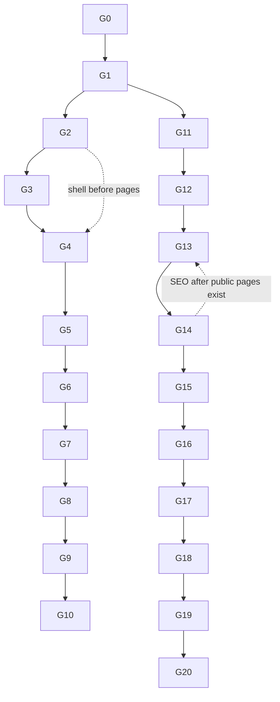

# FILE: /docs/visual-seo/phase-6e-implementation-plan.md

> **Document status:** Phase 6E-A specification — the ordered, dependency-aware Phase 6E-B plan. **Presentation, marketing, and SEO only.** Every task obeys [accessibility-performance-and-safety.md §Code-safety](./accessibility-performance-and-safety.md).
> **Global per-task rules:** light+dark verified; AA contrast; reduced motion; all existing suites stay green; `pnpm check` + `pnpm test` (+ `pnpm test:db` only if the founder-approved dashboard RPC is built); screenshot capture + criteria pass before merge; logical commit per group; presentation-only diff (no logic/data/permission/audit change).

## Implementation status

**6E-B1 (founder visual direction) — complete.** See [phase-6e-b1-founder-visual-review.md](./phase-6e-b1-founder-visual-review.md).

**6E-B2 (authenticated product rollout) — implemented, verification incomplete.** See [phase-6e-b2-authenticated-rollout.md](./phase-6e-b2-authenticated-rollout.md). Branch `codex/phase-6e-b2-authenticated-visual-rollout` off `229ce5c`.

| Plan task | 6E-B2 status |
|-----------|--------------|
| G1 tokens & primitives | ✅ done — surface ladder, hairline, real dark elevation, type scale, `Metric`/`RecordCard`/`AttentionChip`/`Meter`, `Card` tiers |
| G2 application shell | ✅ done — grouped Work/Organization rail, light-accent active state, honest bell, content-width wiring |
| G3 dashboard | ✅ done — Direction A on **Path A** (no new SQL); FD-2 option (b) **not** exercised |
| G4 projects | ✅ list + setup checklist; per-page pass on overview/settings/sub-tabs still outstanding |
| G5 requirements | ✅ register refined; detail and apply flow inherit shared system only |
| G6 templates | ✅ library rebuilt as cards; builder inherits shared system only |
| G7 companies & contacts | ✅ directories refined; detail pages inherit shared system only |
| G8 team & settings | ✅ member state disambiguated; remaining settings inherit shared system only |
| G9 authentication | ✅ refinement only |
| G10 global state pages | ✅ 404 wording, projects skeleton |
| G15–G18 a11y / responsive / full regression | ❌ **blocked** — Docker unavailable, so no DB, e2e, a11y or probe suite ran |
| G11–G14 public site & SEO | ⏸ not started — deliberately out of 6E-B2 scope |

Two latent defects were found and fixed during the rollout: `text-h1`/`text-h2` generated no CSS (headings and dialog titles rendered at body size), and the collapsed sidebar rendered no logo because a plain class was written as a Tailwind variant.

## Task order

### G0 — Baseline & lock
- Branch `codex/phase-6e-visual-seo` off clean post-6D head; record SHA.
- Full green test baseline archived; baseline screenshots for every priority surface; route inventory locked. **No edits yet.** **Founder:** none. **Commit:** none.

### G1 — Tokens & primitives ([design-system-evolution.md](./design-system-evolution.md))
- Surface ladder, dark elevation (`--shadow-raised`), border/hairline strategy, type scale, nav tokens, content-width system, focus ring, motion tokens; refine `Card/Section/DataTable/StatusBadge/Dialog/Sheet/EmptyState/ErrorState/Skeleton`; add `Metric`, `RecordCard`; deprecate `RiskIndicator`.
- **Tests:** UI component tests + a11y; no route change yet. **Screenshot:** `/design` gallery + one sample table. **Founder:** none. **Commit 1.**

### G2 — Application shell ([application-shell.md](./application-shell.md))
- Sidebar grouping + light active state; header; command palette visuals; breadcrumbs; project sub-nav; mobile drawer; content-width wiring; honest notifications placeholder.
- **Tests:** shell e2e + a11y + breadcrumb unit. **Screenshot:** shell expanded/collapsed/mobile, light+dark. **Founder:** part of Checkpoint 1. **Commit 2.**

### G3 — Dashboard ([dashboard-redesign.md](./dashboard-redesign.md)) — **Direction A**, real data (Path A)
- Remove all mock widgets + PREVIEW; build attention-first dashboard on `search_projects` + bounded `get_requirement_summary`; empty/limited states.
- **(Only if FD-2 approved)** a separate prior commit adds `get_organization_requirement_overview` migration + pgTAP; otherwise Path A.
- **Tests:** dashboard e2e (real data, no fake language) + a11y. **Screenshot:** populated/empty/all-configured, desktop light/dark + mobile. **Founder:** Checkpoint 1. **Commit 3.**

### G4 — Projects ([authenticated-pages-redesign.md §1](./authenticated-pages-redesign.md))
- List, overview (growth-safe panel grid), setup checklist, settings, team/companies/contacts tabs, activity.
- **Tests:** project e2e + a11y. **Screenshot:** list/overview/settings + mobile. **Founder:** Checkpoint 2. **Commit 4.**

### G5 — Requirements (flagship, §2)
- Register table system, bulk bar, chips, detail, apply flow, custom create, states, mobile cards.
- **Tests:** full phase-6 e2e + a11y + seven-profile responsive; scale unaffected. **Screenshot:** the full register subset. **Founder:** Checkpoint 2. **Commit 5.**

### G6 — Templates (§3)
- Library, builder two-zone, version chain, apply-from-template shared with G5, mobile builder.
- **Tests:** template e2e + a11y. **Screenshot:** library/builder/version chain. **Founder:** Checkpoint 2. **Commit 6.**

### G7 — Companies & contacts (§4)
- Directories, detail, relationships, dedupe, archive, mobile, contact-vs-user framing.
- **Tests:** directory e2e + a11y. **Screenshot:** directories/detail. **Commit 7.**

### G8 — Team & settings (§5)
- Two-pane settings, members/roles/invites, security/MFA/preferences/sessions, dangerous-action hierarchy, disabled-settings treatment.
- **Tests:** settings e2e + a11y. **Screenshot:** settings/members. **Commit 8.**

### G9 — Authentication consistency (§6, refine only)
- Logo sizing, form width, error states, mobile across auth/invite/onboarding/org-select/MFA/recovery. **No logic touch.**
- **Tests:** full auth e2e (must stay green). **Screenshot:** sign-in/onboarding/invite. **Commit 9.**

### G10 — Global state pages (§7)
- 404, error boundary, `loading.tsx` skeletons, permission-denied, non-enumerating 404 → shared state system.
- **Tests:** state e2e. **Screenshot:** loading/error/permission/404. **Commit 10.**

### G11 — Public marketing shell ([public-site-architecture.md](./public-site-architecture.md))
- `(marketing)` layout (header/footer, marketing tokens, `ProductFrame`); remove `/` dashboard redirect for signed-out users; **no** authenticated data source.
- **Tests:** new public-boundary test (no auth import), a11y, production-probe (public indexable + app still noindex). **Screenshot:** shell/footer. **Founder:** Checkpoint 3. **Commit 11.**

### G12 — Public homepage
- Full homepage per architecture; real framed product screenshots; truthful copy; CTAs per FD-3/FD-6.
- **Tests:** homepage a11y + Lighthouse (perf/seo/a11y) + truthfulness pass. **Screenshot:** full/hero/mobile. **Founder:** Checkpoint 3. **Commit 12.**

### G13 — Public feature/use-case + legal pages
- `/product`, `/closeout-requirements`, `/requirement-templates`, `/security`, `/for-general-contractors`, `/about`, `/request-access` (+ success), `/privacy`, `/terms`.
- **Tests:** per-page a11y + metadata + truthfulness. **Screenshot:** each page + mobile. **Commit 13.**

### G14 — SEO metadata, sitemap, robots, structured data ([seo-content-and-metadata.md](./seo-content-and-metadata.md))
- Per-page metadata/canonical/OG/Twitter; `app/sitemap.ts` + `app/robots.ts` (public only); JSON-LD (Organization/WebSite/SoftwareApplication/BreadcrumbList/FAQPage where genuine).
- **Tests:** sitemap/robots tests; structured-data validation; production-probe noindex/private-leak checks. **Commit 14.**

### G15 — Performance & accessibility optimization
- Image optimization, JS budgets, route loading, font check; a11y sweep (light+dark) on all new/changed routes + public.
- **Tests:** `test:a11y`, Lighthouse budgets. **Commit 15.**

### G16 — Responsive & browser validation
- Seven-profile capture + fixes across app + public; Chromium/Firefox/WebKit smoke.
- **Tests:** seven-profile e2e. **Commit 16 (fixes).**

### G17 — Full visual review
- Full-matrix capture; apply acceptance criteria; fix; founder final visual pass.
- **Commit 17 (fixes).**

### G18 — Full regression
- Entire suite: typecheck/lint/format/test/build/test:db/test:e2e/test:a11y/test:server-only/test:live-security/test:production-probe (+ scale). **Commit 18.**

### G19 — Independent audit (visual/SEO/security)
- Independent reviewer confirms: no logic/data/permission change; noindex/private separation intact; truthfulness; premium criteria; a11y; performance. Audit doc. **Commit 19 (audit).**

### G20 — Exit review & docs
- `docs/visual-seo/phase-6e-exit-review.md`; update AGENTS/CLAUDE pointers; confirm **Phase 7 not started**. **Commit 20.**

## Dependency graph

Tokens (G1) precede everything; shell (G2) precedes app page groups; public pages (G11–13) precede SEO metadata (G14); authenticated and public tracks are independent after G1 and may interleave, but each merges only with its tests + captures green.

## Founder checkpoints (blocking)

- **Checkpoint 1 — visual direction (after G1–G3):** shell, sidebar, dashboard desktop + mobile, requirement register (early), template library (early), public homepage (early mock), light + dark. Confirms FD-1 (dashboard direction), FD-3 (primary CTA), token direction.
- **Checkpoint 2 — authenticated product (after G4–G8):** projects, overview, requirements, templates, companies, contacts, team/settings, mobile nav, empty/loading/error states.
- **Checkpoint 3 — public site & SEO (after G11–G14):** homepage, positioning, feature pages, CTA wording, search terminology, metadata examples, social preview, mobile public site. Confirms FD-5/FD-6/FD-7.

No major visual direction is finalized without the relevant checkpoint.

## Explicit Phase 7 stop condition

6E-B ends at G20. **Do not** begin Phase 7 (subcontractor portal) or any Phase 8+ system: no uploads, storage, documents, submissions, reviews, approvals, portals, external links, notifications, packages, AI, integrations, or billing — in the app **or** the marketing site. The public site advertises only shipped Phase 4/5/6 capability. Any later feature gets its own phase; 6E adds no business tables/RPCs/permissions (the optional dashboard aggregate reader is the sole, founder-gated, read-only exception).

---

*Continue to [open-decisions.md](./open-decisions.md).*
